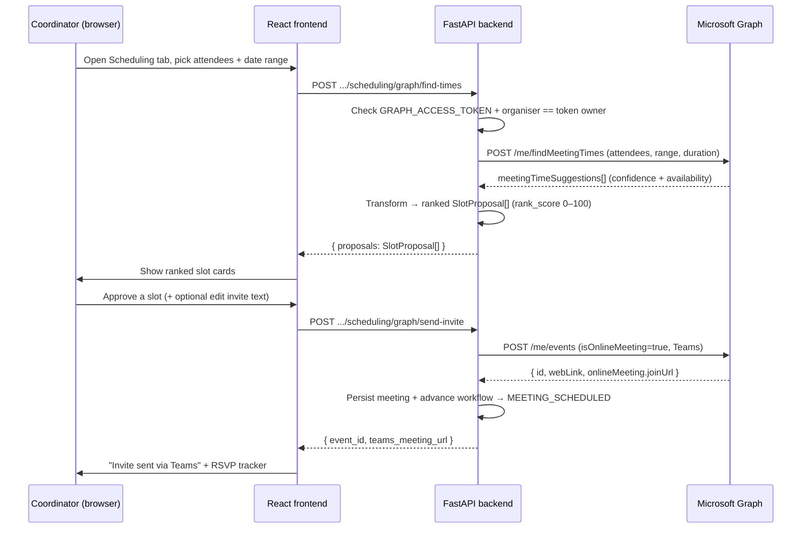

# Meeting Scheduling via Microsoft Graph — Technical Handover & Re-implementation Guide

> **Status:** Feature being **temporarily removed** from the running app.
> **Reason:** The Shell (GCC) tenant will not grant the required Microsoft Graph
> calendar write access (`Calendars.ReadWrite` / the org's "Graph read-write")
> right now — it is a critical permission for them.
> **Plan:** Access is expected in **~2–3 months**. When granted, re-enable the
> feature using this document. Nothing here should be deleted from history — this
> is the single source of truth for how it worked and how to bring it back.

---

## Table of Contents
1. [What the feature does (in plain words)](#1-what-the-feature-does-in-plain-words)
2. [Where it lives — two places](#2-where-it-lives--two-places)
3. [End-to-end flow](#3-end-to-end-flow)
4. [Microsoft Graph — exactly what we call](#4-microsoft-graph--exactly-what-we-call)
5. [Graph permissions required](#5-graph-permissions-required)
6. [Backend components](#6-backend-components)
7. [Frontend components & the scheduling phase machine](#7-frontend-components--the-scheduling-phase-machine)
8. [How slots are ranked](#8-how-slots-are-ranked)
9. [Configuration & environment variables](#9-configuration--environment-variables)
10. [What happens when the token is missing (today's behaviour)](#10-what-happens-when-the-token-is-missing-todays-behaviour)
11. [How to REMOVE the feature cleanly (now)](#11-how-to-remove-the-feature-cleanly-now)
12. [How to RE-IMPLEMENT it (in 2–3 months)](#12-how-to-re-implement-it-in-23-months)
13. [Appendix A — Exact Graph request/response payloads](#appendix-a--exact-graph-requestresponse-payloads)
14. [Appendix B — File index](#appendix-b--file-index)

---

## 1. What the feature does (in plain words)

The app helps a VMO coordinator go from *"I need to run a governance meeting"* to
*"a Teams meeting invite is in everyone's calendar"* — without leaving the app.

It does three things using Microsoft Graph:

1. **Find free slots** — Given a set of attendees and a date range, it asks Graph
   *"when are all these people free?"* and gets back candidate time slots with a
   confidence level (high / medium / low) and per-person availability
   (free / tentative / busy).
2. **Rank the slots** — We turn Graph's suggestions into ranked slot cards (best
   time first), factoring in confidence, organiser/exec-sponsor availability, and
   conflicts.
3. **Schedule the meeting** — When the coordinator approves a slot, we create a
   real **Teams online meeting** on the organiser's Outlook calendar and Graph
   sends the invites. We can also **reschedule** (moves the same meeting, keeps
   the join link) and **cancel** it.

This exact machinery is used in **three modules**:
- **Module A — Scheduling** (the main EGB/QBR meeting).
- **Module C — Internal Alignment** (the internal prep meeting before meeting the vendor).
- **Module D — Vendor Prep** (the vendor prep call — internal team **and** the vendor; attendees editable). *(Added after the initial handover.)*

---

## 2. Where it lives — three places

| | Module A (main meeting) | Module C (alignment meeting) | Module D (vendor prep call) |
|---|---|---|---|
| Find slots | `POST /api/cycles/{id}/scheduling/graph/find-times` | `POST /api/cycles/{id}/alignment/find-times` | `POST /api/cycles/{id}/vendor-prep/find-times` |
| Schedule (create invite) | `POST /api/cycles/{id}/scheduling/graph/send-invite` | `POST /api/cycles/{id}/alignment/schedule-meeting` | `POST /api/cycles/{id}/vendor-prep/schedule-meeting` |
| Reschedule | `POST /api/cycles/{id}/scheduling/graph/schedule-manual` | (same `schedule-meeting`, in-place) | (same `schedule-meeting`, in-place) |
| Fetch / cancel | (via slots / delete event) | `GET`/`DELETE /api/cycles/{id}/alignment/meeting?index=` | `GET`/`DELETE /api/cycles/{id}/vendor-prep/meeting` |
| Attendees | internal + vendor | internal only | internal + vendor (editable per meeting) |

All three paths share the **same** low-level Graph client
(`backend/app/services/graph_service.py`), the **same** slot card UI component
(`frontend/src/components/modules/scheduling/SlotCard.tsx`), and the **same**
persisted `meetings` store (see [§6a](#6a-how-meetings-are-stored-postgres-safe)).

---

## 3. End-to-end flow



**Key rule enforced today:** the *organiser* must be the **same identity as the
Graph token owner**. Because we use a delegated `/me` token (see §4), Graph acts
"as" the token owner, so the organiser can only be that person. This is checked in
the backend and returns HTTP 400 if they differ.

---

## 4. Microsoft Graph — exactly what we call

All calls are plain HTTPS from `GraphService`
(`backend/app/services/graph_service.py`). Base URL: `https://graph.microsoft.com/v1.0`.
Auth is a single **Bearer token** read from `GRAPH_ACCESS_TOKEN`.

| Purpose | Method & endpoint | `GraphService` method |
|---|---|---|
| Find common free time | `POST /me/findMeetingTimes` | `find_meeting_times()` |
| Create Teams meeting + invite | `POST /me/events` | `create_event()` |
| Reschedule (keep join link) | `PATCH /me/events/{id}` | `update_event()` |
| Cancel meeting | `DELETE /me/events/{id}` | `delete_event()` |
| Who is the token for? (debug) | `GET /me` | `get_me_profile()` |
| Resolve email → user | `GET /users/{email}` | `lookup_user()` |
| Attendance outreach email | `POST /me/messages` + `.../send` | `create_draft_message()` / `send_draft_message()` |
| Track email replies | `GET /me/messages?$filter=conversationId eq '...'` | `query_messages_by_conversation_id()` |

**Important detail about `/me`:** every calendar call uses `/me/...`, which only
works with a **delegated** token (a token that represents a signed-in user). This
is why today we paste a token from Graph Explorer / an OAuth login into
`GRAPH_ACCESS_TOKEN`. See §12 for why this should change to an **app-only** model
in production (and why `/me` then becomes `/users/{organiser}`).

**Timezone handling:** the UI offers IST / UTC / GMT. Graph wants *Windows*
timezone IDs (`India Standard Time`, `UTC`, `GMT Standard Time`) and local
wall-clock times, while our data stores UTC ISO strings. `GraphService` and the
route contain the conversion helpers (`_TZ_ALIASES`, `_to_iana_zone`,
`_local_to_utc_iso`) with a fixed-offset fallback (IST = +330 min) for Windows
hosts that lack `tzdata`.

---

## 5. Graph permissions required

This is the crux of why the feature is being paused. **The vague "Graph
read-write" maps to these specific Graph permissions.** Request exactly these when
access is being granted.

### If we keep the current delegated model (token = a real user)
| Graph call | Delegated permission |
|---|---|
| `POST /me/findMeetingTimes` | `Calendars.Read` (and `Calendars.Read.Shared` to see other people's free/busy) |
| `POST /me/events`, `PATCH`, `DELETE` | **`Calendars.ReadWrite`** ← the critical one |
| `GET /me` | `User.Read` |
| `GET /users/{email}` | `User.Read.All` (or `User.ReadBasic.All`) |
| Outreach email (`/me/messages`, send) | `Mail.ReadWrite` + `Mail.Send` |

### If we move to app-only (recommended — see §12)
Application permissions (admin-consented once):
| Graph call | Application permission |
|---|---|
| `POST /users/{organiser}/findMeetingTimes` | `Calendars.Read` |
| `POST /users/{organiser}/events`, `PATCH`, `DELETE` | **`Calendars.ReadWrite`** |
| `GET /users` (directory search) | `User.Read.All` |
| Send mail as organiser | `Mail.Send` |

> **The blocker in one line:** the meeting-creation calls need
> **`Calendars.ReadWrite`**. Reading free/busy needs `Calendars.Read` /
> `Calendars.Read.Shared`. Everything else (scorecards, alignment logic,
> analytics) works without any Graph permission.

---

## 6. Backend components

```
backend/app/
├── services/
│   └── graph_service.py          # ← the ONLY file that talks to Graph. Reusable.
├── api/routes/
│   ├── graph_scheduling.py       # Module A: find-times, send-invite, manual/reschedule, token-info
│   ├── scheduling.py             # cycle & attendee CRUD, RSVP, outreach; legacy sim endpoints return 410
│   └── alignment.py              # Module C: find-times, schedule-meeting, meeting CRUD
├── config.py                     # graph_access_token + scheduling_* tuning knobs
└── main.py                       # registers the routers
```

### `graph_scheduling.py` endpoints (Module A)
| Method & path | Purpose |
|---|---|
| `GET /api/graph/token-info` | Decode the JWT (unverified) → report presence, type (delegated/app-only), scopes, expiry, owner email. Frontend uses this to resolve the organiser. |
| `POST /api/cycles/{id}/scheduling/graph/find-times` | Call Graph `findMeetingTimes`, transform to ranked `SlotProposal[]`, persist, advance to `AVAILABILITY_COLLECTED`. |
| `POST /api/cycles/{id}/scheduling/graph/send-invite` | Create the Teams event via `create_event`, persist the Teams URL, advance to `MEETING_SCHEDULED`. |
| `POST /api/cycles/{id}/scheduling/manual-slot` | Create an approved slot at a chosen time **without** creating a Graph event yet (invite reviewed on the next screen). |
| `POST /api/cycles/{id}/scheduling/graph/schedule-manual` | Create **or reschedule** the main Teams meeting at a manual/slot time (`update_event` for reschedule). |

### `alignment.py` scheduling endpoints (Module C)
| Method & path | Purpose |
|---|---|
| `POST /api/cycles/{id}/alignment/find-times` | `findMeetingTimes` for internal stakeholders only; ranked slots. |
| `POST /api/cycles/{id}/alignment/schedule-meeting` | Create or reschedule the alignment Teams meeting for a given `meeting_index`; persists to `meetings.json`. |
| `GET /api/cycles/{id}/alignment/meeting?index=` / `GET .../meetings` | Fetch one / list all persisted alignment meetings. |
| `DELETE /api/cycles/{id}/alignment/meeting?index=` | Best-effort Graph cancel (`delete_event`) + local delete. |

### `vendor_prep.py` scheduling endpoints (Module D) — *added after handover*
Single vendor-prep meeting per cycle (no index). Attendees = internal + vendor; the
frontend passes the edited subset as `attendee_emails` (restricted server-side to real
cycle attendees).
| Method & path | Purpose |
|---|---|
| `POST /api/cycles/{id}/vendor-prep/find-times` | `findMeetingTimes` over the selected internal+vendor attendees; ranked slots. |
| `POST /api/cycles/{id}/vendor-prep/schedule-meeting` | Create **or reschedule-in-place** the vendor-prep Teams meeting. |
| `GET /api/cycles/{id}/vendor-prep/meeting` | Fetch the persisted vendor-prep meeting. |
| `DELETE /api/cycles/{id}/vendor-prep/meeting` | Best-effort Graph cancel + local delete. |

The transcript + AI-minutes + action-item steps reuse the shared
`TranscriptInput` / `MeetingMinutesViewer` (Module E) components and the existing
`/api/cycles/{id}/meeting/parse-transcript` + minutes endpoints — nothing new there.

### 6a. How meetings are stored (Postgres-safe)

All three meeting types persist to the **single shared `meetings` store**
(`meetings.json` today, via `MeetingRepository`). They are **not** separate stores —
they are the same records discriminated by two fields:

| Field | Alignment | Vendor Prep | Main meeting |
|---|---|---|---|
| `meetingType` | `INTERNAL_ALIGNMENT` | `VENDOR_PREP` | (scheduling module) |
| `alignmentIndex` / index | 1..N (multiple) | always 1 (single) | — |

Every meeting record has the same shape: `meetingId`, `title`, `agenda`,
`organizerId`, `participants[] {userId, status}`, `timeSlot`, `status`, `cycleId`,
`meetingType`, `teamsMeetingUrl`, `webLink`.

**Why this matters for the Postgres migration:** this maps to **one `meetings`
table** with a `meeting_type` column (+ an optional `meeting_index`), not a second
near-identical table per module. No duplicated columns, no repeated meeting data.
`BaseRepository` is the only layer that changes on migration
(`backend/app/repositories/base_repository.py` docstring says exactly this) — the
routes/services are untouched. When modelling in Postgres:
- `meetings (id PK, cycle_id FK, meeting_type, meeting_index, title, agenda, organizer_id, time_slot JSONB/columns, status, teams_meeting_url, web_link, created_at)`
- `participants` → either a JSONB column or a child `meeting_participants (meeting_id FK, user_id, status)` table.
- Look up a cycle's vendor-prep meeting with `WHERE cycle_id = ? AND meeting_type = 'VENDOR_PREP'` — the same predicate the JSON repo uses today.

### Token reads
The token is read **per request** (so you can refresh `.env` without restarting):
`_get_graph_access_token()` in `graph_scheduling.py` / `scheduling.py`, and
`_get_graph_token()` in `alignment.py`. All fall back through
`Settings().graph_access_token`.

---

## 7. Frontend components & the scheduling phase machine

The Scheduling tab is a **linear 5-phase state machine** in
`frontend/src/pages/CycleDetail.tsx` (`SchedulingTab`, `schedulingPhase` state,
`advanceScheduling()`). Each phase renders one component and can advance the
backend workflow state.

| Phase | Component | What the user does | Graph call |
|---|---|---|---|
| `attendance_confirmation` | `AttendanceConfirmationPanel` | Confirm carried-over attendees | none (may send outreach mail) |
| `attendee_refresh` | `AttendeeRefreshPanel` | Edit attendees → **"Find Slots (Graph)"** | `find-times` |
| `slot_ranking` | `SlotRankingPanel` + `SlotCard` | Review ranked slots → **Approve a slot** | none (approve is local) |
| `invite_approval` | `InviteApprovalPanel` | Edit invite text → **"Approve & Send"** | `send-invite` (`create_event`) |
| `confirmation_tracking` | `ConfirmationTracker` + `RescheduleControl` | See RSVPs, optionally reschedule | `schedule-manual` (`update_event`) |

Mapping of workflow state → starting phase is in `getInitialSchedulingPhase()`.

**Module C (alignment)** uses the same building blocks but self-contained inside
`components/modules/alignment/ScheduleAlignmentMeeting.tsx` (wrapped by
`AlignmentMeetingPanel.tsx`), calling the `alignmentApi.ts` functions.

### Frontend API wrappers
- `frontend/src/lib/schedulingApi.ts` — `createManualSlot`, `scheduleMeetingManual`, `approveSlot`, `fetchSlots`, `fetchRsvpStatus`, `getTokenOwnerOrganizerEmail` (calls `GET /api/graph/token-info`), etc. *(Note: `find-times` and `send-invite` are called via raw `apiFetch` inside the components, not wrapped here.)*
- `frontend/src/lib/alignmentApi.ts` — `findAlignmentTimes`, `scheduleAlignmentMeeting`, `getAlignmentMeeting`, `listAlignmentMeetings`, `deleteAlignmentMeeting`, plus alignment attendee CRUD.
- `frontend/src/config/scheduling.config.ts` — `SCHEDULING_CONFIG` (slot page size, score-bar colour thresholds, default duration).
- Key types in `frontend/src/types/scheduling.types.ts`: `SlotProposal`, `CycleAttendee`, `SchedulingPhase`.

---

## 8. How slots are ranked

Graph returns `meetingTimeSuggestions` with a `confidenceLevel` and
`attendeeAvailability`. The backend (`graph_scheduling.py`) turns each suggestion
into a `SlotProposal` with a **`rank_score` (0–100)**:

1. **Base score** from Graph confidence (`_base_score_from_confidence`):
   high → `scheduling_confidence_high_score` (100), medium → `..._medium_score`
   (80), low → `..._low_score` (60). Numeric confidences (0–1 or 0–100) are
   normalised.
2. **Tentative penalty** — each attendee marked *tentative* subtracts
   `scheduling_tentative_penalty` (15) points.
3. Score is clamped to `[scheduling_score_min, scheduling_score_max]` = `[0, 100]`.
4. Per-slot we also record `organiser_available`, `exec_sponsor_available`
   (role `scheduling_exec_sponsor_role` = `EGB_CHAIR`), `attendance_count`,
   `conflict_count`, and name chips for attending / tentative / conflicts.

The UI colours the score bar using the **frontend** thresholds in
`scheduling.config.ts` (HIGH 85 / MEDIUM 70) — these are display-only and
intentionally separate from the backend scoring numbers.

> There is also a **legacy fully-deterministic ranker**
> (`slot_ranking_service.py` / `scheduling_business_start_hour` etc. in config)
> from before the Graph integration. It is **not used** in the current Graph-only
> mode but is still present and could serve as a no-Graph fallback (see §11).

---

## 9. Configuration & environment variables

### `.env` (backend)
```
GRAPH_ACCESS_TOKEN=...        # Bearer token (delegated). Expires ~1 hour today.
GRAPH_MEETING_DURATION_MINUTES=30
```
### `config.py` scheduling knobs (all overridable via `.env`)
| Setting | Default | Meaning |
|---|---|---|
| `scheduling_max_graph_candidates` | 12 | Max slots requested from Graph |
| `scheduling_is_organizer_optional` | False | Organiser availability is a hard constraint |
| `scheduling_require_all_attendees` | True | `minimumAttendeePercentage = 100` |
| `scheduling_activity_domain` | `"work"` | Graph time-constraint domain (route passes this) |
| `scheduling_exec_sponsor_role` | `EGB_CHAIR` | Role treated as exec sponsor |
| `scheduling_confidence_high/medium_threshold` | 90 / 70 | Numeric-confidence cut-offs |
| `scheduling_confidence_high/medium/low_score` | 100 / 80 / 60 | Base score per confidence |
| `scheduling_tentative_penalty` | 15 | Points lost per tentative attendee |
| `scheduling_score_min/max` | 0 / 100 | Clamp range |

Azure OpenAI vars (`azure_openai_*`, `enable_llm`) are **unrelated** to Graph —
they only polish invite/nudge text and are optional.

---

## 10. What happens when the token is missing (today's behaviour)

Understanding this matters for the removal — it explains what a user sees if the
token is absent (which is effectively our situation without Graph access).

- **Backend** hard-fails with **HTTP 500** on every real Graph route when
  `GRAPH_ACCESS_TOKEN` is empty (find-times, send-invite, schedule-manual,
  alignment find-times/schedule-meeting, outreach). Outreach additionally returns
  **HTTP 403** if the token lacks `Mail.Send`.
- **Frontend** calls `GET /api/graph/token-info`; if `token_present=false`,
  `getTokenOwnerOrganizerEmail()` returns `null` and every scheduler component
  shows an inline error like *"Could not resolve the organiser from the Graph
  token. Refresh `GRAPH_ACCESS_TOKEN` and retry."* and aborts.
- Legacy **simulate / rank-slots / agent** endpoints in `scheduling.py` already
  return **HTTP 410 Gone** (we are in deliberate "Graph-only mode") and in-app
  simulation is disabled (`AttendanceConfirmationPanel.handleSimulate` throws).

**Consequence:** there is currently **no non-Graph fallback** for slot finding or
meeting creation. So simply leaving the feature in place without a token = users
hit error messages. That's why we hide the UI rather than leave it dead.

---

## 11. How to REMOVE the feature cleanly (now)

Goal: users should **not see broken buttons**. The rest of the cycle (attendees,
scorecards, alignment analysis, vendor prep, analytics) must keep working.
**Do NOT delete the code** — just hide the entry points behind a flag so re-enabling is a one-line change.

### Recommended approach — a single feature flag
1. **Add a flag.**
   - Backend `config.py`: `graph_scheduling_enabled: bool = False`.
   - Frontend: `VITE_GRAPH_SCHEDULING_ENABLED=false` in `.env.local`, read in `scheduling.config.ts` as `SCHEDULING_CONFIG.GRAPH_ENABLED`.
2. **Frontend — hide the Graph phases, keep the rest.**
   - In `SchedulingTab` (`CycleDetail.tsx`): when `GRAPH_ENABLED` is false, skip the `attendee_refresh` → `slot_ranking` → `invite_approval` → `confirmation_tracking` Graph steps. Keep `AttendanceConfirmationPanel` and `CycleAttendeesPanel` (attendee management is not Graph-dependent). Replace the "Find Slots (Graph)" / "Approve & Send" actions with a short notice: *"Automated Teams scheduling is temporarily unavailable pending Microsoft Graph access. Schedule the meeting manually in Outlook and record the details here."* (optionally keep a manual date/URL entry that just stores the meeting record).
   - In `AlignmentTab` → `ScheduleAlignmentMeeting.tsx`: hide "Find Times" and "Approve/Schedule"; keep transcript + minutes. Same notice.
   - In `VendorPrepTab` → `VendorPrepMeetingPanel.tsx`: hide the "Find Slots (Graph)" / manual-schedule controls; keep the transcript + minutes block. Same notice. (Its transcript/minutes don't need Graph.)
   - Hide any RSVP tracker that depends on a created event.
3. **Backend — make the Graph routes return a clean, explicit response** instead of a 500.
   - Wrap the bodies of the endpoints in §6 so that when `graph_scheduling_enabled` is false they return **HTTP 503** with `{"detail": "Graph scheduling disabled — pending tenant permission (Calendars.ReadWrite)."}`. This is safer than a 500 stack trace if anything still calls them.
4. **Leave in place, untouched:** `graph_service.py`, the transform/ranking logic, `alignmentApi.ts`, `schedulingApi.ts`, all types. They cost nothing when the flag is off and are exactly what you switch back on.
5. **Workflow states:** keep the state machine as-is
   (`…→ MEETING_SCHEDULED →…`). When Graph is off, allow the coordinator to
   advance past `MEETING_SCHEDULED` manually (the `POST /workflow-state`
   endpoint already exists) so the cycle isn't blocked.

### Quick checklist
- [ ] `graph_scheduling_enabled` flag added (BE + FE).
- [ ] Scheduling tab hides Graph steps, shows the "manual for now" notice.
- [ ] Alignment meeting hides find/schedule, keeps transcript+minutes.
- [ ] Graph routes return 503 (not 500) when flag off.
- [ ] Coordinator can still move the cycle forward manually.
- [ ] No code deleted; this doc linked in the PR.

---

## 12. How to RE-IMPLEMENT it (in 2–3 months)

When the tenant grants calendar access, re-enabling is mostly flipping the flag —
**but** take the opportunity to fix the one production weakness: the manually
pasted, 1-hour-expiry delegated token.

### Step 1 — Confirm the granted permissions
Verify the app registration (your SPN) has, with **admin consent**:
- `Calendars.ReadWrite` (create/modify/cancel meetings) — **the critical one**
- `Calendars.Read` / `Calendars.Read.Shared` (free/busy for findMeetingTimes)
- `User.Read.All` (directory / attendee resolution)
- `Mail.Send` (only if you keep attendance-outreach email)

### Step 2 — Choose the auth model
| Model | How it authenticates | Effort | Recommendation |
|---|---|---|---|
| **Delegated (current)** | A signed-in user's token pasted into `GRAPH_ACCESS_TOKEN`; expires ~1h; uses `/me` | Lowest, but fragile | Fine for a demo, **not** for production |
| **App-only (client credentials)** | The app authenticates as itself with tenant id + client id + secret/cert; token auto-refreshes; uses `/users/{organiser}` | Small one-time change | ✅ **Recommended** |

### Step 3 — If moving to app-only (recommended)
1. Add a token helper (use the `msal` Python library — `ConfidentialClientApplication.acquire_token_for_client(scopes=["https://graph.microsoft.com/.default"])`) and cache/refresh it. Feed the resulting bearer token into `GraphService` instead of the static `.env` value.
2. **Replace `/me/…` with `/users/{organiser-id-or-upn}/…`** in `graph_service.py`
   — app-only tokens have no "me". The methods affected: `find_meeting_times`
   (`/users/{organiser}/findMeetingTimes`), `create_event`, `update_event`,
   `delete_event`, `get_me_profile`, message methods. Add an `organiser` argument
   to each (default to the configured organiser).
3. **Drop the "organiser must equal token owner" check** in
   `graph_scheduling.py` / `alignment.py` — with app-only, any valid organiser
   in the tenant is allowed. Keep a validation that the organiser is a real user
   (via `lookup_user`).
4. Env: replace `GRAPH_ACCESS_TOKEN` with `AZURE_TENANT_ID`, `AZURE_CLIENT_ID`,
   `AZURE_CLIENT_SECRET`, `GRAPH_DEFAULT_ORGANISER` (the mailbox meetings are
   booked under).

### Step 4 — Flip the flag & re-test
1. Set `graph_scheduling_enabled=true` (BE) and `VITE_GRAPH_SCHEDULING_ENABLED=true` (FE).
2. Un-hide the Scheduling and Alignment scheduling UIs (remove the "manual for now" notice branch).
3. Restore the Graph route bodies (or just the `if not enabled` guard).
4. Run the verification below.

### Step 5 — Verification (manual acceptance test)
- [ ] `GET /api/graph/token-info` returns `token_present=true` with the expected scopes.
- [ ] **Find slots:** open a cycle → Scheduling → pick attendees + a date range → "Find Slots"; ranked slot cards appear with realistic times and availability.
- [ ] **Schedule:** approve a slot → "Approve & Send"; a real Teams meeting appears in the organiser's Outlook and invitees receive it; `teams_meeting_url` is populated; workflow moves to `MEETING_SCHEDULED`.
- [ ] **Reschedule:** change the time; the *same* meeting updates (same join link), attendees get an update (not a duplicate).
- [ ] **Cancel (alignment):** delete an alignment meeting; Graph sends a cancellation.
- [ ] **Free/busy accuracy:** a deliberately-busy attendee shows as *busy*/*conflict* in the slot cards.
- [ ] Timezone: slots and the created event land at the correct wall-clock time in IST and UTC.

> Tip: keep the legacy deterministic ranker (`slot_ranking_service.py`) available
> as a fallback for when Graph free/busy is unavailable for a specific attendee.

---

## Appendix A — Exact Graph request/response payloads

### A.1 `POST /me/findMeetingTimes`
Request body (from `GraphService.find_meeting_times`):
```json
{
  "attendees": [
    { "emailAddress": { "address": "alex@shell.com" }, "type": "required" }
  ],
  "isOrganizerOptional": false,
  "timeConstraint": {
    "activityDomain": "work",
    "timeSlots": [
      {
        "start": { "dateTime": "2026-08-01T09:00:00", "timeZone": "India Standard Time" },
        "end":   { "dateTime": "2026-08-05T17:00:00", "timeZone": "India Standard Time" }
      }
    ]
  },
  "meetingDuration": "PT60M",
  "returnSuggestionReasons": true,
  "minimumAttendeePercentage": 100,
  "maxCandidates": 12
}
```
Response (trimmed):
```json
{
  "meetingTimeSuggestions": [
    {
      "confidenceLevel": "high",
      "meetingTimeSlot": {
        "start": { "dateTime": "2026-08-01T14:00:00.0000000", "timeZone": "India Standard Time" },
        "end":   { "dateTime": "2026-08-01T15:00:00.0000000", "timeZone": "India Standard Time" }
      },
      "attendeeAvailability": [
        { "availability": "free", "attendee": { "emailAddress": { "address": "alex@shell.com" } } }
      ]
    }
  ]
}
```

### A.2 `POST /me/events` (create Teams meeting)
```json
{
  "subject": "EGB Governance — Q1 2026",
  "start": { "dateTime": "2026-08-01T14:00:00", "timeZone": "India Standard Time" },
  "end":   { "dateTime": "2026-08-01T15:00:00", "timeZone": "India Standard Time" },
  "attendees": [
    { "emailAddress": { "address": "alex@shell.com" }, "type": "required" }
  ],
  "isOnlineMeeting": true,
  "onlineMeetingProvider": "teamsForBusiness",
  "isReminderOn": true,
  "reminderMinutesBeforeStart": 15,
  "responseRequested": true,
  "body": { "contentType": "Text", "content": "Optional coordinator-edited invite text" }
}
```
Response we keep: `id`, `webLink`, `onlineMeeting.joinUrl` (→ `teams_meeting_url`), `iCalUId`.

### A.3 `PATCH /me/events/{id}` (reschedule)
```json
{
  "start": { "dateTime": "2026-08-02T11:00:00", "timeZone": "India Standard Time" },
  "end":   { "dateTime": "2026-08-02T12:00:00", "timeZone": "India Standard Time" },
  "responseRequested": true
}
```

### A.4 `DELETE /me/events/{id}` — cancels the meeting (Graph notifies attendees). 204 = success.

---

## Appendix B — File index

| File | Role |
|---|---|
| `backend/app/services/graph_service.py` | All Microsoft Graph HTTP calls (the reusable client) |
| `backend/app/api/routes/graph_scheduling.py` | Module A: find-times / send-invite / manual / reschedule / token-info |
| `backend/app/api/routes/scheduling.py` | Cycle & attendee CRUD, RSVP, outreach; legacy sim endpoints (410) |
| `backend/app/api/routes/alignment.py` | Module C: find-times / schedule-meeting / meeting CRUD |
| `backend/app/api/routes/vendor_prep.py` | Module D: brief/pushback **+ vendor-prep meeting** find-times / schedule / get / delete |
| `backend/app/repositories/meeting_repository.py` | Shared `meetings` store (all meeting types; Postgres = one table) |
| `frontend/src/components/modules/vendor-prep/VendorPrepMeetingPanel.tsx` | Vendor-prep meeting UI (schedule + attendee edit + transcript + minutes) |
| `frontend/src/lib/vendorPrepApi.ts` | Vendor-prep meeting API wrappers (`findVendorPrepTimes`, `scheduleVendorPrepMeeting`, `getVendorPrepMeeting`, `deleteVendorPrepMeeting`) |
| `backend/app/services/slot_ranking_service.py` | Legacy deterministic ranker (not used in Graph-only mode; keep as fallback) |
| `backend/app/config.py` | `graph_access_token`, `graph_meeting_duration_minutes`, `scheduling_*` knobs |
| `backend/app/main.py` | Router registration |
| `frontend/src/pages/CycleDetail.tsx` | `SchedulingTab` phase machine + `AlignmentTab` |
| `frontend/src/components/modules/scheduling/*` | SlotRankingPanel, SlotCard, ManualScheduleControl, RescheduleControl, ConfirmationTracker, AttendanceConfirmationPanel, AttendeeRefreshPanel, InviteApprovalPanel, CycleAttendeesPanel |
| `frontend/src/components/modules/alignment/ScheduleAlignmentMeeting.tsx`, `AlignmentMeetingPanel.tsx` | Alignment meeting find/schedule UI |
| `frontend/src/lib/schedulingApi.ts`, `frontend/src/lib/alignmentApi.ts` | Frontend API wrappers |
| `frontend/src/config/scheduling.config.ts` | Slot page size + display thresholds |
| `frontend/src/types/scheduling.types.ts` | `SlotProposal`, `CycleAttendee`, `SchedulingPhase` |

---

*Prepared as a handover for the temporary removal of Microsoft Graph meeting
scheduling. Keep this file updated if any of the referenced code moves.*
