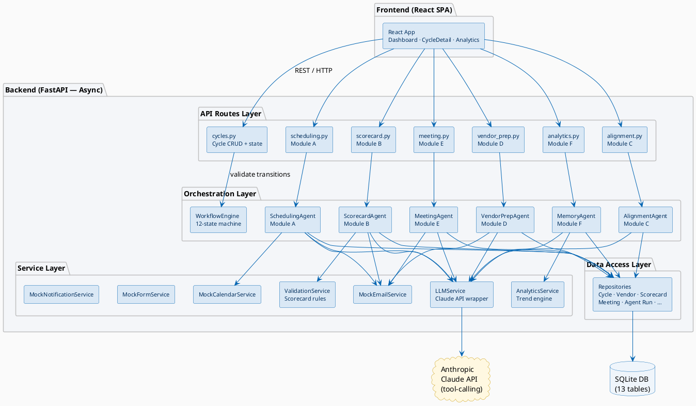
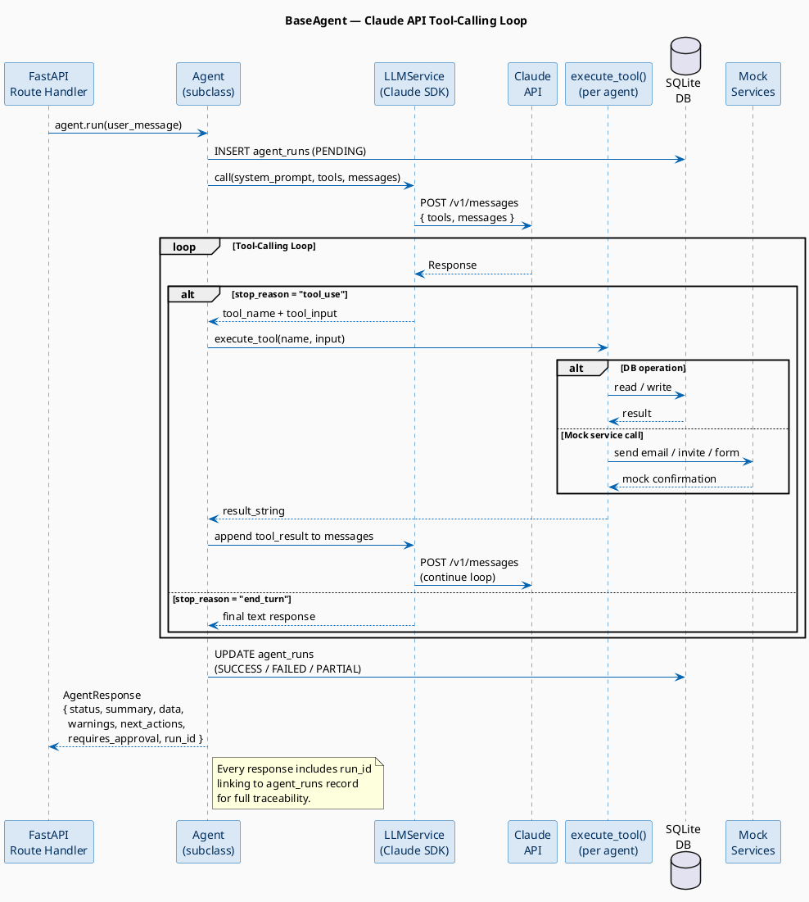
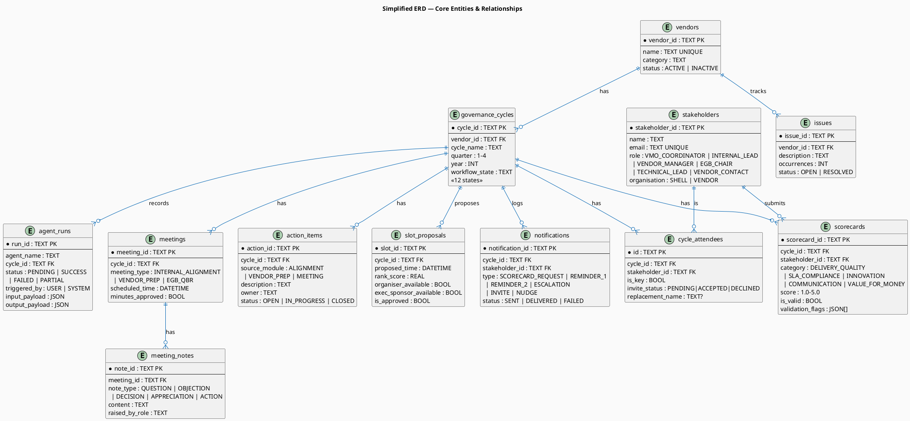

# VendorPulse — Backend High-Level Design UML Diagrams

> **Format:** PlantUML | Render at: https://www.plantuml.com/plantuml/uml
> **Coverage:** System architecture · Workflow state machine · Agent pipeline · Tool-calling loop · Service layer · Data model

---

## Table of Contents

1. [High-Level System Architecture](#1-high-level-system-architecture)
2. [Workflow State Machine](#2-workflow-state-machine)
3. [Agent Pipeline Overview (Modules A–F)](#3-agent-pipeline-overview-modules-af)
4. [Agent Tool-Calling Loop (Claude API)](#4-agent-tool-calling-loop-claude-api)
5. [Service Layer & Dependencies](#5-service-layer--dependencies)
6. [Simplified Data Model (ERD)](#6-simplified-data-model-erd)

---

## 1. High-Level System Architecture

---

## 2. Workflow State Machine

```plantuml
@startuml HLD_WorkflowStateMachine
skinparam backgroundColor #FAFAFA
skinparam state {
  BackgroundColor #DAE8F5
  BorderColor #0063B1
  FontColor #002D5C
  FontSize 11
}
skinparam note {
  BackgroundColor #FFF8E1
  BorderColor #C99A06
  FontSize 10
}
skinparam arrow {
  Color #0063B1
}

title VendorPulse — Governance Cycle Workflow State Machine
note as Legend
  Rule: Forward transitions only.
  No skipping. No rollback.
  WorkflowViolationError → HTTP 409.
end note

[*] --> CYCLE_CREATED

CYCLE_CREATED --> ATTENDEE_REFRESH_SENT : [Module A]\nSchedulingAgent\nsends refresh emails\n(requires approval)

ATTENDEE_REFRESH_SENT --> AVAILABILITY_COLLECTED : Attendees respond\nto refresh form

AVAILABILITY_COLLECTED --> MEETING_SCHEDULED : [Module A]\nCoordinator approves\nranked slot\n(requires approval)

note right of MEETING_SCHEDULED
  Calendar invite sent
  via MockCalendarService
end note

MEETING_SCHEDULED --> SCORECARD_REQUEST_SENT : [Module B]\nScorecardAgent\ndispatches forms\n(requires approval)

SCORECARD_REQUEST_SENT --> SCORECARD_COLLECTION : Stakeholders\nsubmit scores

note right of SCORECARD_COLLECTION
  ScorecardAgent sends
  tiered reminders:
  reminder_1 → reminder_2
  → escalation
end note

SCORECARD_COLLECTION --> SCORECARD_COMPILED : [Module B]\nScorecardAgent compiles\nvalidates + flags outliers

SCORECARD_COMPILED --> INTERNAL_ALIGNMENT : [Module C]\nAlignmentAgent generates\nalignment document

note right of INTERNAL_ALIGNMENT
  Highlights score deltas
  Flags high-spread categories
  Extracts action items
  from alignment notes
end note

INTERNAL_ALIGNMENT --> VENDOR_PREP : [Module D]\nVendorPrepAgent\ngenerates vendor brief\n(requires approval)

note right of VENDOR_PREP
  Handles vendor pushback
  with AI-generated
  FACTUAL / NEUTRAL /
  ESCALATION responses
end note

VENDOR_PREP --> MEETING_IN_PROGRESS : [Module E]\nMeetingAgent provides\nfacilitator briefing

MEETING_IN_PROGRESS --> POST_MEETING_COMPLETE : [Module E]\nMeetingAgent generates\nminutes + action items\n(requires approval)

POST_MEETING_COMPLETE --> ARCHIVED : Cycle archived

ARCHIVED --> [*]

note bottom of ARCHIVED
  [Module F] MemoryAgent
  reads ARCHIVED cycles
  for trend analysis,
  recurring issue detection,
  and leadership briefings.
  (Cross-cycle, read-only)
end note

@enduml
```

---

## 3. Agent Pipeline Overview (Modules A–F)

```plantuml
@startuml HLD_AgentPipeline
skinparam backgroundColor #FAFAFA
skinparam classBackgroundColor #DAE8F5
skinparam classBorderColor #0063B1
skinparam classHeaderBackgroundColor #0063B1
skinparam classFontColor #002D5C
skinparam packageBackgroundColor #F4F6F9
skinparam packageBorderColor #BFBFBF

title Agent Modules A–F — Capabilities & Tools

abstract class BaseAgent {
  + agent_name: str
  + db: AsyncSession
  + cycle_id: str
  + llm: LLMService
  + run_id: UUID
  --
  + {abstract} get_system_prompt(): str
  + {abstract} get_tools(): list[dict]
  + {abstract} execute_tool(name, input): str
  + run(message): AgentResponse
  - _tool_calling_loop(message)
  - _create_run_record()
  - _update_run_record()
  - _build_response()
}

class SchedulingAgent {
  agent_name = "scheduling_agent"
  --
  Tools:
  get_cycle_attendees()
  send_attendee_refresh_emails() *
  get_availability()
  rank_slots()
  create_slot_proposal()
  approve_and_schedule() *
  --
  * = requires_approval
}

class ScorecardAgent {
  agent_name = "scorecard_agent"
  --
  Tools:
  dispatch_scorecard_requests() *
  get_submission_status()
  send_reminder() *
  compile_scorecard()
  flag_outliers()
  --
  * = requires_approval
}

class AlignmentAgent {
  agent_name = "alignment_agent"
  --
  Tools:
  get_score_diff()
  get_alignment_flags()
  generate_alignment_doc()
  update_face_off_model()
  extract_action_items()
}

class VendorPrepAgent {
  agent_name = "vendor_prep_agent"
  --
  Tools:
  get_compiled_scorecard()
  get_trend_data()
  generate_vendor_brief() *
  handle_pushback()
  resolve_pushback()
  --
  * = requires_approval
}

class MeetingAgent {
  agent_name = "meeting_agent"
  --
  Tools:
  get_meeting_context()
  capture_note()
  parse_transcript()
  generate_minutes()
  approve_minutes() *
  extract_actions_from_minutes()
  --
  * = requires_approval
}

class MemoryAgent {
  agent_name = "memory_agent"
  --
  Tools:
  get_multi_cycle_scores()
  detect_recurring_issues()
  get_cross_vendor_data()
  generate_leadership_brief()
  update_issue_record()
  --
  (read-only — cross-cycle)
}

BaseAgent <|-- SchedulingAgent
BaseAgent <|-- ScorecardAgent
BaseAgent <|-- AlignmentAgent
BaseAgent <|-- VendorPrepAgent
BaseAgent <|-- MeetingAgent
BaseAgent <|-- MemoryAgent

note right of SchedulingAgent
  Module A
  States: CYCLE_CREATED →
  MEETING_SCHEDULED
end note

note right of ScorecardAgent
  Module B
  States: MEETING_SCHEDULED →
  SCORECARD_COMPILED
end note

note right of AlignmentAgent
  Module C
  State: INTERNAL_ALIGNMENT
end note

note right of VendorPrepAgent
  Module D
  State: VENDOR_PREP
end note

note right of MeetingAgent
  Module E
  States: MEETING_IN_PROGRESS →
  POST_MEETING_COMPLETE
end note

note right of MemoryAgent
  Module F
  Reads: ARCHIVED cycles
  Cross-cycle analytics
end note

@enduml
```

---

## 4. Agent Tool-Calling Loop (Claude API)

---

## 5. Service Layer & Dependencies

```plantuml
@startuml HLD_ServiceLayer
skinparam classBackgroundColor #DAE8F5
skinparam classBorderColor #0063B1
skinparam classHeaderBackgroundColor #0063B1
skinparam classFontColor #002D5C
skinparam backgroundColor #FAFAFA
skinparam packageBackgroundColor #F4F6F9
skinparam packageBorderColor #BFBFBF

title Service Layer — Responsibilities & Agent Consumers

package "Core Services" {

  class LLMService {
    - client: Anthropic SDK
    - model: claude-opus-4-6
    --
    + call(system, tools, messages)
    + handle_tool_use(response)
    + retry_on_overload()
    + log_token_usage()
  }

  class ValidationService {
    --
    + validate_score(score): bool
    + check_range(score): flag[]
    + detect_duplicate(cycle, stakeholder): bool
    + flag_outlier(scores): bool
    + compute_spread(scores): float
  }

  class AnalyticsService {
    --
    + compute_trends(vendor, cycles): TrendData
    + detect_recurring_issues(vendor): Issue[]
    + cross_vendor_compare(vendors): CompareData
    + compute_delta(prev, curr): ScoreChange[]
  }
}

package "Mock External Services" {

  abstract class BaseMockService {
    + {abstract} execute()
    + log_call()
    + return_mock_response()
  }

  class MockCalendarService {
    --
    + send_invite(attendees, slot): confirmation
    + update_invite(meeting_id): confirmation
    + cancel_invite(meeting_id): confirmation
  }

  class MockEmailService {
    --
    + send(to, subject, body): message_id
    + send_bulk(recipients, template): results[]
    + log_delivery()
  }

  class MockFormService {
    --
    + generate_link(cycle, stakeholder): url
    + collect_responses(cycle): responses[]
    + mark_submitted(stakeholder_id)
  }

  class MockNotificationService {
    --
    + push(stakeholder, content): notification_id
    + send_nudge(stakeholder, type)
    + broadcast(cycle, message)
  }

  BaseMockService <|-- MockCalendarService
  BaseMockService <|-- MockEmailService
  BaseMockService <|-- MockFormService
  BaseMockService <|-- MockNotificationService
}

package "Agent Consumers" {
  class SchedulingAgent
  class ScorecardAgent
  class AlignmentAgent
  class VendorPrepAgent
  class MeetingAgent
  class MemoryAgent
}

SchedulingAgent --> LLMService
SchedulingAgent --> MockCalendarService
SchedulingAgent --> MockEmailService

ScorecardAgent --> LLMService
ScorecardAgent --> ValidationService
ScorecardAgent --> MockEmailService
ScorecardAgent --> MockFormService

AlignmentAgent --> LLMService
AlignmentAgent --> AnalyticsService

VendorPrepAgent --> LLMService
VendorPrepAgent --> MockEmailService

MeetingAgent --> LLMService
MeetingAgent --> MockEmailService
MeetingAgent --> MockNotificationService

MemoryAgent --> LLMService
MemoryAgent --> AnalyticsService

@enduml
```

---

## 6. Simplified Data Model (ERD)

