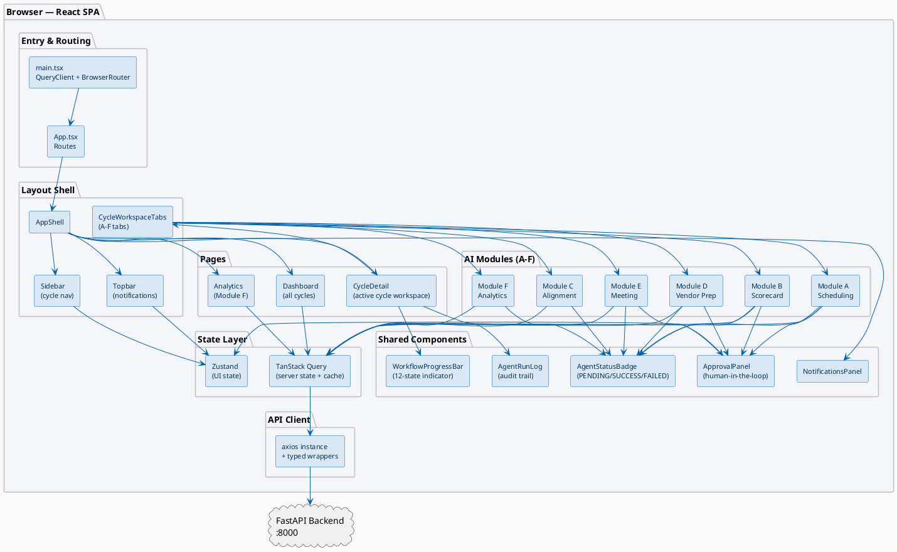
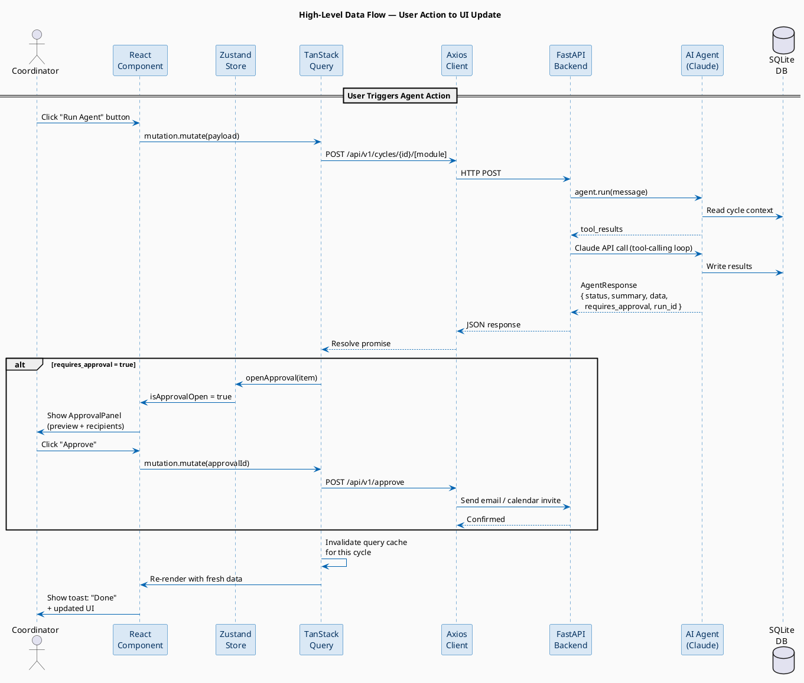
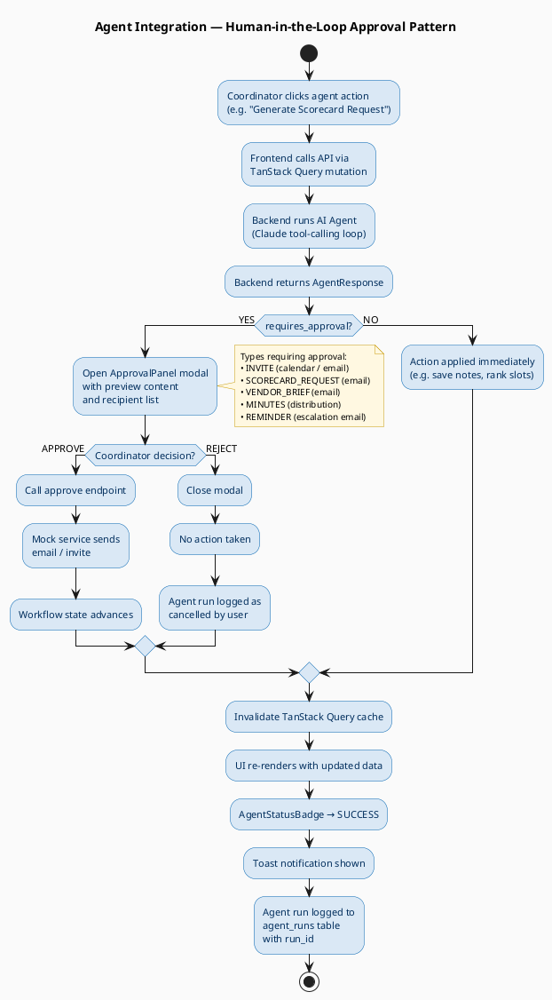
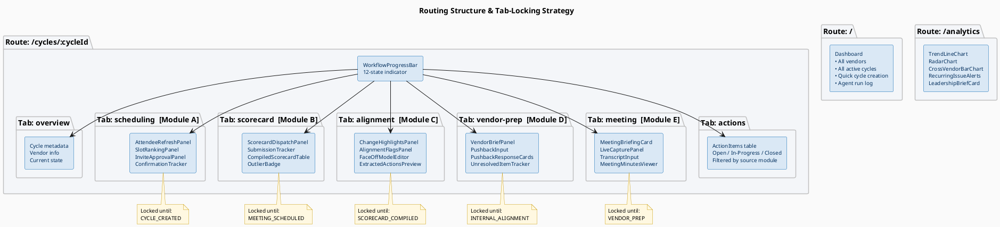

# VendorPulse — Frontend High-Level Design UML Diagrams

> **Format:** PlantUML | Render at: https://www.plantuml.com/plantuml/uml
> **Coverage:** System architecture · Module-workflow mapping · Data flow · State management · Agent integration

---

## Table of Contents

1. [High-Level Component Architecture](#1-high-level-component-architecture)
2. [Module-to-Workflow State Mapping](#2-module-to-workflow-state-mapping)
3. [State Management Architecture](#3-state-management-architecture)
4. [Full Data Flow Sequence](#4-full-data-flow-sequence)
5. [Agent Integration & Approval Flow](#5-agent-integration--approval-flow)
6. [Page & Routing Structure](#6-page--routing-structure)

---

## 1. High-Level Component Architecture

---

## 2. Module-to-Workflow State Mapping

```plantuml
@startuml HLD_WorkflowModuleMapping
skinparam backgroundColor #FAFAFA
skinparam state {
  BackgroundColor #DAE8F5
  BorderColor #0063B1
  FontColor #002D5C
  FontSize 11
}
skinparam note {
  BackgroundColor #FFF8E1
  BorderColor #C99A06
  FontSize 10
}

title VendorPulse — Workflow States mapped to Frontend Modules

[*] --> CYCLE_CREATED

state "MODULE A — Scheduling" as ModA #E8F5E9 {
  CYCLE_CREATED --> ATTENDEE_REFRESH_SENT : Scheduling Agent\nsends refresh emails
  ATTENDEE_REFRESH_SENT --> AVAILABILITY_COLLECTED : Attendees respond
  AVAILABILITY_COLLECTED --> MEETING_SCHEDULED : Coordinator\napproves slot
}

state "MODULE B — Scorecard" as ModB #E3F2FD {
  MEETING_SCHEDULED --> SCORECARD_REQUEST_SENT : Scorecard Agent\ndispatches forms
  SCORECARD_REQUEST_SENT --> SCORECARD_COLLECTION : Stakeholders submit
  SCORECARD_COLLECTION --> SCORECARD_COMPILED : Scorecard Agent\ncompiles + validates
}

state "MODULE C — Alignment" as ModC #FFF3E0 {
  SCORECARD_COMPILED --> INTERNAL_ALIGNMENT : Alignment Agent\ngenerates alignment doc
}

state "MODULE D — Vendor Prep" as ModD #FCE4EC {
  INTERNAL_ALIGNMENT --> VENDOR_PREP : Vendor Prep Agent\ngenerates brief
}

state "MODULE E — Meeting" as ModE #F3E5F5 {
  VENDOR_PREP --> MEETING_IN_PROGRESS : Meeting Agent\nprovides briefing card
  MEETING_IN_PROGRESS --> POST_MEETING_COMPLETE : Meeting Agent\ngenerates minutes
}

state "MODULE F — Analytics" as ModF #E8EAF6 {
  POST_MEETING_COMPLETE --> ARCHIVED : Cycle archived
  ARCHIVED --> ARCHIVED : Memory Agent\nanalyses trends\n(cross-cycle)
}

ARCHIVED --> [*]

note right of ModA
  Components:
  AttendeeRefreshPanel
  SlotRankingPanel
  InviteApprovalPanel
  ConfirmationTracker
end note

note right of ModB
  Components:
  ScorecardDispatchPanel
  SubmissionTracker
  CompiledScorecardTable
  OutlierBadge
end note

note right of ModC
  Components:
  ChangeHighlightsPanel
  AlignmentFlagsPanel
  FaceOffModelEditor
  ExtractedActionsPreview
end note

note right of ModD
  Components:
  VendorBriefPanel
  PushbackInput
  PushbackResponseCards
  UnresolvedItemTracker
end note

note right of ModE
  Components:
  MeetingBriefingCard
  LiveCapturePanel
  TranscriptInput
  MeetingMinutesViewer
end note

note right of ModF
  Components:
  TrendLineChart
  RadarChart
  CrossVendorBarChart
  RecurringIssueAlerts
  LeadershipBriefCard
end note

@enduml
```

---

## 3. State Management Architecture

```plantuml
@startuml HLD_StateManagement
skinparam classBackgroundColor #DAE8F5
skinparam classBorderColor #0063B1
skinparam classHeaderBackgroundColor #0063B1
skinparam classFontColor #002D5C
skinparam backgroundColor #FAFAFA
skinparam packageBackgroundColor #F4F6F9
skinparam packageBorderColor #BFBFBF

title State Management — Two-Store System

package "Zustand (UI / Ephemeral State)" {

  class useCycleStore {
    + activeCycleId: string | null
    + activeVendorId: string | null
    + activeTab: TabKey
    --
    + setActiveCycleId(id)
    + setActiveVendorId(id)
    + setActiveTab(tab: TabKey)
  }

  class useApprovalStore {
    + pendingApproval: ApprovalItem | null
    + isApprovalOpen: boolean
    --
    + openApproval(item: ApprovalItem)
    + closeApproval()
    + confirmApproval(approvalId)
    + rejectApproval(approvalId)
  }

  class useUIStore {
    + sidebarCollapsed: boolean
    + notificationsOpen: boolean
    + agentRunLogOpen: boolean
    --
    + toggleSidebar()
    + toggleNotifications()
    + toggleAgentRunLog()
  }

  class ApprovalItem {
    + id: string
    + type: INVITE | SCORECARD_REQUEST\n   | VENDOR_BRIEF | MINUTES | REMINDER
    + summary: string
    + previewContent: string
    + recipients: string[]
    + agentRunId: string
  }

  useApprovalStore --> ApprovalItem : contains
}

package "TanStack Query (Server / Async State)" {

  class useCycles {
    + useGetCycles(): Cycle[]
    + useGetCycle(id): Cycle
    + useCreateCycle(): Mutation
  }

  class useScheduling {
    + useGetAttendees(cycleId): Attendee[]
    + useGetSlots(cycleId): SlotProposal[]
    + useRunSchedulingAgent(): Mutation
    + useApproveSlot(): Mutation
  }

  class useScorecard {
    + useGetScorecards(cycleId)
    + useSubmitScore(): Mutation
    + useCompileScorecard(): Mutation
    + useGetCompiledScorecard(cycleId)
  }

  class useAlignment {
    + useGetScoreDiff(cycleId)
    + useGetAlignmentFlags(cycleId)
    + useExtractActions(): Mutation
    + useGetActionItems(cycleId)
  }

  class useVendorPrep {
    + useGetVendorBrief(cycleId)
    + useGenerateBrief(): Mutation
    + useSubmitPushback(): Mutation
    + useGetPushbackItems(cycleId)
  }

  class useMeeting {
    + useGetMeetingContext(cycleId)
    + useCaptureNote(): Mutation
    + useParseTranscript(): Mutation
    + useGetMinutes(cycleId)
    + useApproveMinutes(): Mutation
  }

  class useAnalytics {
    + useGetTrends(vendorId)
    + useGetCrossVendorData()
    + useGetLeadershipBrief(vendorId)
    + useGetRecurringIssues(vendorId)
  }
}

package "API Client (axios)" {
  class AxiosClient {
    + baseURL: VITE_API_BASE_URL
    + interceptors: error handler
    --
    + get<T>(url): Promise<T>
    + post<T>(url, data): Promise<T>
    + patch<T>(url, data): Promise<T>
  }
}

useCycles --> AxiosClient
useScheduling --> AxiosClient
useScorecard --> AxiosClient
useAlignment --> AxiosClient
useVendorPrep --> AxiosClient
useMeeting --> AxiosClient
useAnalytics --> AxiosClient

@enduml
```

---

## 4. Full Data Flow Sequence

---

## 5. Agent Integration & Approval Flow

---

## 6. Page & Routing Structure

