# VendorPulse — Backend UML Diagrams

> **Format:** PlantUML | Render at: https://www.plantuml.com/plantuml/uml  
> **Coverage:** ERD · Class diagrams · Sequence flows · State machine · Component architecture

---

## Table of Contents

1. [System Architecture Component Diagram](#1-system-architecture-component-diagram)
2. [Entity Relationship Diagram (ERD)](#2-entity-relationship-diagram-erd)
3. [ORM Model Class Diagram](#3-orm-model-class-diagram)
4. [Agent Class Hierarchy Diagram](#4-agent-class-hierarchy-diagram)
5. [Service Layer Class Diagram](#5-service-layer-class-diagram)
6. [Repository Layer Class Diagram](#6-repository-layer-class-diagram)
7. [Pydantic Schema Class Diagram](#7-pydantic-schema-class-diagram)
8. [Workflow Engine Class & State Diagram](#8-workflow-engine-class--state-diagram)
9. [Mock Services Class Diagram](#9-mock-services-class-diagram)
10. [Sequence: Full Request Lifecycle](#10-sequence-full-request-lifecycle)
11. [Sequence: Agent Tool-Calling Loop (Claude API)](#11-sequence-agent-tool-calling-loop-claude-api)
12. [Sequence: Module A — Scheduling Agent Execution](#12-sequence-module-a--scheduling-agent-execution)
13. [Sequence: Module B — Scorecard Validation Pipeline](#13-sequence-module-b--scorecard-validation-pipeline)
14. [Sequence: Module C — Alignment & Action Extraction](#14-sequence-module-c--alignment--action-extraction)
15. [Sequence: Module D — Vendor Brief Generation](#15-sequence-module-d--vendor-brief-generation)
16. [Sequence: Module E — Minutes Generation](#16-sequence-module-e--minutes-generation)
17. [Sequence: Module F — Recurring Issue Detection](#17-sequence-module-f--recurring-issue-detection)
18. [Sequence: Seed Data Initialisation](#18-sequence-seed-data-initialisation)
19. [State Machine: Workflow Engine](#19-state-machine-workflow-engine)
20. [Activity: Scorecard Compilation Pipeline](#20-activity-scorecard-compilation-pipeline)
21. [Activity: LLM Service with Retry](#21-activity-llm-service-with-retry)
22. [Deployment Component Diagram](#22-deployment-component-diagram)

---

## 1. System Architecture Component Diagram

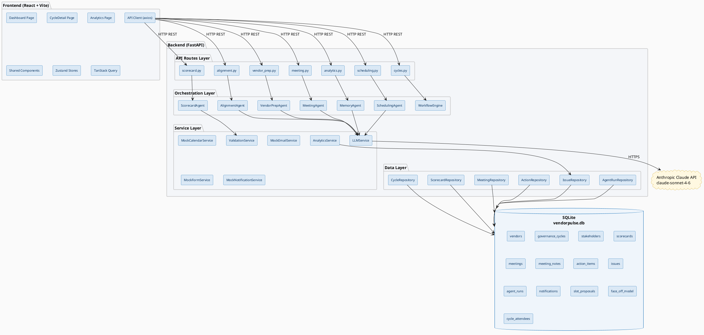

---

## 2. Entity Relationship Diagram (ERD)

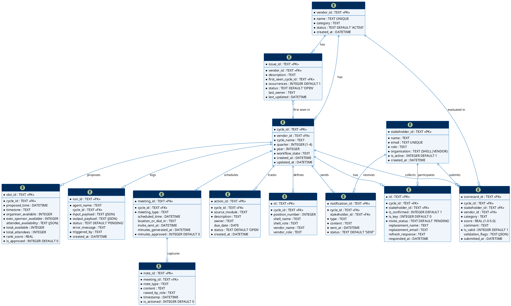

---

## 3. ORM Model Class Diagram

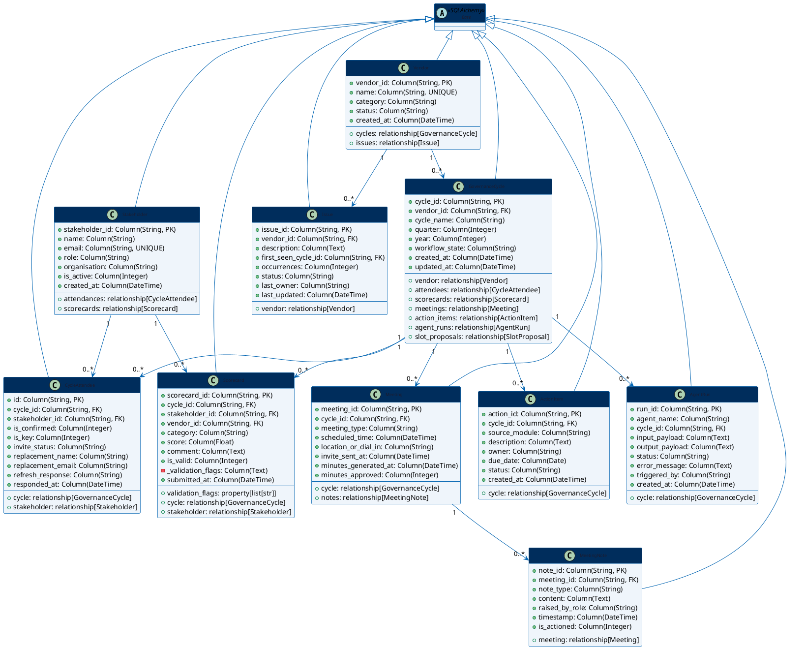

---

## 4. Agent Class Hierarchy Diagram

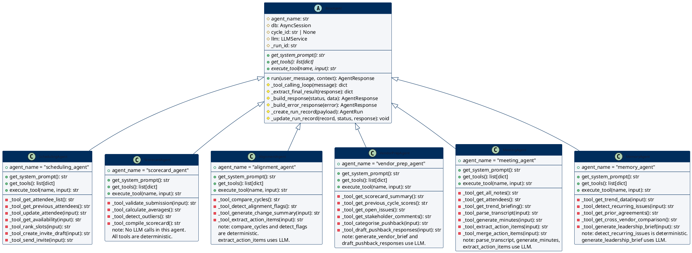

---

## 5. Service Layer Class Diagram

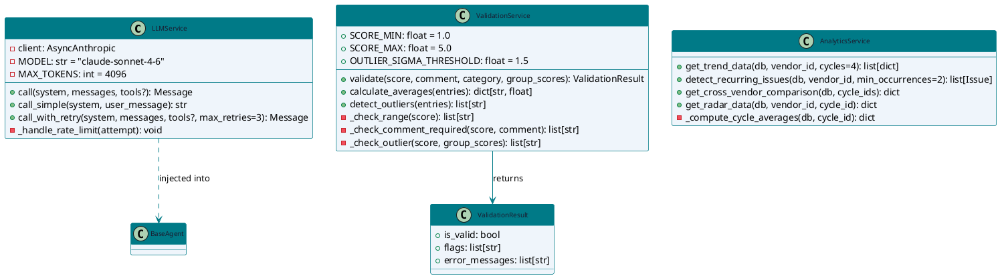

---

## 6. Repository Layer Class Diagram

```plantuml
@startuml RepositoryLayer
skinparam classBackgroundColor #F4F6F9
skinparam classBorderColor #002D5C
skinparam classHeaderBackgroundColor #0063B1
skinparam classHeaderFontColor #FFFFFF
skinparam classFontColor #1A1A2E
skinparam classFontSize 10
skinparam arrowColor #002D5C

abstract class BaseRepository {
  #model: Type
  --
  +get(db, id): Model | None
  +get_all(db): list[Model]
  +create(db, obj): Model
  +update(db, obj): Model
  +delete(db, id): bool
}

class CycleRepository {
  --
  +get_by_vendor(db, vendor_id): list[GovernanceCycle]
  +get_recent(db, vendor_id, limit=4): list[GovernanceCycle]
  +get_all_filtered(db, vendor_id?): list[GovernanceCycle]
  +update_workflow_state(db, cycle_id, state): void
}

class VendorRepository {
  --
  +get_by_name(db, name): Vendor | None
  +get_active(db): list[Vendor]
}

class StakeholderRepository {
  --
  +get_active(db): list[Stakeholder]
  +get_by_role(db, role): list[Stakeholder]
  +get_by_email(db, email): Stakeholder | None
}

class AttendeeRepository {
  --
  +get_by_cycle(db, cycle_id): list[CycleAttendee]
  +get_key_attendees(db, cycle_id): list[CycleAttendee]
  +update_status(db, id, status): CycleAttendee
  +bulk_confirm(db, cycle_id): void
}

class ScorecardRepository {
  --
  +get_by_cycle(db, cycle_id): list[Scorecard]
  +get_valid(db, cycle_id): list[Scorecard]
  +get_by_stakeholder(db, cycle_id, stakeholder_id): list[Scorecard]
  +get_averages(db, cycle_id): dict[str, float]
  +get_previous_cycle_averages(db, cycle_id): dict[str, float]
  +get_submission_status(db, cycle_id, stakeholder_ids): list[dict]
}

class MeetingRepository {
  --
  +get_by_cycle(db, cycle_id): list[Meeting]
  +get_by_type(db, cycle_id, meeting_type): Meeting | None
  +get_notes(db, meeting_id): list[MeetingNote]
  +add_note(db, note): MeetingNote
  +approve_minutes(db, meeting_id): void
}

class ActionRepository {
  --
  +get_by_cycle(db, cycle_id): list[ActionItem]
  +get_by_module(db, cycle_id, source_module): list[ActionItem]
  +get_open(db, cycle_id): list[ActionItem]
  +update_status(db, action_id, status): ActionItem
  +bulk_create(db, actions): list[ActionItem]
}

class IssueRepository {
  --
  +get_by_vendor(db, vendor_id): list[Issue]
  +get_recurring(db, vendor_id, min_occurrences=2): list[Issue]
  +increment_occurrence(db, issue_id): Issue
  +resolve(db, issue_id): Issue
}

class AgentRunRepository {
  --
  +get_by_cycle(db, cycle_id): list[AgentRun]
  +get_recent(db, limit=20): list[AgentRun]
  +get_failures(db): list[AgentRun]
  +create_run(db, agent_name, cycle_id, input): AgentRun
  +complete_run(db, run_id, output, status): AgentRun
}

class SlotRepository {
  --
  +get_by_cycle(db, cycle_id): list[SlotProposal]
  +get_approved(db, cycle_id): SlotProposal | None
  +create_batch(db, slots): list[SlotProposal]
  +approve(db, slot_id): SlotProposal
}

BaseRepository <|-- CycleRepository
BaseRepository <|-- VendorRepository
BaseRepository <|-- StakeholderRepository
BaseRepository <|-- AttendeeRepository
BaseRepository <|-- ScorecardRepository
BaseRepository <|-- MeetingRepository
BaseRepository <|-- ActionRepository
BaseRepository <|-- IssueRepository
BaseRepository <|-- AgentRunRepository
BaseRepository <|-- SlotRepository

@enduml
```

---

## 7. Pydantic Schema Class Diagram

```plantuml
@startuml PydanticSchemas
skinparam classBackgroundColor #DAE8F5
skinparam classBorderColor #0063B1
skinparam classHeaderBackgroundColor #0063B1
skinparam classHeaderFontColor #FFFFFF
skinparam classFontColor #1A1A2E
skinparam classFontSize 9
skinparam arrowColor #002D5C
skinparam packageBackgroundColor #F4F6F9
skinparam packageBorderColor #BFBFBF

package "common.py" {
  class AgentResponse<T> {
    +status: str
    +agent: str
    +summary: str
    +data: T
    +warnings: list[str]
    +next_actions: list[str]
    +requires_approval: bool
    +run_id: str
  }
  class ErrorResponse {
    +detail: str
    +code: str
  }
}

package "cycle_schema.py" {
  class CycleCreateIn {
    +vendor_id: str
    +cycle_name: str
    +quarter: int
    +year: int
  }
  class CycleOut {
    +cycle_id: str
    +vendor_id: str
    +vendor_name: str
    +cycle_name: str
    +quarter: int
    +year: int
    +workflow_state: str
    +created_at: datetime
    +updated_at: datetime
  }
}

package "scheduling_schema.py" {
  class AttendeeOut {
    +id: str
    +stakeholder_id: str
    +name: str
    +email: str
    +role: str
    +is_key: bool
    +is_confirmed: bool
    +invite_status: str
    +replacement_name: str | None
    +replacement_email: str | None
  }
  class SlotProposalOut {
    +slot_id: str
    +proposed_time: datetime
    +timezone: str
    +rank_score: float
    +organiser_available: bool
    +exec_sponsor_available: bool
    +attendee_availability: dict[str,bool]
    +total_available: int
    +total_attendees: int
    +is_approved: bool
  }
  class ApproveSlotIn {
    +slot_id: str
  }
}

package "scorecard_schema.py" {
  class ScorecardSubmitIn {
    +stakeholder_id: str
    +scores: dict[str, float]
    +comments: dict[str, str]
  }
  class ScorecardEntryOut {
    +scorecard_id: str
    +stakeholder_id: str
    +stakeholder_name: str
    +category: str
    +score: float
    +comment: str | None
    +is_valid: bool
    +validation_flags: list[str]
    +submitted_at: datetime
  }
  class CompiledScorecardOut {
    +cycle_id: str
    +vendor_id: str
    +entries: list[ScorecardEntryOut]
    +averages: dict[str,float]
    +overall_average: float
    +outlier_count: int
    +missing_count: int
    +compiled_at: datetime
  }
}

package "alignment_schema.py" {
  class ScoreChangeOut {
    +category: str
    +previous_score: float
    +current_score: float
    +delta: float
    +is_significant: bool
  }
  class AlignmentFlagOut {
    +category: str
    +min_score: float
    +max_score: float
    +spread: float
    +prompt_question: str
    +stakeholders_involved: list[str]
  }
  class ExtractActionsIn {
    +raw_notes: str
  }
  class ActionItemOut {
    +action_id: str
    +source_module: str
    +description: str
    +owner: str | None
    +due_date: date | None
    +status: str
    +created_at: datetime
  }
}

package "vendor_prep_schema.py" {
  class VendorBriefOut {
    +overall_score: float
    +overall_trend: str
    +category_ratings: list[dict]
    +key_concerns: list[str]
    +positive_areas: list[str]
    +generated_at: datetime
  }
  class PushbackItemIn {
    +description: str
    +category: str
  }
  class PushbackItemOut {
    +id: str
    +description: str
    +category: str
    +requires_legal_review: bool
    +status: str
    +responses: list[PushbackResponseOut]
  }
  class PushbackResponseOut {
    +stance: str
    +content: str
    +is_selected: bool
  }
}

package "meeting_schema.py" {
  class CaptureNoteIn {
    +note_type: str
    +content: str
    +raised_by_role: str | None
  }
  class MeetingNoteOut {
    +note_id: str
    +note_type: str
    +content: str
    +raised_by_role: str | None
    +timestamp: datetime
    +is_actioned: bool
  }
  class ParseTranscriptIn {
    +transcript: str
  }
  class MeetingMinutesOut {
    +meeting_id: str
    +generated_at: datetime
    +metadata: dict
    +executive_summary: str
    +agenda_summaries: list[dict]
    +key_decisions: list[str]
    +qa_log: list[MeetingNoteOut]
    +action_items: list[ActionItemOut]
    +approved: bool
  }
}

CompiledScorecardOut --> ScorecardEntryOut
MeetingMinutesOut --> MeetingNoteOut
MeetingMinutesOut --> ActionItemOut
PushbackItemOut --> PushbackResponseOut

@enduml
```

---

## 8. Workflow Engine Class & State Diagram

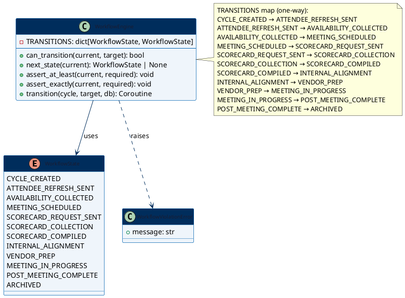

---

## 9. Mock Services Class Diagram

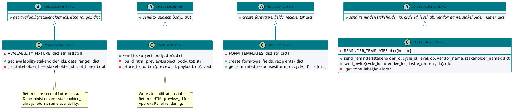

---

## 10. Sequence: Full Request Lifecycle

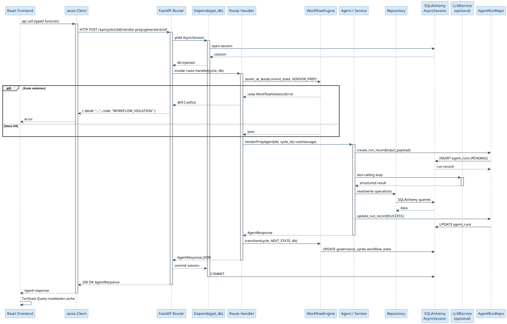

---

## 11. Sequence: Agent Tool-Calling Loop (Claude API)

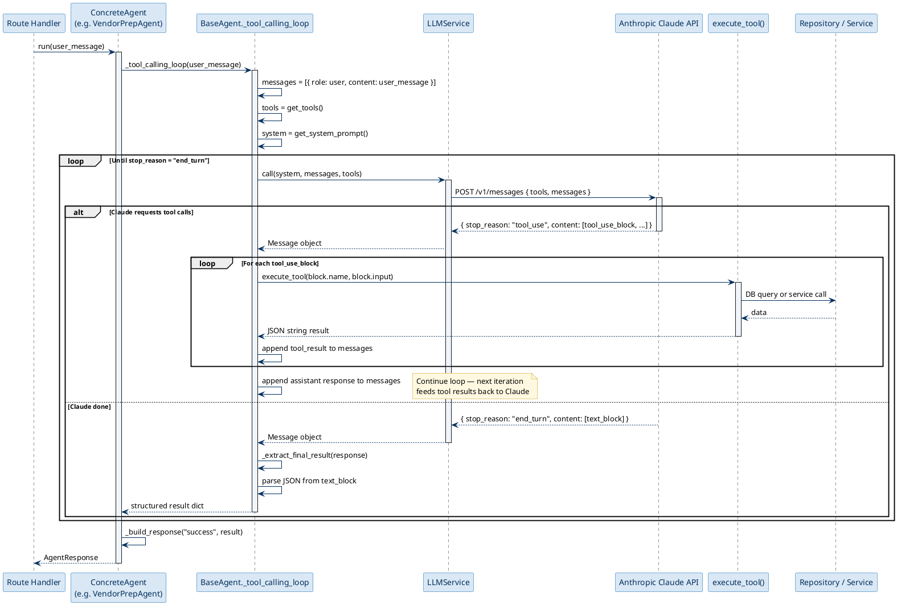

---

## 12. Sequence: Module A — Scheduling Agent Execution

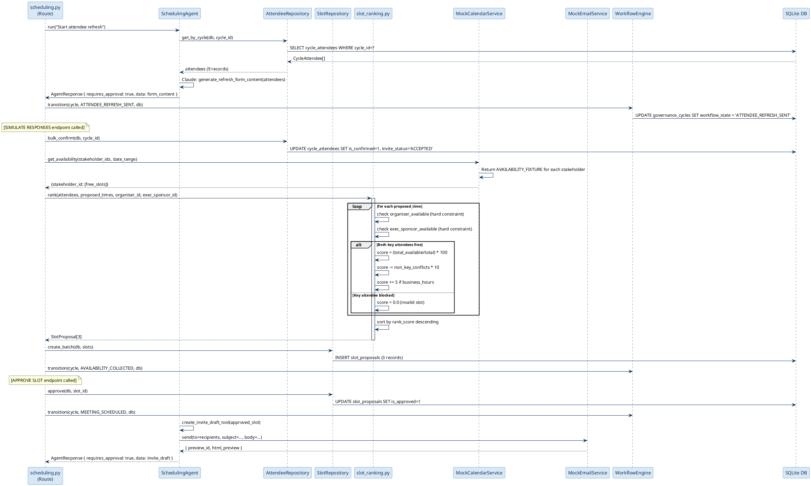

---

## 13. Sequence: Module B — Scorecard Validation Pipeline

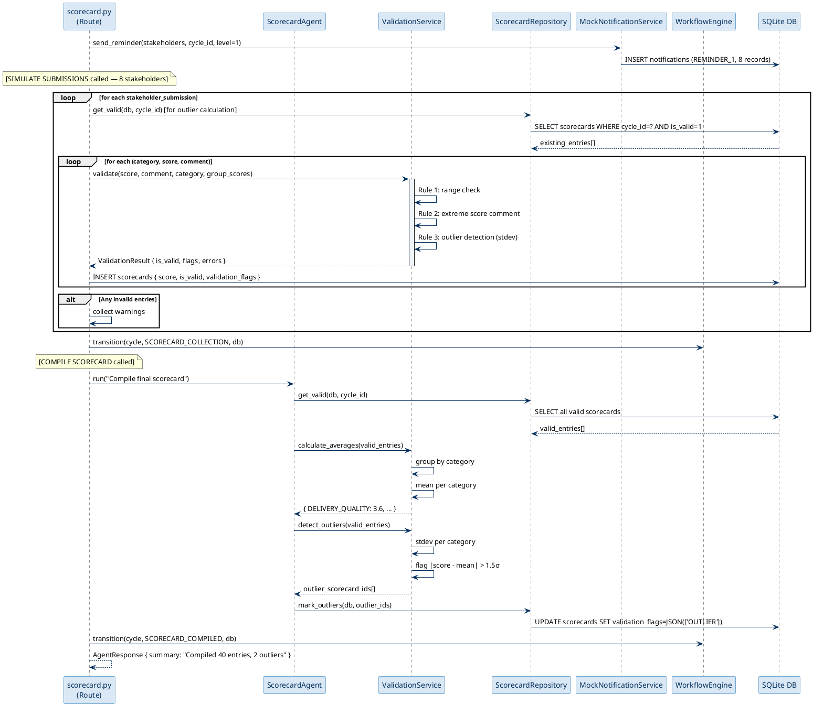

---

## 14. Sequence: Module C — Alignment & Action Extraction

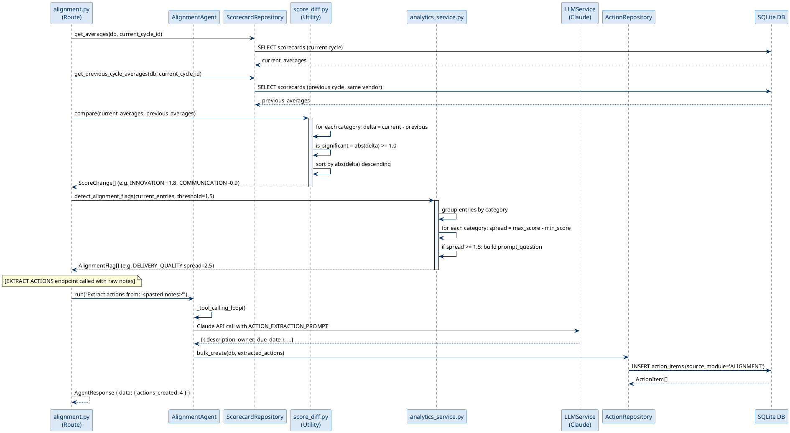

---

## 15. Sequence: Module D — Vendor Brief Generation

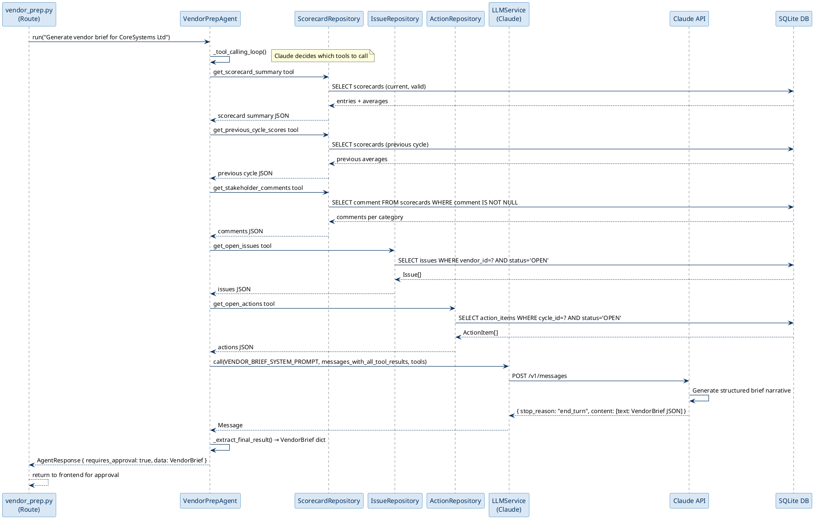

---

## 16. Sequence: Module E — Minutes Generation

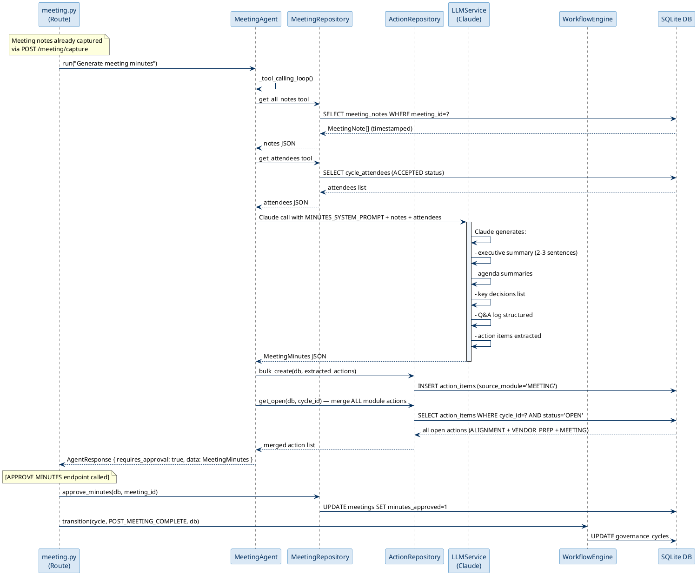

---

## 17. Sequence: Module F — Recurring Issue Detection

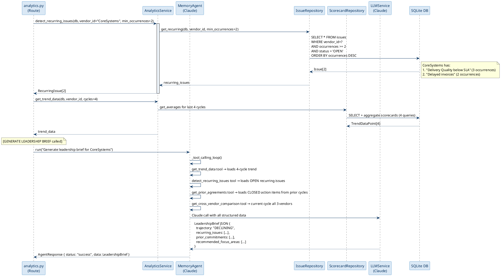

---

## 18. Sequence: Seed Data Initialisation

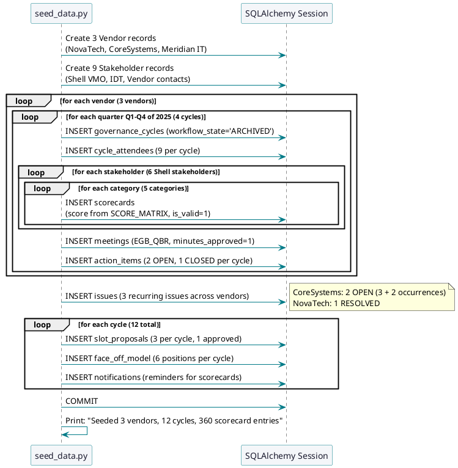

---

## 19. State Machine: Workflow Engine

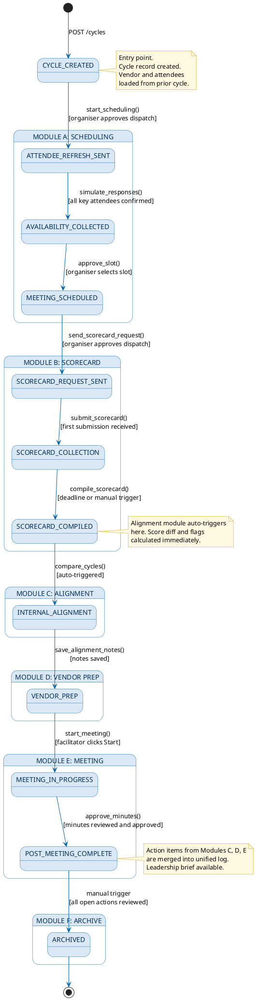

---

## 20. Activity: Scorecard Compilation Pipeline

```plantuml
@startuml ScorecardCompilation
skinparam activityBackgroundColor #EFF5FB
skinparam activityBorderColor #0063B1
skinparam activityFontColor #1A1A2E
skinparam arrowColor #0063B1
skinparam noteBackgroundColor #FFF8E1
skinparam noteBorderColor #C99A06

|Route Handler|
start
:POST /cycles/{id}/scorecard/compile;
:Load all scorecards for cycle_id;

|ValidationService|
:Separate VALID from INVALID entries;
if (valid_count >= minimum threshold?) then (no)
  |Route Handler|
  :Return 400: "Insufficient submissions";
  stop
else (yes)
  :Proceed with valid entries;
endif

:Group entries by CATEGORY;
:Calculate mean per category;
:Calculate overall_average;
note right: weighted average across\nall 5 categories

:Run outlier detection per category;
loop for each category group
  if (group_size >= 3?) then (yes)
    :Calculate stdev;
    loop for each entry in group
      if (|score - mean| > 1.5 * stdev?) then (yes)
        :Mark entry: OUTLIER flag;
        :UPDATE scorecards SET validation_flags;
      else (no)
        :Entry is clean;
      endif
    end
  else (no)
    :Skip outlier check (too few entries);
  endif
end

|Route Handler|
:Build CompiledScorecardOut;
:averages per category;
:outlier_count;
:missing_count (stakeholders without submission);
:compiled_at = now();

:UPDATE governance_cycles\nSET workflow_state = SCORECARD_COMPILED;

:Log to agent_runs (status=SUCCESS);
:Return AgentResponse;

|AlignmentModule (auto-triggered)|
:score_diff.compare(current, previous);
:detect_alignment_flags(current_entries);
:UPDATE governance_cycles\nSET workflow_state = INTERNAL_ALIGNMENT;

stop

@enduml
```

---

## 21. Activity: LLM Service with Retry

```plantuml
@startuml LLMRetry
skinparam activityBackgroundColor #EFF5FB
skinparam activityBorderColor #007A87
skinparam activityFontColor #1A1A2E
skinparam arrowColor #007A87
skinparam noteBackgroundColor #FFF8E1
skinparam noteBorderColor #C99A06

|LLMService.call_with_retry|
start
:attempt = 0;
:max_retries = 3;

repeat
  :POST /v1/messages to Anthropic API;

  if (Response OK?) then (yes)
    :Return Message object;
    stop
  else (no)
    if (RateLimitError?) then (yes)
      :attempt += 1;
      if (attempt < max_retries?) then (yes)
        :sleep(2 ^ attempt seconds);
        note right: Exponential backoff:\n2s, 4s, 8s
      else (no)
        :raise RateLimitError;
        stop
      endif
    else if (APIConnectionError?) then (yes)
      :attempt += 1;
      if (attempt < max_retries?) then (yes)
        :sleep(1 second);
      else (no)
        :Build error AgentResponse;
        :status = "failed";
        :warnings = ["LLM unavailable"];
        :next_actions = ["RETRY"];
        :Return fallback AgentResponse;
        stop
      endif
    else if (JSONDecodeError on output?) then (yes)
      :Log raw_output to agent_runs;
      :Return AgentResponse {\n  status: "partial",\n  data: { raw_output: ... }\n};
      stop
    else
      :Unexpected error;
      :Log full traceback;
      :raise Exception;
      stop
    endif
  endif
repeat while (attempt < max_retries)

stop

@enduml
```

---

## 22. Deployment Component Diagram

```plantuml
@startuml Deployment
skinparam nodeBackgroundColor #DAE8F5
skinparam nodeBorderColor #0063B1
skinparam nodeFontColor #002D5C
skinparam componentBackgroundColor #F4F6F9
skinparam componentBorderColor #007A87
skinparam databaseBackgroundColor #EFF5FB
skinparam databaseBorderColor #0063B1
skinparam cloudBackgroundColor #FFF8E1
skinparam cloudBorderColor #C99A06
skinparam arrowColor #002D5C

actor "Shell Executive\n(Browser)" as User

node "Vercel CDN\n(Frontend)" as Vercel {
  component "React SPA\n(dist/index.html)" as FE
  component "Vite Build\n(assets/*.js, *.css)" as Assets
}

node "Render.com / Fly.io\n(Backend)" as Backend {
  component "uvicorn\n(ASGI server)" as Uvicorn
  component "FastAPI App\n(app/main.py)" as App
  component "Agent Modules\n(6 agents)" as Agents
  component "Service Layer\n(LLM, Validation, Analytics)" as Services
  database "SQLite\n(/data/vendorpulse.db)" as SQLite
}

cloud "Anthropic API\n(External)" as Anthropic {
  component "claude-sonnet-4-6\nTool-calling endpoint" as Claude
}

User --> Vercel : HTTPS
Vercel --> Backend : HTTPS API calls\n/api/*
Backend --> Anthropic : HTTPS\nPOST /v1/messages

FE --> Assets : bundles
FE --> App : axios REST calls
Uvicorn --> App : routes
App --> Agents
App --> Services
Agents --> Services
Services --> SQLite
Services --> Claude

note right of Backend
  Environment variables:
  - ANTHROPIC_API_KEY
  - DATABASE_URL
  - CORS_ORIGINS
end note

note right of SQLite
  Persisted via volume mount.
  Seed data loaded at startup.
  Reset-friendly for demo.
end note

@enduml
```

---

*VendorPulse Backend UML v1.0 — Zensar Technologies — 2026-04-01*
