# VendorPulse — Frontend UML Diagrams

> **Format:** PlantUML | Render at: https://www.plantuml.com/plantuml/uml  
> **Coverage:** Component hierarchy · State management · Type system · Sequence flows · Activity flows

---

## Table of Contents

1. [Component Tree Diagram](#1-component-tree-diagram)
2. [Shared Component Class Diagram](#2-shared-component-class-diagram)
3. [Module Components Class Diagram](#3-module-components-class-diagram)
4. [Zustand Store Class Diagram](#4-zustand-store-class-diagram)
5. [TypeScript Type System Class Diagram](#5-typescript-type-system-class-diagram)
6. [API Client Layer Class Diagram](#6-api-client-layer-class-diagram)
7. [TanStack Query Hooks Class Diagram](#7-tanstack-query-hooks-class-diagram)
8. [Sequence: Approval Flow](#8-sequence-approval-flow)
9. [Sequence: Module A — Scheduling Flow](#9-sequence-module-a--scheduling-flow)
10. [Sequence: Module B — Scorecard Submission](#10-sequence-module-b--scorecard-submission)
11. [Sequence: Module D — Vendor Brief & Pushback](#11-sequence-module-d--vendor-brief--pushback)
12. [Sequence: Module E — Live Meeting Capture & Minutes](#12-sequence-module-e--live-meeting-capture--minutes)
13. [Sequence: Module F — Analytics & Leadership Brief](#13-sequence-module-f--analytics--leadership-brief)
14. [Sequence: TanStack Query Cache Invalidation](#14-sequence-tanstack-query-cache-invalidation)
15. [Activity: Cycle Workspace Tab Navigation](#15-activity-cycle-workspace-tab-navigation)
16. [Activity: Scorecard Validation Flow](#16-activity-scorecard-validation-flow)
17. [State: AgentStatusBadge States](#17-state-agentstatusbadge-states)
18. [State: ApprovalPanel States](#18-state-approvalpanel-states)

---

## 1. Component Tree Diagram

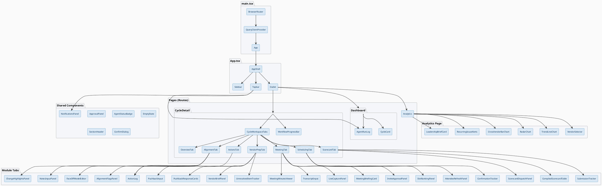

---

## 2. Shared Component Class Diagram

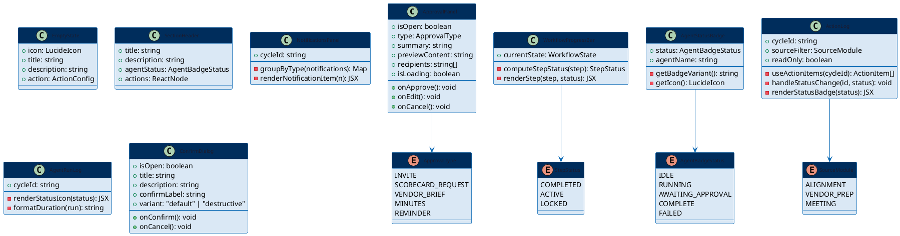

---

## 3. Module Components Class Diagram

```plantuml
@startuml ModuleComponents
skinparam classBackgroundColor #F4F6F9
skinparam classBorderColor #007A87
skinparam classHeaderBackgroundColor #007A87
skinparam classHeaderFontColor #FFFFFF
skinparam classFontColor #1A1A2E
skinparam classFontSize 10
skinparam arrowColor #007A87
skinparam packageBackgroundColor #EAF7F8
skinparam packageBorderColor #007A87

package "Module A — Scheduling" {
  class AttendeeRefreshPanel {
    +cycleId: string
    --
    -useAttendees(cycleId)
    -useStartScheduling()
    -useSimulateResponses()
    +handleDispatch(): void
    +handleSimulate(): void
  }

  class SlotRankingPanel {
    +cycleId: string
    --
    -useRankedSlots(cycleId)
    -useApproveSlot()
    +handleApprove(slotId): void
  }

  class SlotCard {
    +slot: SlotProposal
    +rank: 1|2|3
    --
    +onApprove(slotId): void
    -renderAvailabilityBreakdown(): JSX
  }

  class InviteApprovalPanel {
    +cycleId: string
    --
    -useInviteDraft(cycleId)
    -useSendInvite()
    +handleApprove(): void
  }

  class ConfirmationTracker {
    +cycleId: string
    --
    -useAttendees(cycleId)
    -renderStatusBadge(status): JSX
  }
}

package "Module B — Scorecard" {
  class ScorecardDispatchPanel {
    +cycleId: string
    --
    -useSendScorecardRequest()
    +handleDispatch(): void
  }

  class SubmissionTracker {
    +cycleId: string
    --
    -useSubmissionStatus(cycleId)
    +expandRow(stakeholderId): void
  }

  class ReminderHistory {
    +notifications: Notification[]
    --
    -renderTimeline(): JSX
    -getToneLabel(type): string
  }

  class CompiledScorecardTable {
    +cycleId: string
    --
    -useCompiledScorecard(cycleId)
    -renderOutlierCell(entry): JSX
    -renderAveragesRow(): JSX
  }

  class OutlierBadge {
    +score: number
    +groupAvg: number
    +deviation: number
  }
}

package "Module C — Alignment" {
  class ChangeHighlightsPanel {
    +cycleId: string
    --
    -useAlignmentChanges(cycleId)
    -renderDeltaIndicator(delta): JSX
  }

  class AlignmentFlagsPanel {
    +cycleId: string
    --
    -useAlignmentFlags(cycleId)
    -handleMarkResolved(flagId): void
  }

  class FaceOffModelEditor {
    +cycleId: string
    --
    -useFaceOffModel(cycleId)
    -useUpdateFaceOff()
    +handleInlineEdit(posId, field, value): void
  }

  class NotesInputPanel {
    +cycleId: string
    --
    -useExtractActions()
    +handleExtract(): void
  }

  class ExtractedActionsPreview {
    +actions: ActionItem[]
    --
    +onEdit(id, field, value): void
    +onConfirm(): void
    +onDiscard(): void
  }
}

package "Module D — Vendor Prep" {
  class VendorBriefPanel {
    +cycleId: string
    --
    -useVendorBrief(cycleId)
    -useGenerateBrief()
    +handleGenerate(): void
    +handleApprove(): void
    -renderCategoryRow(cat): JSX
  }

  class PushbackInput {
    +cycleId: string
    --
    -form: UseFormReturn
    -useAddPushback()
    +handleSubmit(data): void
  }

  class PushbackResponseCards {
    +pushbackId: string
    +responses: PushbackResponse[]
    --
    -useSelectResponse()
    +handleSelect(stance): void
    -renderLegalFlag(): JSX
  }

  class UnresolvedItemTracker {
    +cycleId: string
    --
    -usePushbackItems(cycleId)
    -renderCategoryBadge(cat): JSX
  }
}

package "Module E — Meeting" {
  class MeetingBriefingCard {
    +cycleId: string
    --
    -useMeetingBriefing(cycleId)
    -renderMiniChart(data): JSX
  }

  class LiveCapturePanel {
    +cycleId: string
    --
    -useCapture(cycleId)
    -useCaptureNote()
    +selectedType: NoteType
    +handleAddNote(): void
  }

  class CaptureNoteItem {
    +note: MeetingNote
    --
    +onDelete(noteId): void
    -renderTypeBadge(): JSX
  }

  class TranscriptInput {
    +cycleId: string
    --
    -useParseTranscript()
    +handleParse(): void
  }

  class MeetingMinutesViewer {
    +cycleId: string
    --
    -useMeetingMinutes(cycleId)
    -useApproveMinutes()
    +handleCopyToClipboard(): void
    +handleApprove(): void
  }
}

package "Module F — Analytics" {
  class TrendLineChart {
    +vendorId: string
    +data: TrendDataPoint[]
    --
    -buildChartData(): object[]
    -CATEGORY_COLOURS: Record
  }

  class RadarChart {
    +currentCycleData: Record
    +previousCycleData: Record
    --
    -buildRadarData(): object[]
  }

  class CrossVendorBarChart {
    +cycleId: string
    +data: VendorComparison[]
    --
    -buildGroupedData(): object[]
  }

  class RecurringIssueAlerts {
    +issues: RecurringIssue[]
    --
    -useMarkResolved()
    +handleResolve(issueId): void
  }

  class LeadershipBriefCard {
    +cycleId: string
    --
    -useLeadershipBrief(cycleId)
    -useGenerateLeadershipBrief()
    +handleGenerate(): void
    -renderSection(label, items): JSX
  }

  class VendorSelector {
    +vendors: Vendor[]
    +selected: string
    --
    +onChange(vendorId): void
  }
}

SubmissionTracker --> ReminderHistory
SlotRankingPanel --> SlotCard
LiveCapturePanel --> CaptureNoteItem
CompiledScorecardTable --> OutlierBadge
NotesInputPanel --> ExtractedActionsPreview
PushbackInput --> PushbackResponseCards

@enduml
```

---

## 4. Zustand Store Class Diagram

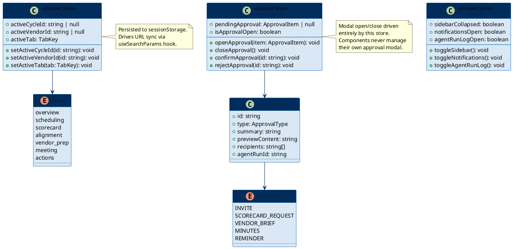

---

## 5. TypeScript Type System Class Diagram

```plantuml
@startuml TypeSystem
skinparam classBackgroundColor #F4F6F9
skinparam classBorderColor #002D5C
skinparam classHeaderBackgroundColor #0063B1
skinparam classHeaderFontColor #FFFFFF
skinparam classFontColor #1A1A2E
skinparam classFontSize 9
skinparam arrowColor #002D5C
skinparam packageBackgroundColor #EFF5FB
skinparam packageBorderColor #0063B1

package "agent.types" {
  class AgentResponse<T> {
    +status: AgentStatus
    +agent: string
    +summary: string
    +data: T
    +warnings: string[]
    +next_actions: string[]
    +requires_approval: boolean
    +run_id: string
  }
  enum AgentStatus {
    success
    failed
    partial
    pending_approval
  }
  enum WorkflowState {
    CYCLE_CREATED
    ATTENDEE_REFRESH_SENT
    AVAILABILITY_COLLECTED
    MEETING_SCHEDULED
    SCORECARD_REQUEST_SENT
    SCORECARD_COLLECTION
    SCORECARD_COMPILED
    INTERNAL_ALIGNMENT
    VENDOR_PREP
    MEETING_IN_PROGRESS
    POST_MEETING_COMPLETE
    ARCHIVED
  }
}

package "cycle.types" {
  class Cycle {
    +cycle_id: string
    +vendor_id: string
    +vendor_name: string
    +cycle_name: string
    +quarter: number
    +year: number
    +workflow_state: WorkflowState
    +created_at: string
    +updated_at: string
  }
  class Vendor {
    +vendor_id: string
    +name: string
    +category: string
    +status: string
  }
}

package "scheduling.types" {
  class Attendee {
    +id: string
    +stakeholder_id: string
    +name: string
    +email: string
    +role: string
    +is_key: boolean
    +is_confirmed: boolean
    +invite_status: InviteStatus
    +replacement_name: string | null
    +replacement_email: string | null
  }
  class SlotProposal {
    +slot_id: string
    +proposed_time: string
    +timezone: string
    +rank_score: number
    +organiser_available: boolean
    +exec_sponsor_available: boolean
    +attendee_availability: Record<string,boolean>
    +total_available: number
    +total_attendees: number
    +is_approved: boolean
  }
  class InviteDraft {
    +subject: string
    +body: string
    +recipients: string[]
    +dial_in_details: string
    +scheduled_time: string
  }
  enum InviteStatus {
    PENDING
    ACCEPTED
    DECLINED
  }
}

package "scorecard.types" {
  class ScorecardEntry {
    +scorecard_id: string
    +stakeholder_id: string
    +stakeholder_name: string
    +category: ScorecardCategory
    +score: number
    +comment: string | null
    +is_valid: boolean
    +validation_flags: ValidationFlag[]
    +submitted_at: string
  }
  class CompiledScorecard {
    +cycle_id: string
    +vendor_id: string
    +entries: ScorecardEntry[]
    +averages: Record<ScorecardCategory,number>
    +overall_average: number
    +outlier_count: number
    +missing_count: number
    +compiled_at: string
  }
  enum ScorecardCategory {
    DELIVERY_QUALITY
    SLA_COMPLIANCE
    INNOVATION
    COMMUNICATION
    VALUE_FOR_MONEY
  }
  enum ValidationFlag {
    OUT_OF_RANGE
    COMMENT_REQUIRED
    OUTLIER
  }
}

package "alignment.types" {
  class ScoreChange {
    +category: ScorecardCategory
    +previous_score: number
    +current_score: number
    +delta: number
    +is_significant: boolean
  }
  class AlignmentFlag {
    +category: ScorecardCategory
    +min_score: number
    +max_score: number
    +spread: number
    +prompt_question: string
    +stakeholders_involved: string[]
  }
  class ActionItem {
    +action_id: string
    +cycle_id: string
    +source_module: SourceModule
    +description: string
    +owner: string | null
    +due_date: string | null
    +status: ActionStatus
    +created_at: string
  }
  enum ActionStatus {
    OPEN
    IN_PROGRESS
    CLOSED
  }
}

package "vendorPrep.types" {
  class VendorBrief {
    +overall_score: number
    +overall_trend: Trend
    +category_ratings: CategoryRating[]
    +key_concerns: string[]
    +positive_areas: string[]
    +generated_at: string
  }
  class PushbackItem {
    +id: string
    +description: string
    +category: PushbackCategory
    +requires_legal_review: boolean
    +status: string
    +responses: PushbackResponse[]
  }
  class PushbackResponse {
    +stance: ResponseStance
    +content: string
    +is_selected: boolean
  }
  enum PushbackCategory {
    DATA_DISPUTE
    PROCESS_CONCERN
    RESOURCE_CONSTRAINT
    SCOPE_DISAGREEMENT
    OTHER
  }
  enum ResponseStance {
    FACTUAL
    NEUTRAL
    ESCALATION
  }
  enum Trend {
    IMPROVING
    STABLE
    DECLINING
  }
}

package "meeting.types" {
  class MeetingNote {
    +note_id: string
    +note_type: NoteType
    +content: string
    +raised_by_role: string | null
    +timestamp: string
    +is_actioned: boolean
  }
  class MeetingMinutes {
    +meeting_id: string
    +generated_at: string
    +metadata: MinutesMeta
    +executive_summary: string
    +agenda_summaries: AgendaItem[]
    +key_decisions: string[]
    +qa_log: MeetingNote[]
    +action_items: ActionItem[]
    +approved: boolean
  }
  enum NoteType {
    QUESTION
    OBJECTION
    DECISION
    APPRECIATION
    ACTION
  }
}

package "analytics.types" {
  class TrendDataPoint {
    +cycle_id: string
    +cycle_name: string
    +quarter: number
    +year: number
    +scores: Record<ScorecardCategory,number>
  }
  class RecurringIssue {
    +issue_id: string
    +vendor_id: string
    +vendor_name: string
    +description: string
    +first_seen_cycle: string
    +occurrences: number
    +status: string
    +last_owner: string
  }
  class LeadershipBrief {
    +vendor_name: string
    +trajectory: Trend
    +recurring_issues: RecurringIssue[]
    +prior_commitments: string[]
    +recommended_focus_areas: string[]
    +generated_at: string
  }
}

Cycle --> WorkflowState
AgentResponse --> AgentStatus
CompiledScorecard --> ScorecardEntry
ScorecardEntry --> ScorecardCategory
ScorecardEntry --> ValidationFlag
ScoreChange --> ScorecardCategory
VendorBrief --> Trend
PushbackItem --> PushbackCategory
PushbackItem --> PushbackResponse
PushbackResponse --> ResponseStance
MeetingMinutes --> MeetingNote
MeetingMinutes --> ActionItem
LeadershipBrief --> RecurringIssue
LeadershipBrief --> Trend

@enduml
```

---

## 6. API Client Layer Class Diagram

```plantuml
@startuml APIClient
skinparam classBackgroundColor #DAE8F5
skinparam classBorderColor #0063B1
skinparam classHeaderBackgroundColor #002D5C
skinparam classHeaderFontColor #FFFFFF
skinparam classFontColor #1A1A2E
skinparam classFontSize 10
skinparam arrowColor #002D5C

class AxiosClient <<singleton>> {
  -baseURL: string
  -timeout: number
  --
  +get<T>(url): Promise<T>
  +post<T>(url, data): Promise<T>
  +put<T>(url, data): Promise<T>
  +patch<T>(url, data): Promise<T>
  +delete<T>(url): Promise<T>
  --
  -requestInterceptor(): void
  -responseInterceptor(): void
  -errorNormaliser(error): never
}

class CyclesApi {
  +create(payload: CycleCreateIn): Promise<Cycle>
  +list(vendorId?: string): Promise<Cycle[]>
  +getById(cycleId: string): Promise<Cycle>
}

class SchedulingApi {
  +start(cycleId: string): Promise<AgentResponse>
  +simulateResponses(cycleId: string): Promise<AgentResponse>
  +getAttendees(cycleId: string): Promise<Attendee[]>
  +getRankedSlots(cycleId: string): Promise<SlotProposal[]>
  +approveSlot(cycleId, slotId): Promise<AgentResponse>
  +getInviteDraft(cycleId: string): Promise<InviteDraft>
  +sendInvite(cycleId: string): Promise<AgentResponse>
}

class ScorecardApi {
  +sendRequest(cycleId: string): Promise<AgentResponse>
  +simulateSubmissions(cycleId: string): Promise<AgentResponse>
  +submit(cycleId, payload: ScorecardSubmitIn): Promise<AgentResponse>
  +getStatus(cycleId: string): Promise<SubmissionStatus[]>
  +compile(cycleId: string): Promise<AgentResponse>
  +getCompiled(cycleId: string): Promise<CompiledScorecard>
}

class AlignmentApi {
  +getChanges(cycleId: string): Promise<ScoreChange[]>
  +getFlags(cycleId: string): Promise<AlignmentFlag[]>
  +extractActions(cycleId, notes: string): Promise<AgentResponse>
  +getActions(cycleId: string): Promise<ActionItem[]>
  +updateFaceOff(cycleId, positions): Promise<void>
  +getFaceOff(cycleId: string): Promise<FaceOffPosition[]>
}

class VendorPrepApi {
  +generateBrief(cycleId: string): Promise<AgentResponse>
  +getBrief(cycleId: string): Promise<VendorBrief>
  +addPushback(cycleId, payload): Promise<AgentResponse>
  +getPushback(cycleId: string): Promise<PushbackItem[]>
  +getResponses(cycleId, pushbackId): Promise<PushbackResponse[]>
  +selectResponse(cycleId, pushbackId, stance): Promise<void>
}

class MeetingApi {
  +getBriefing(cycleId: string): Promise<object>
  +captureNote(cycleId, payload): Promise<MeetingNote>
  +getNotes(cycleId: string): Promise<MeetingNote[]>
  +parseTranscript(cycleId, transcript): Promise<AgentResponse>
  +generateMinutes(cycleId: string): Promise<AgentResponse>
  +getMinutes(cycleId: string): Promise<MeetingMinutes>
  +approveMinutes(cycleId: string): Promise<void>
}

class AnalyticsApi {
  +getTrends(vendorId: string): Promise<TrendDataPoint[]>
  +getRadarData(vendorId, cycleId): Promise<object>
  +getCrossVendorComparison(cycleId): Promise<object>
  +getRecurringIssues(): Promise<RecurringIssue[]>
  +generateLeadershipBrief(cycleId): Promise<AgentResponse>
  +getLeadershipBrief(cycleId): Promise<LeadershipBrief>
}

AxiosClient <.. CyclesApi : uses
AxiosClient <.. SchedulingApi : uses
AxiosClient <.. ScorecardApi : uses
AxiosClient <.. AlignmentApi : uses
AxiosClient <.. VendorPrepApi : uses
AxiosClient <.. MeetingApi : uses
AxiosClient <.. AnalyticsApi : uses

@enduml
```

---

## 7. TanStack Query Hooks Class Diagram

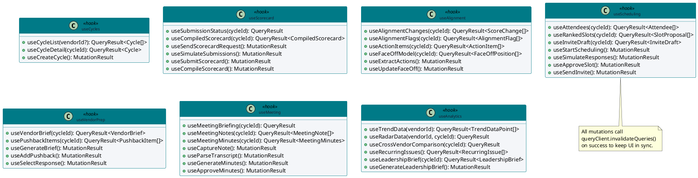

---

## 8. Sequence: Approval Flow

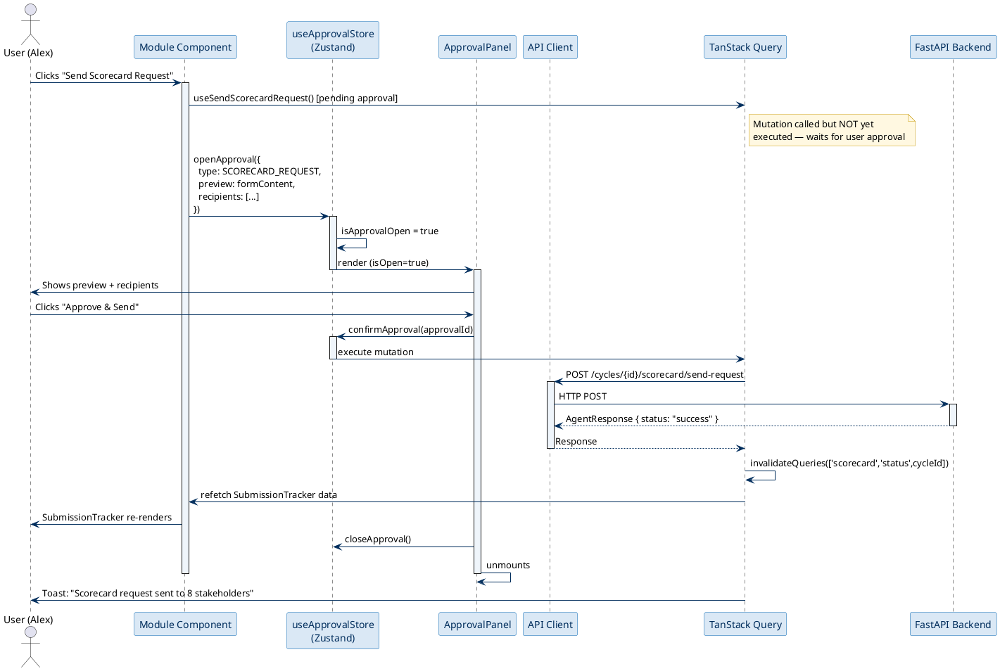

---

## 9. Sequence: Module A — Scheduling Flow

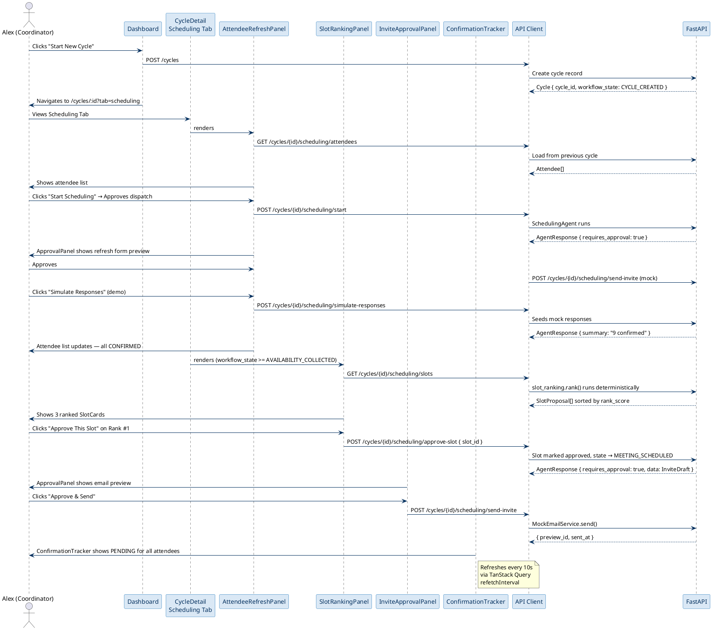

---

## 10. Sequence: Module B — Scorecard Submission

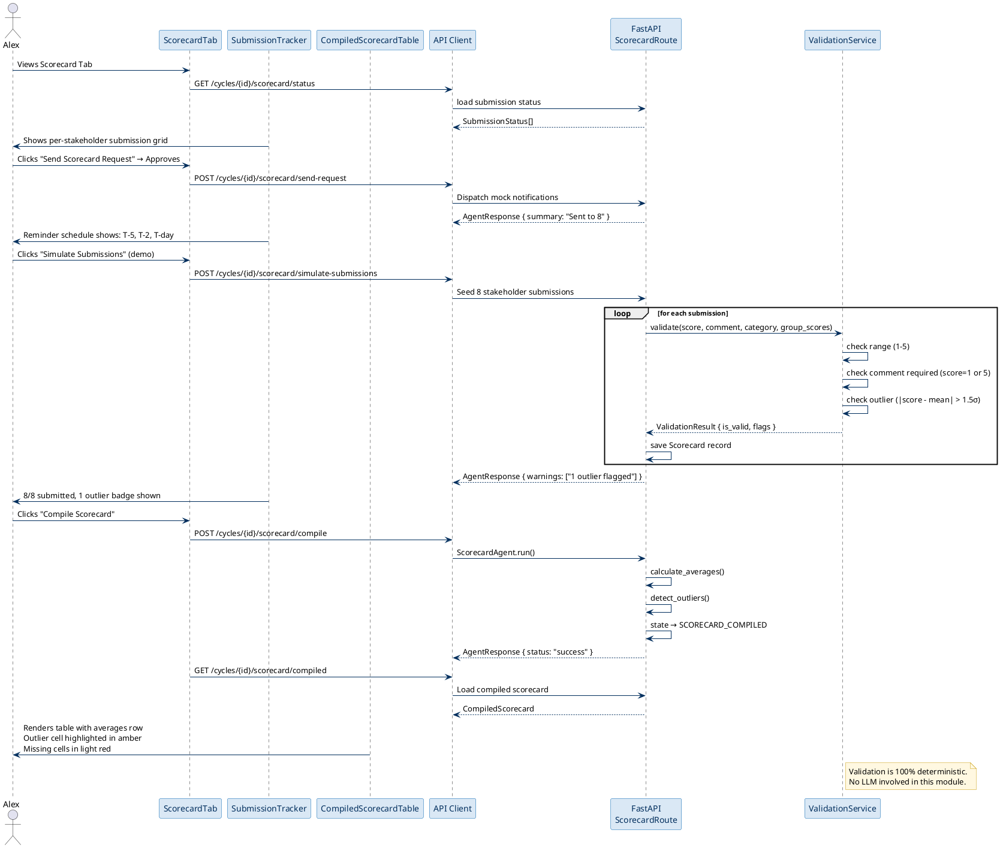

---

## 11. Sequence: Module D — Vendor Brief & Pushback

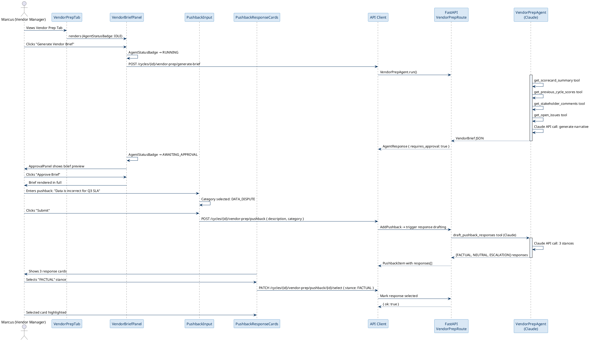

---

## 12. Sequence: Module E — Live Meeting Capture & Minutes

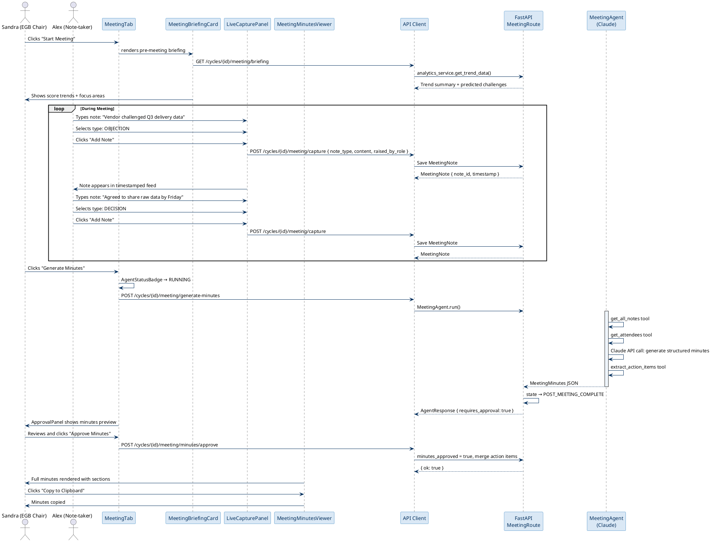

---

## 13. Sequence: Module F — Analytics & Leadership Brief

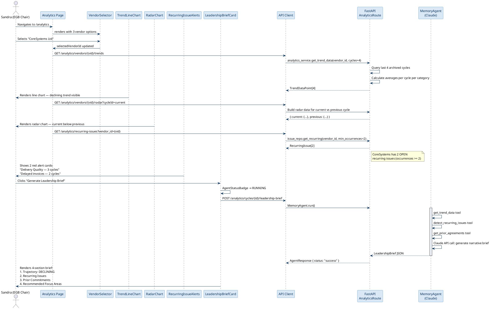

---

## 14. Sequence: TanStack Query Cache Invalidation

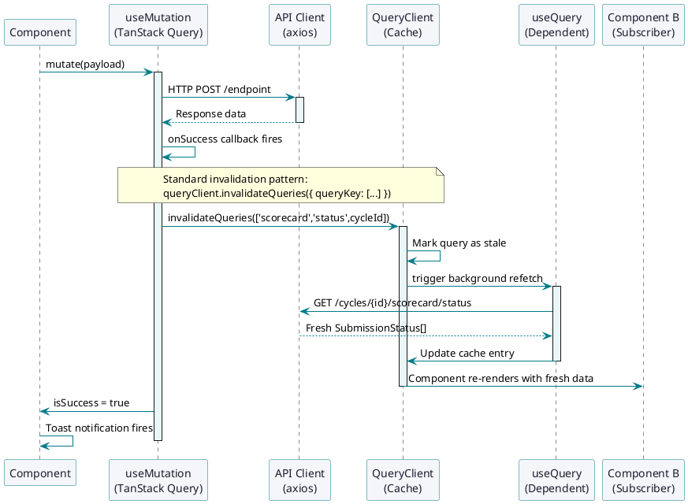

---

## 15. Activity: Cycle Workspace Tab Navigation

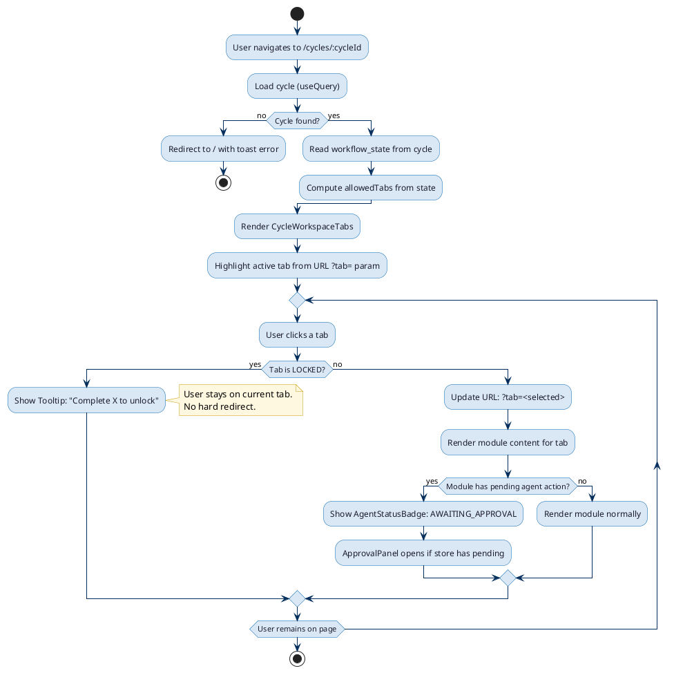

---

## 16. Activity: Scorecard Validation Flow

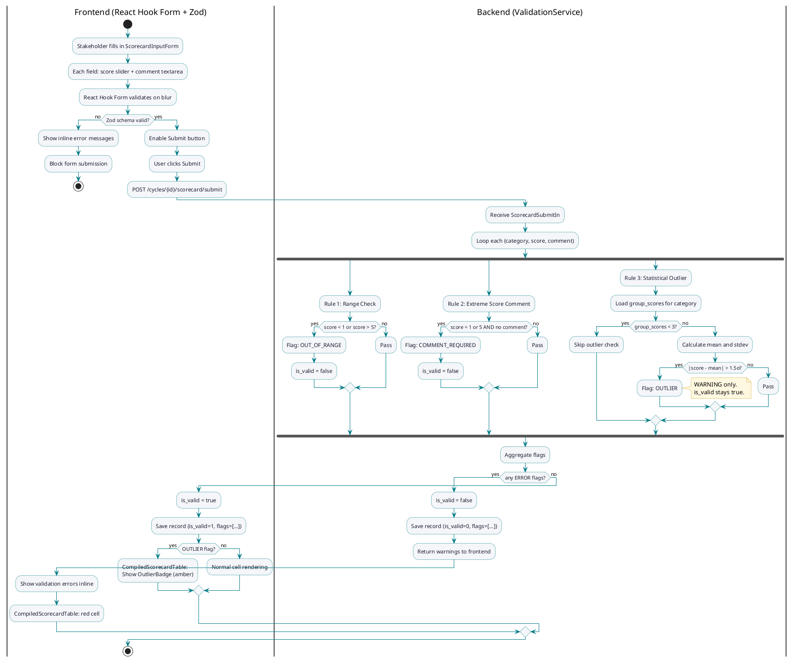

---

## 17. State: AgentStatusBadge States

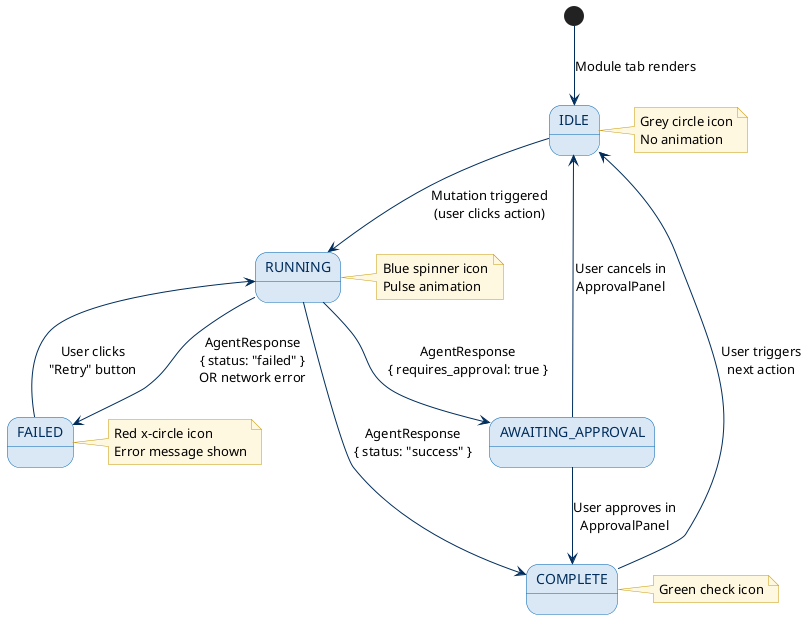

---

## 18. State: ApprovalPanel States

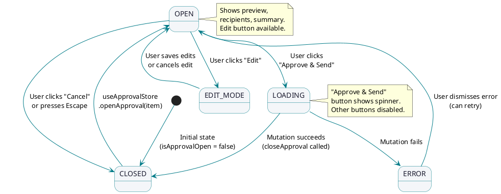

---

*VendorPulse Frontend UML v1.0 — Zensar Technologies — 2026-04-01*
