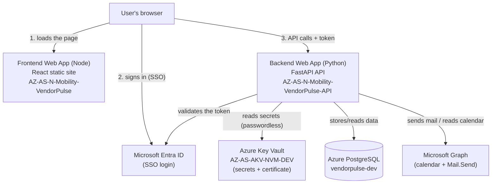
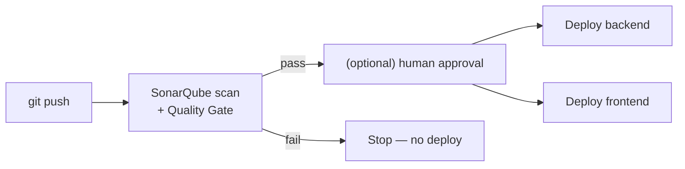

# VendorPulse — Azure Deployment Runbook & Learning Guide

> **Who this is for:** any developer (even a brand-new one) who needs to understand,
> operate, change, or re-deploy the VendorPulse application on Azure.
>
> **What it covers:** every component we deployed, how they connect, every environment
> variable, how to change a variable, how to rebuild & release, and how to fix the
> problems we actually hit. Read top to bottom the first time; use it as a lookup later.
>
> **Environment:** this documents the **Non-PROD (dev)** deployment. Production will follow
> the same shapes with stricter security (private networking, no self-service secrets).

---

## Table of contents
1. [The big picture (how everything connects)](#1-the-big-picture)
2. [Core concepts explained simply](#2-core-concepts-explained-simply)
3. [The Azure resources we use](#3-the-azure-resources-we-use)
4. [Environment variables — the complete reference](#4-environment-variables--the-complete-reference)
5. [How to change an environment variable](#5-how-to-change-an-environment-variable)
6. [How to rebuild and release (deploy)](#6-how-to-rebuild-and-release-deploy)
7. [Key Vault, Managed Identity & the certificate](#7-key-vault-managed-identity--the-certificate)
8. [SSO (Microsoft sign-in)](#8-sso-microsoft-sign-in)
9. [Troubleshooting — the problems we hit and how we fixed them](#9-troubleshooting)
10. [Quick command cheat-sheet](#10-quick-command-cheat-sheet)
11. [CI/CD pipeline (automated deployment)](#11-cicd-pipeline-automated-deployment)
12. [Pending actions (as of August 2026)](#12a-pending-actions-as-of-august-2026)
13. [Glossary](#12b-glossary)

---

## 1. The big picture

VendorPulse runs as **two separate web apps** on Azure App Service, plus a database, a
secrets vault, and Microsoft sign-in.



**In plain words:**
1. The browser downloads the **frontend** (just HTML/JS/CSS — static files).
2. The user **signs in** with their Shell account (SSO via Entra).
3. The frontend (running in the browser) calls the **backend API** directly, attaching the
   sign-in token.
4. The **backend** does the real work: reads secrets from **Key Vault**, reads/writes the
   **PostgreSQL** database, validates the token, and talks to **Microsoft Graph** for mail.

> **Key mental model:** the frontend is "just files in the browser." All the sensitive work
> (database, secrets, email) happens on the **backend**, never the frontend.

---

## 2. Core concepts explained simply

| Concept | Plain-English meaning |
|---|---|
| **App Service (Web App)** | A managed place in Azure that runs your app over HTTPS. You don't manage a server — Azure does. One Web App runs **one runtime** (Node **or** Python, not both). |
| **Runtime stack** | The language the Web App runs. Frontend = **Node**, Backend = **Python 3.11**. |
| **App Settings** | Environment variables you set **in the Azure portal** for a Web App. On Azure, these **replace the `.env` file**. The app reads them exactly like normal environment variables. |
| **`.env` file** | A local file that holds settings **for running on your laptop only**. It is git-ignored and **not used by the deployed app** (Azure uses App Settings instead). |
| **Startup command** | The command Azure runs to launch your app (e.g. `gunicorn …` for Python, `pm2 serve …` for the static frontend). |
| **Key Vault** | A secure locker for secrets (passwords, keys, certificates). The app fetches them at runtime. |
| **Managed Identity** | A passwordless identity Azure gives the Web App so it can read Key Vault **without storing any password**. |
| **CORS** | A browser security rule. Because the frontend and backend are on **different URLs**, the backend must explicitly **allow the frontend's URL** to call it. |
| **SSO (Entra ID)** | "Sign in with your Shell account." The app trusts Microsoft to prove who the user is. |
| **Public network access** | Whether the Web App is reachable from the internet. If **Disabled**, nobody (not even your deploy) can reach it. |
| **Build vs Deploy** | **Build** = turn source code into runnable files (`npm run build`, or `pip install`). **Deploy** = upload those files to the Web App. |

### The single most important idea: frontend config is "baked in"
The frontend's settings (like which backend URL to call) are **compiled into the JavaScript
at build time**. That means: **if you change a frontend `VITE_*` variable, you MUST rebuild
and redeploy** — editing it after the build does nothing. The backend is different: it reads
App Settings **live**, so changing a backend setting just needs a **restart** (no rebuild).

---

## 3. The Azure resources we use

All resources live in resource group **`AZ-AS-RGP-EX-N-SEQ02296-NVM-DEV`**
(Subscription `AZ-AS-SUB-EX-N-SEQ02296-NVM-DEV`, Tenant **Shell** `db1e96a8-a3da-442a-930b-235cac24cd5c`).

| Resource | Name | What it is |
|---|---|---|
| **Frontend Web App** | `AZ-AS-N-Mobility-VendorPulse` | Node 24 runtime, serves the React site |
| **Backend Web App** | `AZ-AS-N-Mobility-VendorPulse-API` | Python 3.11 runtime, runs the FastAPI API |
| **App Service Plan** | `ASP-AZASRGPEXNSEQ02296NVMDEV-b6e2` | The compute both apps share (Premium P0v3) |
| **Database** | `vendorpulse-dev` (Azure PostgreSQL) | Stores all app data (16 tables) |
| **Key Vault** | `AZ-AS-AKV-NVM-DEV` | Secrets + the Mail.Send certificate |
| **Entra app (SPA)** | client `98aa0372-ccb6-4cc5-b075-fc863fbc2743` | The SSO sign-in registration |

### Live URLs
- **Frontend:** `https://az-as-n-mobility-vendorpulse-afcyb2d5frhsf9cz.northeurope-01.azurewebsites.net`
- **Backend:** `https://az-as-n-mobility-vendorpulse-api-hqbpe8gybhg9epf6.northeurope-01.azurewebsites.net`
  - Health check: append **`/api/health`** → returns `{"status":"ok", "database":"connected", ...}`

> **Tip — always get the exact URL from Azure**, don't type it from memory. The random
> suffix (`hqbpe8…`) is easy to mistype. Get it from the Web App **Overview → Browse**, or:
> `az webapp show -g AZ-AS-RGP-EX-N-SEQ02296-NVM-DEV -n AZ-AS-N-Mobility-VendorPulse-API --query defaultHostName -o tsv`

---

## 4. Environment variables — the complete reference

There are **two totally separate sets** of variables:

### 4a. Frontend variables (build-time, PUBLIC)
These live in `VendorPulse-code/frontend/.env`, are prefixed **`VITE_`**, and are **baked into
the browser bundle at build time**. They are **public** (visible to anyone in the browser) —
so **never put a secret here**.

| Variable | Example / value | Meaning |
|---|---|---|
| `VITE_API_URL` | `https://az-as-n-mobility-vendorpulse-api-hqbpe8gybhg9epf6.northeurope-01.azurewebsites.net` | Which backend the frontend calls |
| `VITE_SSO_ENABLED` | `true` | Turn Microsoft sign-in on/off in the UI |
| `VITE_SSO_CLIENT_ID` | `98aa0372-ccb6-4cc5-b075-fc863fbc2743` | The Entra SPA app (public ID) |
| `VITE_SSO_TENANT_ID` | `db1e96a8-a3da-442a-930b-235cac24cd5c` | The Shell tenant (public ID) |
| `VITE_SSO_REDIRECT_URI` | the **frontend** URL | Where Entra sends the user back after login |

> Changing any of these = **rebuild + redeploy the frontend** (see §6).

### 4b. Backend variables (runtime, some SECRET)
On Azure, these live in **App Settings** (Backend Web App → **Settings → Environment
variables → App settings**). On a laptop they'd be in `backend/.env`, but **the deployed app
ignores that file** — it only reads App Settings.

**Secrets (real credentials — keep protected):**
| App Setting | Where the value should ultimately live |
|---|---|
| `PG_PASSWORD` (or `DATABASE_URL`) | Key Vault (`VENDORPULSE-DATABASE-URL`) |
| `AZURE_OPENAI_API_KEY` | Key Vault (`VENDORPULSE-AZURE-OPENAI-API-KEY`) |
| `GRAPH_CERT_PASSWORD` | (empty — our cert has no password) |

**Non-secret config (safe as plain values):**
| App Setting | Value | Meaning |
|---|---|---|
| `PG_HOST` | `vendorpulse-dev.postgres.database.azure.com` | DB server |
| `PG_PORT` / `PG_DATABASE` / `PG_USER` | `5432` / `vendorpulse` / `vendorpulse_admin` | DB connection parts |
| `PG_SSLMODE` | `require` | Azure Postgres needs SSL |
| `ENABLE_LLM` | `true` | Turn AI features on/off |
| `AI_PROVIDER` | `azure` | Which AI provider |
| `AZURE_OPENAI_ENDPOINT` | `https://gaura-mgt924zq-eastus2.openai.azure.com/` | AI endpoint |
| `AZURE_OPENAI_DEPLOYMENT_NAME` | `gpt-4o` | AI model deployment |
| `AZURE_OPENAI_API_VERSION` | `2024-12-01-preview` | AI API version |
| `MAIL_PROVIDER` | `graph` | Send mail via Microsoft Graph |
| `GRAPH_MAIL_SENDER` | `Mobility-VendorPulse@shell.com` | The "from" mailbox |
| `GRAPH_CLIENT_ID` / `GRAPH_TENANT_ID` | (public IDs) | The Mail.Send app identity |
| `GRAPH_CERT_THUMBPRINT` | `E3B27F913B430B93718E3B12BDFE7E4FFF65DFC5` | Which certificate to use |
| `GRAPH_CERT_PATH` | `/var/ssl/private/E3B27F913B430B93718E3B12BDFE7E4FFF65DFC5.p12` | Where Azure places the loaded cert |
| `WEBSITE_LOAD_CERTIFICATES` | the cert thumbprint | Tells Azure to load the cert into the app |
| `SSO_ENABLED` | `true` | Backend enforces sign-in |
| `SSO_CLIENT_ID` / `SSO_TENANT_ID` | (public IDs) | Which Entra app/tenant to validate tokens against |
| `CORS_ORIGINS` | the **frontend** URL | Allow the frontend to call the API |
| `SCM_DO_BUILD_DURING_DEPLOYMENT` | `1` | Run `pip install` on deploy |
| `WEBSITES_PORT` | `8000` | The port the API listens on |

> **Secret vs non-secret rule of thumb:** if it's a **password, key, or certificate password**,
> it's a secret → belongs in Key Vault. If it's an **ID, URL, hostname, or on/off flag**, it's
> public config → a plain App Setting is fine.

---

## 5. How to change an environment variable

### 5a. Change a FRONTEND variable (e.g. `VITE_API_URL`, `VITE_SSO_ENABLED`)
1. Edit `VendorPulse-code/frontend/.env`.
2. **Rebuild + redeploy the frontend** (§6a) — this is required because the value is baked in
   at build time.

### 5b. Change a BACKEND variable (e.g. `SSO_ENABLED`, `ENABLE_LLM`)
You do **not** rebuild. You change the **App Setting** and restart:

**Option A — Portal:** Backend Web App → **Settings → Environment variables → App settings**
→ click the variable → change the value → **Apply/Save** (the app restarts automatically).

**Option B — One command:**
```
az webapp config appsettings set -g AZ-AS-RGP-EX-N-SEQ02296-NVM-DEV -n AZ-AS-N-Mobility-VendorPulse-API --settings SSO_ENABLED=true
```

> **Remember:** editing `backend/.env` does **nothing** to the live app — it's laptop-only.
> The deployed backend reads **App Settings**.

---

## 6. How to rebuild and release (deploy)

We deploy by making a **zip** of the built app and pushing it with the Azure CLI.

> ⚠️ **Critical:** use **`tar`** to make the zip, **not** `Compress-Archive`. On Windows,
> `Compress-Archive` writes backslash (`\`) path separators, which **breaks** on Azure's Linux
> servers (files in sub-folders like `assets/` fail to deploy). `tar` uses forward slashes and
> works. This tripped us up for an hour — don't repeat it.

### 6a. Frontend release
```
cd "C:\Users\Anup.Kesarwani\OneDrive - Shell\Desktop\VendorPulse\VendorPulse-code\frontend"
npm run build
Remove-Item dist.zip -Force -ErrorAction SilentlyContinue
tar -a -c -f dist.zip -C dist .
az webapp deploy -g AZ-AS-RGP-EX-N-SEQ02296-NVM-DEV -n AZ-AS-N-Mobility-VendorPulse --src-path dist.zip --type zip
```
Then **hard-refresh** the site (`Ctrl+F5`).
- `npm run build` → creates the `dist/` folder (the static site).
- `tar … -C dist .` → zips the **contents** of `dist` (so `index.html` sits at the top).
- `az webapp deploy` → uploads it to the frontend Web App.

**Frontend startup command** (set once, in Configuration → Stack settings):
```
pm2 serve /home/site/wwwroot --no-daemon --spa
```
This serves the static files; `--spa` makes client-side routes (like `/cycles/123`) work on refresh.

### 6b. Backend release
```
cd "C:\Users\Anup.Kesarwani\OneDrive - Shell\Desktop\VendorPulse\VendorPulse-code\backend"
Remove-Item backend.zip -Force -ErrorAction SilentlyContinue
tar -a -c -f backend.zip --exclude=./.venv --exclude=./__pycache__ --exclude=./data --exclude=./logs --exclude=./.env -C . .
az webapp deploy -g AZ-AS-RGP-EX-N-SEQ02296-NVM-DEV -n AZ-AS-N-Mobility-VendorPulse-API --src-path backend.zip --type zip
```
Then check `…/api/health`.
- The `--exclude` flags keep local junk (virtual env, caches, logs) out of the upload.
- `SCM_DO_BUILD_DURING_DEPLOYMENT=1` makes Azure run `pip install -r requirements.txt`.

**Backend startup command** (set once):
```
gunicorn app.main:app -k uvicorn.workers.UvicornWorker -w 2 --bind 0.0.0.0:8000 --timeout 600
```

### 6c. Prerequisites for deploying
- **Azure CLI installed** (`az`) and signed in (`az login`). *(Install once with winget; open a
  new terminal afterward so `az` is recognized.)*
- **Public network access = Enabled** on the Web App (else the deploy is blocked with 403 — see §9).

---

## 7. Key Vault, Managed Identity & the certificate

**Goal:** the backend reads its secrets/cert from Key Vault **without any stored password**.

**How it works:**
1. The backend Web App has a **System-assigned Managed Identity**
   (Object ID `9adfc405-781a-4818-ab31-4c88caf24d75`).
2. Key Vault `AZ-AS-AKV-NVM-DEV` grants that identity **read** access via an **access policy**
   (this vault uses the *Vault access policy* model, not RBAC).
3. Secrets are **namespaced** `VENDORPULSE-*` because the vault is **shared** with other teams:
   - `VENDORPULSE-DATABASE-URL`
   - `VENDORPULSE-AZURE-OPENAI-API-KEY`
   - `VENDORPULSE-GRAPH-MAIL-CERT` (the Mail.Send certificate)

**The Mail.Send certificate (how it reaches the app):**
1. The `.pfx` is imported into Key Vault as a **certificate** (`VENDORPULSE-GRAPH-MAIL-CERT`,
   thumbprint `E3B27F913B430B93718E3B12BDFE7E4FFF65DFC5`).
2. In the backend Web App → **Certificates → Bring your own certificates → Import from Key Vault**.
3. App Setting `WEBSITE_LOAD_CERTIFICATES = <thumbprint>` makes Azure drop the cert at
   `/var/ssl/private/<thumbprint>.p12`.
4. App Setting `GRAPH_CERT_PATH` points there, and the app loads it — **no code change**.

> **Two access models to keep straight:** *management plane* (managing the vault) vs *data plane*
> (reading secret values). They're separate. Being a Contributor doesn't let you read secrets;
> you need a **data-plane access policy** (Secret Get/List). Least privilege: the app gets
> **read-only**; a human doing setup gets Get/List/Set.

**"Keep env for now" vs Key Vault references:** right now some secrets are plain App Settings.
The production-grade step is to change those two App Settings to Key Vault **references**:
```
DATABASE_URL = @Microsoft.KeyVault(SecretUri=https://az-as-akv-nvm-dev.vault.azure.net/secrets/VENDORPULSE-DATABASE-URL)
```
No code changes — Azure resolves the reference into the env var at startup.

---

## 8. SSO (Microsoft sign-in)

SSO requires **three places to agree**:

1. **Entra app registration** (owned by the Entra team / manager): the **frontend production
   URL** must be listed as an **SPA redirect URI**. Without it, login fails with "redirect URI
   mismatch." *(This is a Shell-side change — request it from your manager/Entra team.)*
2. **Frontend:** `VITE_SSO_ENABLED=true` → **rebuild + redeploy** (§6a).
3. **Backend:** App Setting `SSO_ENABLED=true` (+ `SSO_CLIENT_ID`, `SSO_TENANT_ID`) → **restart**.

### Temporary shareable mode (SSO disabled)
If you want to share the deployment link with Zensar without forcing Shell login, disable SSO on both sides temporarily:

- Frontend: set `VITE_SSO_ENABLED=false` in `VendorPulse-code/frontend/.env`, then rebuild and redeploy the frontend.
- Backend: set `SSO_ENABLED=false` in the backend App Settings for `AZ-AS-N-Mobility-VendorPulse-API`, then restart the backend.

This will make the app accessible without login. However, features that require a signed-in Shell user may not work:
- Graph people search will fall back to local directory results,
- delegated calendar scheduling will be unavailable.

**Golden rule:** enable or disable frontend and backend together. If the backend requires a token but the frontend doesn't send one, every API call returns **401** and the app breaks.

**Two identities, don't confuse them:**
- **SSO** = proves **who the user is** (delegated, uses PKCE, no secret).
- **Mail.Send** = proves **what the app is** (app-only, uses a certificate). Unaffected by SSO.

---

## 9. Troubleshooting

| Symptom | Cause | Fix |
|---|---|---|
| Deploy fails **403 "blocked your access"** | Web App **Public network access = Disabled** | Networking → Public network access → **Enabled from all networks** → Save → redeploy |
| Deploy fails **Kudu 400 / rsync `failed to stat assets\…: Invalid argument`** | Zip made with `Compress-Archive` (backslash paths) | Rebuild the zip with **`tar -a -c -f dist.zip -C dist .`** |
| Browser: **`ERR_NAME_NOT_RESOLVED` / can't reach page** | Wrong Web App URL (mistyped suffix) | Get the exact URL from **Overview → Browse** or `az webapp show … --query defaultHostName` |
| Frontend shows **"waiting for content"** placeholder | Files not in `wwwroot`, or no startup command | Redeploy so files land in `wwwroot`; set `pm2 serve … --spa` |
| Site returns **404 Not Found** for everything | Static files missing/wrong location | SSH → `ls -la /home/site/wwwroot` should show `index.html` + `assets`; redeploy if not |
| Frontend: **"Failed to fetch"** | Frontend built with wrong `VITE_API_URL`, **or** CORS not allowing the frontend | Fix `VITE_API_URL` → rebuild/redeploy; ensure backend `CORS_ORIGINS` = frontend URL |
| Backend stuck **"Starting the site…"** / exit code 1 | Dependencies not installed, or DB unreachable at startup | Check `az webapp log tail`; ensure `SCM_DO_BUILD_DURING_DEPLOYMENT=1`; check Postgres firewall |
| **`az` not recognized** after install | Terminal opened before install (stale PATH) | Open a **new** terminal, or fully restart the editor |
| SSO **"redirect URI mismatch"** | Prod frontend URL not registered in Entra | Add the frontend URL as an **SPA redirect URI** on the app registration |
| API returns **401** everywhere | Backend `SSO_ENABLED=true` but frontend not sending a token | Enable SSO on **both** frontend and backend |

**Useful diagnostic commands:**
```
# Stream live backend logs (see the real startup error)
az webapp log tail -g AZ-AS-RGP-EX-N-SEQ02296-NVM-DEV -n AZ-AS-N-Mobility-VendorPulse-API

# Check what files are actually deployed (via the Web App SSH console)
ls -la /home/site/wwwroot

# Confirm the exact hostname
az webapp show -g AZ-AS-RGP-EX-N-SEQ02296-NVM-DEV -n AZ-AS-N-Mobility-VendorPulse-API --query defaultHostName -o tsv
```

---

## 10. Quick command cheat-sheet

**Deploy frontend:**
```
cd VendorPulse-code/frontend
npm run build
Remove-Item dist.zip -Force -ErrorAction SilentlyContinue
tar -a -c -f dist.zip -C dist .
az webapp deploy -g AZ-AS-RGP-EX-N-SEQ02296-NVM-DEV -n AZ-AS-N-Mobility-VendorPulse --src-path dist.zip --type zip
```

**Deploy backend:**
```
cd VendorPulse-code/backend
Remove-Item backend.zip -Force -ErrorAction SilentlyContinue
tar -a -c -f backend.zip --exclude=./.venv --exclude=./__pycache__ --exclude=./data --exclude=./logs -C . .
az webapp deploy -g AZ-AS-RGP-EX-N-SEQ02296-NVM-DEV -n AZ-AS-N-Mobility-VendorPulse-API --src-path backend.zip --type zip
```

**Change a backend setting + restart:**
```
az webapp config appsettings set -g AZ-AS-RGP-EX-N-SEQ02296-NVM-DEV -n AZ-AS-N-Mobility-VendorPulse-API --settings KEY=value
```

**Restart an app:**
```
az webapp restart -g AZ-AS-RGP-EX-N-SEQ02296-NVM-DEV -n AZ-AS-N-Mobility-VendorPulse-API
```

**Health check:** open `https://<backend-url>/api/health` → expect `{"status":"ok"}`.

---

## 11. CI/CD pipeline (automated deployment)

### Why CI/CD
Today every change means running `npm run build` → `tar` → `az webapp deploy` **by hand**, per app.
That is repetitive and error-prone. **CI/CD automates it:** you just **`git push`**, and a
pipeline builds, scans, and deploys — the same way every time, with a history of what shipped
and a one-click rollback. It's also how mature companies release software (manual laptop
deploys are not the production standard).

### The pipeline flow

1. **Push** to the deploy branch triggers the workflow.
2. **SonarQube** scans the code for bugs/vulnerabilities; if it fails the **Quality Gate**, the
   pipeline stops (nothing deploys).
3. If a **production** environment with reviewers is configured, a human **approves**.
4. Both apps **build + deploy** automatically (on a Linux runner, so no Windows zip bug).

### Files that make it work
| File | Purpose |
|---|---|
| `.github/workflows/deploy.yml` | The pipeline: SonarQube gate + backend deploy + frontend deploy |
| `sonar-project.properties` | SonarQube config (project key, what to scan/exclude) |

### How the pipeline logs in to Azure — passwordless OIDC
No secret is stored in GitHub. The **OIDC team** creates an Entra **app registration** with a
**federated credential** that trusts *this repo + branch*. At run time GitHub gives Azure a
short-lived token; Azure grants temporary access. Nothing long-lived to leak or rotate.

### One-time setup (what to provide)
**From the OIDC / platform team:**
- An **app registration** + a **federated credential** whose subject matches the repo + branch,
  e.g. `repo:<org>/<repo>:ref:refs/heads/shell-feature`
- A **least-privilege role** (e.g. *Website Contributor*) on **both** App Services
- The app's **client ID**

**From the SonarQube / platform team:**
- The **SonarQube server URL**, an **analysis token**, and the **project key**
- Which **Quality Gate** profile must pass

**GitHub → Settings → Secrets and variables → Actions:**
| Type | Name | Value |
|---|---|---|
| Variable | `AZURE_CLIENT_ID` | *(from OIDC team)* |
| Variable | `AZURE_TENANT_ID` | `db1e96a8-a3da-442a-930b-235cac24cd5c` |
| Variable | `AZURE_SUBSCRIPTION_ID` | `7a7b9587-b1e3-4b7a-8142-1a3d3de0910d` |
| Variable | `SONAR_HOST_URL` | *(Shell SonarQube server URL)* |
| **Secret** | `SONAR_TOKEN` | *(analysis token — keep secret)* |

**Also:** set `sonar.projectKey` in `sonar-project.properties`, and (recommended) create a
GitHub **Environment** named `production` with **required reviewers** for the approval gate.

### Everyday use
- **Release a change:** `git push` to the deploy branch → watch it in the repo's **Actions** tab.
- **Approve a deploy:** if the `production` environment has reviewers, approve it in the run.
- **A deploy blocked?** Check the **SonarQube** result first (quality gate), then the Azure login
  (OIDC trust), then the deploy step logs.

### Note on test coverage
The scan currently runs **without test coverage** (no automated tests yet). If Shell's Quality
Gate requires coverage on new code, add test steps (pytest / vitest) that emit coverage
reports and point Sonar at them (see the commented lines in `sonar-project.properties`).

### What still isn't automated (future)
- **Infrastructure as Code** (Bicep/Terraform) to create the App Services / Key Vault / DB in
  code instead of portal clicks.
- **Private-network deploys** — if production uses private endpoints, the pipeline needs a
  **self-hosted runner inside the Shell VNet** to reach the apps.

---

## 12a. Pending actions (as of August 2026)

Items that are **not yet completed** — track these to close out the deployment:

### CI/CD & RBAC
| # | Action | Who | Status |
|---|--------|-----|--------|
| 1 | **Grant `Website Contributor` RBAC role** to the GitHub Actions deploy SPN on both App Services and the resource group. Anup doesn't have User Access Administrator/Owner rights — the "Add role assignment" button is disabled. **Request sent to Diganta.** | Diganta / platform team | ⏳ Waiting |
| 2 | **OIDC federated credential** — create the Entra app registration with a federated credential trusting the repo + branch (see §11 one-time setup). Requires the OIDC team. | OIDC / platform team | ⏳ Not started |
| 3 | **SonarQube** — get the server URL, analysis token, project key, and Quality Gate profile from the SonarQube / platform team (see §11). | SonarQube team | ⏳ Not started |

### Security (Apiiro findings)
| # | Action | Who | Status |
|---|--------|-----|--------|
| 4 | **Delete old workflow template files** from `main` branch. These are leftover template YAML files in `.github/workflows/` that Apiiro flagged as pipeline misconfiguration. Delete via GitHub UI (edit branch → delete files → commit). | Anup | ⏳ Pending |
| 5 | **Inactive admin permissions** — review and remove inactive admin users from the GitHub repo. Needs confirmation from Jaydev on who to remove. | Jaydev / Anup | ⏳ Needs confirmation |
| 6 | **Rotate PostgreSQL password** — the current password is weak and was briefly exposed in git history. Reset it on the PostgreSQL server and update the Key Vault secret `VENDORPULSE-PG-PASSWORD`. Also update the local `.env` for dev. | Anup | ⏳ Recommended |

### Deployment reliability
| # | Action | Who | Status |
|---|--------|-----|--------|
| 7 | **Switch backend deploy command** from `az webapp deploy --type zip` to `az webapp deployment source config-zip` — the current command skips `pip install` (build takes 1 second instead of 60+). It works now because dependencies are cached, but will break when the instance recycles or a new dependency is added. | Anup | ⏳ Recommended |

> **When an item is completed**, update this table (change status to ✅ Done) rather than
> deleting the row — it serves as a record of what was done.

---

## 12b. Glossary

| Term | Meaning |
|---|---|
| **Web App / App Service** | Managed Azure hosting that runs your app over HTTPS. |
| **App Setting** | An environment variable set in the Azure portal (replaces `.env` in the cloud). |
| **Runtime stack** | The language a Web App runs (Node or Python). |
| **Build** | Turning source into runnable files (`npm run build`, `pip install`). |
| **Deploy / release** | Uploading built files to the Web App. |
| **Startup command** | The command Azure runs to launch the app. |
| **Key Vault** | Azure's secure store for secrets and certificates. |
| **Managed Identity** | A passwordless identity Azure gives the app to access other Azure services. |
| **Access policy (Key Vault)** | Grants a principal permission to read/write secrets (data plane). |
| **CORS** | Browser rule; the backend must allow the frontend's origin. |
| **SSO / Entra ID** | Sign in with your corporate account. |
| **Redirect URI** | Where Entra returns the user after sign-in (must be registered). |
| **Public network access** | Whether the Web App is reachable from the internet. |
| **Kudu / SCM** | The deployment/admin engine behind every App Service (used for deploys, SSH, logs). |
| **`.pfx` / certificate** | A file holding a private key + certificate, used by Mail.Send to authenticate. |
| **CI/CD** | Continuous Integration / Continuous Delivery — automated build + deploy on every push. |
| **OIDC / federated credential** | Passwordless trust between GitHub and Azure; no stored secret. |
| **SonarQube** | Static code-analysis tool; a "Quality Gate" can block a deploy if code fails the standard. |
| **Quality Gate** | The pass/fail threshold SonarQube enforces (bugs, vulnerabilities, coverage). |
| **Self-hosted runner** | A pipeline agent you run inside a private network so CI/CD can reach private resources. |

---

*This runbook reflects the actual Non-PROD deployment of VendorPulse (two App Services —
Node frontend + Python backend — with Azure PostgreSQL, Key Vault, a Mail.Send certificate,
and Entra SSO). For production, tighten security: move all secrets to Key Vault references,
rotate any exposed secrets, use private networking, and automate releases with a CI/CD pipeline.*
