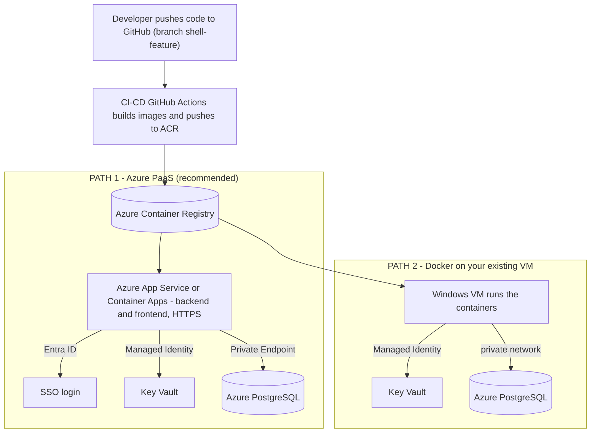

# VendorPulse — Production Deployment Guide
### Docker, CI/CD, Azure Key Vault, Azure PostgreSQL & SSO — explained from zero

> **Who this is for:** someone who has never used Docker, CI/CD, or Key Vault before.
> Every concept is explained in plain language first, then shown for *this* app.
>
> **Current state (the pilot):** the app runs on one Windows VM as two NSSM services,
> stores data in **JSON files**, has **no login**, and is reached over plain **HTTP** on the
> VM's private IP. That was great to prove it works. This guide takes it toward a
> **production‑grade** setup.
>
> **Source control:** the codebase lives in **GitHub**, so we use **GitHub Actions** for CI/CD and
> **GitHub Environments + passwordless OIDC** for safe deployment to Azure (no stored cloud passwords).

---

## Table of contents
0. [✅ Confirmed plan & sequence — READ THIS FIRST](#0--confirmed-plan--sequence--read-this-first)
1. [The concepts in plain English](#1-the-concepts-in-plain-english)
2. [Do we REALLY need Docker and CI/CD? (honest answer)](#2-do-we-really-need-docker-and-cicd-honest-answer)
3. [The big picture — two deployment paths](#3-the-big-picture--two-deployment-paths)
4. [Part A — Dockerize the application](#part-a--dockerize-the-application)
5. [Part B — Azure Key Vault (secrets)](#part-b--azure-key-vault-secrets)
6. [Part C — Move from JSON files to Azure PostgreSQL](#part-c--move-from-json-files-to-azure-postgresql)
7. [Part D — SSO login with Microsoft Entra ID](#part-d--sso-login-with-microsoft-entra-id)
8. [Part E — CI/CD pipeline (GitHub Actions)](#part-e--cicd-pipeline-github-actions)
9. [Part F — Running it (PaaS vs Docker on the VM)](#part-f--running-it-paas-vs-docker-on-the-vm)
10. [Part G — End‑to‑end deployment order](#part-g--end-to-end-deployment-order)
11. [Part H — Test everything locally](#part-h--test-everything-locally)
12. [Part I — Verify each phase works (acceptance checks)](#part-i--verify-each-phase-works-acceptance-checks)
13. [Security checklist](#security-checklist)
14. [Glossary](#glossary)

---

## 0. ✅ Confirmed plan & sequence — READ THIS FIRST

>  They
> are the agreed target and **override the "options" discussed later** — the later sections are still
> the *how‑to*, but this section is the *what & in what order*.

### 0.1 Confirmed decisions

| # | Topic | Decision | Mandatory? |
|---|---|---|---|
| 1 | **Hosting** | **Azure App Service** (more reliable & secure than the VM) | ✅ Move to App Service |
| 2 | **Docker / containerising** | **Optional** — no hard rule; fine to containerise if cost isn't a concern | ⚪ Optional |
| 3 | **CI/CD pipeline** | **Required** (we are productionising) | ✅ Yes |
| 4 | **Secrets** | **Azure Key Vault** | ✅ Yes |
| 5 | **Database** | **Azure PostgreSQL** with a **Private Endpoint** | ✅ Yes |
| 6 | **Authentication** | **SSO via Microsoft Entra ID** | ✅ Yes |
| 7 | **Transport security** | **HTTPS, TLS 1.2** | ✅ Yes |
| 8 | **Reference architecture** | Diganta will check if a standard one exists | ⏳ Pending |

**Net effect:** the current **VM + NSSM** setup is the **pilot only**. Production moves to **Azure App
Service**, with **Key Vault**, **PostgreSQL (private endpoint)**, **Entra SSO**, **TLS 1.2**, and a
**CI/CD pipeline**.

### 0.2 Do we need Docker Desktop or Rancher Desktop?

**Short answer: No — not required.**

- Because containerising is **optional**, the simplest route is to deploy to App Service **as code**
  (App Service builds/runs the Python backend and the static frontend for you) — **no Docker tool at all**.
- **If** you later choose to containerise, you can **build the image in the cloud** — with **ACR Tasks**
  (`az acr build ...`) or inside the **GitHub Actions** pipeline — so you *still* don't need Docker
  Desktop or Rancher Desktop locally. A local tool is only for **optional local container testing**.
- **Licensing note:** **Docker Desktop** needs a **paid licence** at an organisation Shell's size;
  **Rancher Desktop** is **free/open‑source**. But if you build in Azure/CI, **you need neither**.

> **Recommendation:** start **code‑based on App Service (no Docker)**. Containerise later only if there's
> a clear reason — and then build in **ACR/CI**, not on a laptop.

### 0.3 The sequence — what to do, in order

Do these top‑to‑bottom; each step is testable before the next. (Links point to the detailed "how".)

1. **Prep & access** — confirm you can create resources (App Service, Key Vault, Postgres networking,
   Entra app registrations) in resource group `AZ-AS-RGP-EX-N-SEQ02296-NVM-DEV`; code is in GitHub. ✅
2. **Database → Azure PostgreSQL** *(mandatory)* — create the `vendorpulse` DB, add a **Private Endpoint**
   (disable public access), and **migrate the app from JSON to Postgres** (driver + schema + rewrite the
   repository layer + migrate data). *Real dev work — see [Part C](#part-c--move-from-json-files-to-azure-postgresql).*
3. **Secrets → Azure Key Vault** *(mandatory)* — create the vault; store the DB password, API keys, and
   SSO secret; the app reads them via **managed identity**. *See [Part B](#part-b--azure-key-vault-secrets).*
4. **Auth → Entra ID SSO + TLS 1.2** *(mandatory)* — register the app in Entra, protect the backend and
   add login (or App Service **"Easy Auth"**), enforce **minimum TLS 1.2**, and restrict CORS to the real
   frontend origin. *See [Part D](#part-d--sso-login-with-microsoft-entra-id).*
5. **Host → Azure App Service** *(decided)* — create the App Service(s), wire environment + **Key Vault
   references**, enable the **managed identity**, connect **privately** to PostgreSQL, and deploy the
   backend + frontend (code‑based; containerise only if you decide to). *See [Part F](#part-f--running-it-paas-vs-docker-on-the-vm).*
6. **Automate → CI/CD** *(required)* — a GitHub Actions pipeline (passwordless **OIDC**) that builds and
   deploys to App Service on each push, behind an approval gate. *See [Part E](#part-e--cicd-pipeline-github-actions).*
7. **Test & verify at every step** — run each phase's **acceptance checks** before moving on.
   *See [Part H](#part-h--test-everything-locally) (local testing) and
   [Part I](#part-i--verify-each-phase-works-acceptance-checks) (per‑phase verification).*
8. **Cut over & decommission** — once App Service is verified, retire the **VM + NSSM** pilot.

> **Why this order?** Data (Postgres) and secrets (Key Vault) come first because the app needs them to
> run anywhere; security (SSO + TLS) next so it's protected before exposure; then hosting on App Service;
> then CI/CD to automate repeat deploys; finally cut over from the pilot.

---

## 1. The concepts in plain English

### 🐳 Docker (and "image", "container", "registry")
- **Image** = a frozen box that contains *everything* the app needs to run: the code, the exact
  Python/Node version, all the libraries, and the start command. Think "a recipe + all ingredients
  pre‑packed."
- **Container** = a running copy of an image. You can run the same image on any machine and it
  behaves *identically* — no more "it worked on my machine but not on the VM" (exactly the kind of
  environment/typo problems we hit during the manual deploy).
- **Dockerfile** = the plain‑text instructions used to *build* an image.
- **Registry** = a "photo library" for images in the cloud. On Azure this is **Azure Container
  Registry (ACR)**. You push your built image there; your servers pull it from there.

**Analogy:** a Dockerfile is a recipe, an image is a sealed meal‑kit made from that recipe, a
container is the meal cooked and served, and the registry is the warehouse the meal‑kits ship from.

### 🔁 CI/CD (Continuous Integration / Continuous Delivery)
- **CI** = every time you push code, a robot automatically **builds** it and **runs checks/tests**.
- **CD** = if the build passes, the robot automatically **deploys** it to your servers.
- In practice it's a small script (a "pipeline" / "workflow") that runs on **GitHub Actions** or
  **Azure DevOps**. It replaces the manual `git pull` → `npm build` → `nssm restart` steps we did
  by hand (and where all the typos happened).

**Analogy:** an automated assembly line: raw code goes in one end, a tested, deployed app comes out
the other — the same way every time, with a record of who changed what.

### 🔐 Azure Key Vault
- A **secure locker** in Azure for secrets: database passwords, API keys, SSO client secrets.
- Instead of typing the PostgreSQL password into a file on the VM, the app **asks Key Vault for it
  at runtime**, and only an approved identity can read it.
- The app proves who it is using a **Managed Identity** (a passwordless identity Azure gives the VM
  or the app — your VM already has one). No secret is ever stored in code or on disk.

### 🪪 SSO with Microsoft Entra ID (Azure AD)
- **SSO** = users sign in with their normal corporate account (the same one they use for email),
  and the app trusts that identity. No new passwords.
- **Entra ID** (formerly Azure AD) is the corporate identity system. The app is "registered" in
  Entra, and Entra hands the user a signed **token** proving who they are; the backend checks that
  token on every request.
- This is the thing that turns "anyone who reaches the URL can use it" into "only logged‑in,
  authorized employees can use it."

### ☁️ PaaS (Platform as a Service)
- Instead of you managing a VM (OS patching, services, firewall), Azure runs your **container** for
  you and provides HTTPS, scaling, and identity out of the box.
- The two common ones for an app like this: **Azure App Service** and **Azure Container Apps**.

---

## 2. Do we REALLY need Docker and CI/CD? (honest answer)

> ✅ **Now confirmed (architecture review):** **CI/CD is required**, **Docker is optional**, and
> **Key Vault + PostgreSQL + SSO are mandatory** — see [Section 0](#0--confirmed-plan--sequence--read-this-first).
> The general reasoning below still applies.

Short version: **not for a throwaway demo — but yes for anything real, and especially for the
production goals you listed (PostgreSQL + SSO + enterprise).** Here's the honest breakdown:

| Thing | Strictly required? | Why you'd want it |
|---|---|---|
| **Docker** | No (we ran without it) | Guarantees the app runs the same everywhere; eliminates the environment/typo class of problems; it's the standard package format and a prerequisite for PaaS, CI/CD, and easy rollbacks. |
| **CI/CD** | No for a one‑off | Automates build+deploy so a human never hand‑types deploy steps again; gives repeatable releases, history, and instant rollback. Pays for itself the moment you deploy more than a couple of times. |
| **Key Vault** | **Yes, once you have real secrets** | You're adding a DB password + SSO secret + API keys. Storing those in plaintext files is a security finding at any enterprise. |
| **PostgreSQL** | **Yes for real data** | JSON files aren't safe for multiple users at once and have no proper backups/transactions. You already provisioned the DB. |
| **SSO** | **Yes for production** | A vendor‑governance app with no login won't pass security review. |

**Rule of thumb:**
- *Keep the current VM pilot* to demo today.
- *Add Docker + CI/CD + Key Vault + PostgreSQL + SSO* for the real, shared, secured version.

> 💡 **Key insight:** the moment you decide to invest in Docker + CI/CD + Key Vault + SSO, running
> everything on a single hand‑managed VM stops being worth it. That's exactly the point where moving
> to **Azure Container Apps / App Service (PaaS)** becomes the easier *and* more standard choice —
> because it gives you HTTPS, scaling, and identity for free. This guide supports **both** targets.

---

## 3. The big picture — two deployment paths



- **Path 1 (recommended, industry standard):** the pipeline builds container images and deploys them
  to **Azure Container Apps** (or App Service). Azure handles HTTPS, scaling, restarts, and Entra
  login. The VM is no longer needed.
- **Path 2 (keep the VM):** the pipeline builds images, and the **VM runs the containers**. You get
  Docker's consistency and CI/CD's automation, but you still manage the VM, TLS, and a login proxy
  yourself. More work, less benefit — covered for completeness because you asked "how in the VM."

Everything below (Dockerfiles, Key Vault, PostgreSQL, SSO) is **the same for both paths** — only the
final "where it runs" step differs (Part F).

---

## Part A — Dockerize the application

We create **two** images: one for the backend (Python/FastAPI), one for the frontend (React static
site served by nginx). Create these files in the repo.

### A.1 Backend image — `VendorPulse-code/backend/Dockerfile`
```dockerfile
# ---- Base: small, official Python matching the app (3.11) ----
FROM python:3.11-slim

# Don't buffer logs (so container logs appear immediately) and don't write .pyc files
ENV PYTHONUNBUFFERED=1 PYTHONDONTWRITEBYTECODE=1

WORKDIR /app

# Install dependencies first (better build caching)
COPY requirements.txt .
RUN pip install --no-cache-dir --upgrade pip && \
    pip install --no-cache-dir -r requirements.txt

# Copy the application code
COPY . .

# Run as a non-root user (security best practice — containers shouldn't run as root)
RUN useradd --create-home --uid 1001 appuser && chown -R appuser /app
USER appuser

# The app listens on 8000 (see run.py / config.py)
EXPOSE 8000

# Health check — Docker/Azure use this to know the app is actually alive (not just started)
HEALTHCHECK --interval=30s --timeout=5s --start-period=20s --retries=3 \
  CMD python -c "import urllib.request,sys; sys.exit(0 if urllib.request.urlopen('http://localhost:8000/api/health').status==200 else 1)"

# Start the same way we do on the VM
CMD ["python", "run.py", "--no-reload"]
```

### A.2 Backend `.dockerignore` — `VendorPulse-code/backend/.dockerignore`
Keeps junk (and secrets!) out of the image:
```
.venv/
__pycache__/
*.pyc
.env
logs/
data/*.json
.git/
```
> Note: we exclude `data/*.json` because production data will live in **PostgreSQL** (Part C), not in
> the image.

### A.3 Frontend image — `VendorPulse-code/frontend/Dockerfile`
This is a **multi‑stage** build: stage 1 builds the site with Node; stage 2 serves the finished files
with **nginx** (a real, production‑grade web server — the proper replacement for `vite preview`).
```dockerfile
# ---- Stage 1: build the static site ----
FROM node:22-alpine AS build
WORKDIR /app
COPY package*.json ./
RUN npm ci
COPY . .
# The API URL is baked in at build time. Passed in by CI (see Part E).
ARG VITE_API_URL
ENV VITE_API_URL=$VITE_API_URL
# Use vite build directly (skips the strict tsc type-check that blocked us earlier)
RUN npx vite build

# ---- Stage 2: serve with nginx ----
FROM nginx:alpine
COPY nginx.conf /etc/nginx/conf.d/default.conf
COPY --from=build /app/dist /usr/share/nginx/html
EXPOSE 8080
```

### A.4 Frontend web‑server config — `VendorPulse-code/frontend/nginx.conf`
Serves the React app **and** forwards API calls to the backend, so the browser only ever talks to one
address (no CORS, no hard‑coded IP):
```nginx
server {
    listen 8080;
    server_name _;
    root /usr/share/nginx/html;
    index index.html;

    # Forward API/backend paths to the backend container/service.
    # "backend" is the hostname of the backend (a container name, App Service, etc.).
    location ~ ^/(api|auth|docs|redoc|openapi.json) {
        proxy_pass http://backend:8000;
        proxy_set_header Host $host;
        proxy_set_header X-Forwarded-For $proxy_add_x_forwarded_for;
        proxy_set_header X-Forwarded-Proto $scheme;
    }

    # Everything else = the React single-page app (client-side routing fallback)
    location / {
        try_files $uri $uri/ /index.html;
    }
}
```

### A.5 Run both locally with one command — `VendorPulse-code/docker-compose.yml`
Great for testing the containers on any machine before deploying:
```yaml
services:
  backend:
    build: ./backend
    ports:
      - "8000:8000"
    environment:
      ENABLE_LLM: "false"
      # In real environments these come from Key Vault (Part B), not here.

  frontend:
    build:
      context: ./frontend
      args:
        VITE_API_URL: "http://localhost:8080"   # same-origin via the nginx proxy
    ports:
      - "8080:8080"
    depends_on:
      - backend
```
Test locally: `docker compose up --build`, then open `http://localhost:8080`.

---

## Part B — Azure Key Vault (secrets)

**Goal:** never store passwords in files. The app reads them from Key Vault using a passwordless
**Managed Identity**.

### B.1 Create the vault and add secrets (run once, in Azure CLI)
```bash
# Create the Key Vault (RBAC-based access)
az keyvault create \
  --name vendorpulse-kv \
  --resource-group AZ-AS-RGP-EX-N-SEQ02296-NVM-DEV \
  --location northeurope \
  --enable-rbac-authorization true

# Add secrets (values are examples — use your real ones)
az keyvault secret set --vault-name vendorpulse-kv --name POSTGRES-PASSWORD --value '<db-password>'
az keyvault secret set --vault-name vendorpulse-kv --name AZURE-OPENAI-API-KEY --value '<key>'
az keyvault secret set --vault-name vendorpulse-kv --name ENTRA-CLIENT-SECRET --value '<secret>'
```

### B.2 Let the app's identity read secrets
- **On the VM (Path 2):** your VM already has a **system‑assigned managed identity**. Grant it access:
```bash
# Get the VM's managed identity principal id
PRINCIPAL_ID=$(az vm identity show -g AZ-AS-RGP-EX-N-SEQ02296-NVM-DEV -n AENNW02296XENOP --query principalId -o tsv)

az role assignment create \
  --assignee $PRINCIPAL_ID \
  --role "Key Vault Secrets User" \
  --scope /subscriptions/7a7b9587-b1e3-4b7a-8142-1a3d3de0910d/resourceGroups/AZ-AS-RGP-EX-N-SEQ02296-NVM-DEV/providers/Microsoft.KeyVault/vaults/vendorpulse-kv
```
- **On PaaS (Path 1):** enable a managed identity on the App Service/Container App and give it the same
  `Key Vault Secrets User` role. App Service can even inject secrets automatically via **Key Vault
  references** (no code needed).

### B.3 Read secrets in the backend (small code addition)
Add `azure-identity` and `azure-keyvault-secrets` to `requirements.txt`, then load secrets into the
app's settings at startup. The app already uses **pydantic‑settings** ([config.py](VendorPulse-code/backend/app/config.py)),
which reads environment variables — so we just populate env vars from Key Vault before settings load:
```python
# app/keyvault_boot.py  (imported at the very top of app/main.py, before settings are used)
import os
from azure.identity import DefaultAzureCredential
from azure.keyvault.secrets import SecretClient

def load_secrets_from_keyvault():
    vault = os.getenv("KEY_VAULT_URL")          # e.g. https://vendorpulse-kv.vault.azure.net/
    if not vault:
        return                                   # local/dev: fall back to .env
    client = SecretClient(vault_url=vault, credential=DefaultAzureCredential())
    mapping = {
        "POSTGRES-PASSWORD":    "POSTGRES_PASSWORD",
        "AZURE-OPENAI-API-KEY": "AZURE_OPENAI_API_KEY",
        "ENTRA-CLIENT-SECRET":  "ENTRA_CLIENT_SECRET",
    }
    for secret_name, env_name in mapping.items():
        os.environ.setdefault(env_name, client.get_secret(secret_name).value)
```
> `DefaultAzureCredential` is the same passwordless mechanism the app already uses for Azure OpenAI /
> Foundry ([llm_service.py](VendorPulse-code/backend/app/services/llm_service.py)), so this fits the
> existing pattern.

---

## Part C — Move from JSON files to Azure PostgreSQL

> ⚠️ **Be aware:** this is the one part that is **real development work**, not just configuration. The
> app currently stores everything in JSON via [base_repository.py](VendorPulse-code/backend/app/repositories/base_repository.py).
> There is **no** database driver in the project today. Below is the plan + representative code; I can
> implement it for you as a focused task.

### C.1 What changes
1. Add a Postgres driver: `psycopg[binary]` (and optionally `SQLAlchemy`) to `requirements.txt`.
2. Create the database schema (tables for cycles, attendees, scorecards, meetings, agent_runs, etc.).
3. Rewrite the repository layer so `find_all/insert/update_by_id/...` run **SQL** instead of reading/
   writing JSON — the routes and services above it stay unchanged (that's the benefit of the existing
   repository pattern).
4. One‑time **migrate** the current JSON data into the new tables.

### C.2 Create the database and secure the network
```bash
# Create the database on your existing flexible server
az postgres flexible-server db create \
  --resource-group AZ-AS-RGP-EX-N-SEQ02296-NVM-DEV \
  --server-name vendorpulse-dev \
  --database-name vendorpulse
```
- **Recommended:** add a **Private Endpoint** for the PostgreSQL server so it's reachable only from
  your VNet (turn *off* public access). This is the enterprise‑standard, and avoids the public‑IP
  firewall dance.
- Azure PostgreSQL **requires SSL** — keep `sslmode=require` in the connection.

### C.3 Connection settings (via env vars → from Key Vault)
Add to [config.py](VendorPulse-code/backend/app/config.py):
```python
    postgres_host: str = "vendorpulse-dev.postgres.database.azure.com"
    postgres_port: int = 5432
    postgres_db: str = "vendorpulse"
    postgres_user: str = "vendorpulse_admin"
    postgres_password: str = ""   # populated from Key Vault in production
```
Connection string (note the `@` in a password must be URL‑encoded as `%40`):
```
postgresql://vendorpulse_admin:<url-encoded-pw>@vendorpulse-dev.postgres.database.azure.com:5432/vendorpulse?sslmode=require
```

### C.4 Representative Postgres repository (replaces the JSON base)
```python
# app/repositories/pg_base_repository.py  (illustrative)
import json, psycopg
from psycopg.rows import dict_row

class PgRepository:
    def __init__(self, table: str, dsn: str):
        self.table, self.dsn = table, dsn

    def _conn(self):
        return psycopg.connect(self.dsn, row_factory=dict_row)

    def find_all(self) -> list[dict]:
        with self._conn() as c, c.cursor() as cur:
            cur.execute(f"SELECT data FROM {self.table}")
            return [r["data"] for r in cur.fetchall()]

    def find_by_id(self, id_field: str, id_value: str):
        with self._conn() as c, c.cursor() as cur:
            cur.execute(f"SELECT data FROM {self.table} WHERE data->>%s = %s", (id_field, id_value))
            row = cur.fetchone()
            return row["data"] if row else None

    def insert(self, record: dict) -> dict:
        with self._conn() as c, c.cursor() as cur:
            cur.execute(f"INSERT INTO {self.table}(data) VALUES (%s)", (json.dumps(record),))
        return record
```
> A pragmatic first migration is to store each record as a **JSONB** column (mirrors today's JSON
> documents, minimal code change), then evolve to fully typed columns later. A `data JSONB` table per
> entity keeps the change small while gaining transactions, concurrency, and backups.

### C.5 One‑time data migration
A short script loads each existing `data/*.json` file and `INSERT`s its records into the matching
table. Run it once during cutover.

---

## Part D — SSO login with Microsoft Entra ID

> ⚠️ Also **net‑new development** — the app has no login today. Plan + representative code below.

### D.1 Register the app in Entra ID (Azure Portal → Microsoft Entra ID → App registrations)
Create **one registration** (or two — one for the SPA, one for the API):
- Redirect URI (SPA): your frontend URL, e.g. `https://vendorpulse.example.com`.
- Expose an API scope, e.g. `access_as_user`.
- Note the **Tenant ID**, **Client ID**, and (for confidential flows) a **Client secret** → store the
  secret in **Key Vault** (Part B).

### D.2 Protect the backend (validate the Entra token on every request)
Add a FastAPI dependency that checks the incoming `Authorization: Bearer <token>` against Entra's
public keys, then apply it to the routers in [main.py](VendorPulse-code/backend/app/main.py):
```python
# app/auth.py  (illustrative — uses Entra's OpenID metadata + JWT validation)
from fastapi import Depends, HTTPException, Security
from fastapi.security import HTTPBearer, HTTPAuthorizationCredentials
# validate signature/issuer/audience against https://login.microsoftonline.com/<tenant>/v2.0

bearer = HTTPBearer()

async def require_user(cred: HTTPAuthorizationCredentials = Security(bearer)) -> dict:
    claims = validate_entra_jwt(cred.credentials)   # verify signature, issuer, audience, expiry
    if not claims:
        raise HTTPException(status_code=401, detail="Invalid or missing token")
    return claims   # e.g. {"name": ..., "preferred_username": ..., "roles": [...]}
```
Apply it, e.g.:
```python
app.include_router(cycles.router, dependencies=[Depends(require_user)])
```
Also **tighten CORS** (currently `*` in [main.py](VendorPulse-code/backend/app/main.py)) to your real
frontend origin.

### D.3 Add login to the frontend
- Install `@azure/msal-browser` and `@azure/msal-react`.
- Wrap the app so users are redirected to the corporate sign‑in, then attach the returned token as
  `Authorization: Bearer <token>` on API calls (a small change in
  [lib/api.ts](VendorPulse-code/frontend/src/lib/api.ts)).

> On **App Service / Container Apps** you can often skip most of the frontend code by turning on
> **built‑in authentication ("Easy Auth")**, which puts an Entra login in front of the whole app with
> no code. That's the fastest route to SSO on Path 1.

---

## Part E — CI/CD pipeline (GitHub Actions)

Your code is on **GitHub**, so we use **GitHub Actions**. The industry‑standard, most secure way to let
GitHub deploy to Azure is **passwordless OIDC** ("workload identity federation"): GitHub proves its
identity to Azure with a short‑lived token, so **no Azure password/secret is ever stored in GitHub**.

### E.1 One‑time GitHub ↔ Azure trust setup (OIDC)
1. Create an Azure AD app registration (the pipeline's identity).
2. Add a **federated credential** that trusts your GitHub repo + branch:
```bash
az ad app federated-credential create --id <APP_ID> --parameters '{
  "name": "github-shell-feature",
  "issuer": "https://token.actions.githubusercontent.com",
  "subject": "repo:<org>/<repo>:ref:refs/heads/shell-feature",
  "audiences": ["api://AzureADTokenExchange"]
}'
```
3. Grant that identity **least‑privilege** roles (e.g., `AcrPush` on the registry, `Contributor` scoped
   to the Container Apps only).
4. In **GitHub → repo → Settings → Secrets and variables → Actions → Variables**, add
   `AZURE_CLIENT_ID`, `AZURE_TENANT_ID`, `AZURE_SUBSCRIPTION_ID` (these are IDs, not secrets).
5. **Recommended:** in **Settings → Environments** create a `production` environment with **required
   reviewers** (a human approves each deploy), and enable **branch protection** on `shell-feature`.

### E.2 The workflow — `.github/workflows/deploy.yml`
```yaml
name: Build and Deploy VendorPulse
on:
  push:
    branches: [ shell-feature ]

permissions:
  id-token: write      # REQUIRED for passwordless OIDC login
  contents: read

env:
  ACR: vendorpulseacr.azurecr.io

jobs:
  build-and-deploy:
    runs-on: ubuntu-latest
    environment: production        # triggers the approval gate from E.1
    steps:
      - uses: actions/checkout@v4

      - name: Log in to Azure (OIDC — no stored password)
        uses: azure/login@v2
        with:
          client-id: ${{ vars.AZURE_CLIENT_ID }}
          tenant-id: ${{ vars.AZURE_TENANT_ID }}
          subscription-id: ${{ vars.AZURE_SUBSCRIPTION_ID }}

      - name: Log in to ACR
        run: az acr login --name vendorpulseacr

      - name: Build & push backend image
        run: |
          docker build -t $ACR/vendorpulse-backend:${{ github.sha }} ./VendorPulse-code/backend
          docker push $ACR/vendorpulse-backend:${{ github.sha }}

      - name: Build & push frontend image
        run: |
          docker build \
            --build-arg VITE_API_URL=https://vendorpulse.example.com \
            -t $ACR/vendorpulse-frontend:${{ github.sha }} ./VendorPulse-code/frontend
          docker push $ACR/vendorpulse-frontend:${{ github.sha }}

      # ---- Deploy (Path 1: Azure Container Apps) ----
      - name: Deploy backend
        run: az containerapp update -n vendorpulse-backend -g AZ-AS-RGP-EX-N-SEQ02296-NVM-DEV --image $ACR/vendorpulse-backend:${{ github.sha }}
      - name: Deploy frontend
        run: az containerapp update -n vendorpulse-frontend -g AZ-AS-RGP-EX-N-SEQ02296-NVM-DEV --image $ACR/vendorpulse-frontend:${{ github.sha }}
```
> **Why OIDC over a stored secret?** Nothing long‑lived lives in GitHub — nothing to rotate or leak.
> This is the current enterprise standard. (The older `creds: ${{ secrets.AZURE_CREDENTIALS }}` still
> works but is discouraged.)

### E.3 Add quality gates (recommended)
Before the build/deploy steps, add jobs that **fail the pipeline on problems** so bad code never ships:
- Frontend: `npm ci` then `npm run lint` (the repo already has ESLint) and `npx vite build`.
- Backend: `pip install -r requirements.txt` then run tests once a `pytest` suite exists (there's none
  today — a good thing to add).

### E.4 Alternative registry: GitHub Container Registry (GHCR)
Prefer keeping images in GitHub? Push to `ghcr.io/<org>/<image>` using the built‑in `GITHUB_TOKEN`.
**ACR** is usually preferred when the target is Azure (Container Apps/App Service pull from ACR with a
managed identity), but **GHCR** is a perfectly valid, GitHub‑native option.

---

## Part F — Running it (PaaS vs Docker on the VM)

> ✅ **Confirmed target: Azure App Service** (per the architecture review — see
> [Section 0](#0--confirmed-plan--sequence--read-this-first)). App Service works the same way as the
> Container Apps steps below — choose **App Service**. You can deploy **as code (no Docker)** or as a
> container; Docker is optional.

### Path 1 — Azure Container Apps (recommended)
1. Create an **Azure Container Registry** and a **Container Apps Environment** (one‑time, or via IaC).
2. Create two container apps (`vendorpulse-backend`, `vendorpulse-frontend`) that pull from ACR.
3. Enable **HTTPS ingress** (automatic), **Managed Identity** (for Key Vault), **Entra Easy Auth**
   (for SSO), and connect to **PostgreSQL via private endpoint**.
4. The CI/CD pipeline (Part E) deploys new versions automatically.

You get TLS, autoscaling, restarts, and login **without managing a VM**. The Windows VM can be retired.

### Path 2 — Docker on your existing Windows VM
If you must keep the VM:
1. Install **Docker** on the VM (Windows Server 2019 supports Linux containers via WSL2/Hyper‑V).
2. Install a **self‑hosted GitHub Actions runner** on the VM so the pipeline can deploy there.
3. Replace the two NSSM services with the two **containers** (e.g., via `docker compose up -d` in the
   pipeline). Put a reverse proxy (nginx/Caddy/IIS) in front for **HTTPS**.
4. Still use **Key Vault** (via the VM's managed identity) and **PostgreSQL**.

**Trade‑off:** you keep OS patching, TLS certificates, and scaling as *your* responsibility — which is
exactly what PaaS removes. Recommended only if org policy forces workloads onto that VM.

---

## Part G — End‑to‑end deployment order

A sensible sequence to roll this out without breaking the working pilot:

1. **Containerize** (Part A) and test locally with `docker compose up`. *(No impact on the VM.)*
2. **PostgreSQL** (Part C): create the DB, add the driver + repository, migrate the JSON data, test.
3. **Key Vault** (Part B): move the DB password + keys into the vault.
4. **SSO** (Part D): add Entra login (or Easy Auth on PaaS), lock down CORS.
5. **CI/CD** (Part E): wire the pipeline to build + push images.
6. **Choose the target** (Part F): deploy to Container Apps (recommended) or Docker‑on‑VM.
7. **Cut over** and decommission the manual NSSM services.

Each step is independently testable; you can pause after any of them.

---

## Part H — Test everything locally

> **Golden rule:** test each layer on your own machine first. Never let production be the place you
> discover a problem. Everything below runs locally — no Azure needed until the very end.

### H.0 Install the tools (one time, on your dev machine)
- **Docker Desktop** — runs containers locally (includes `docker` and `docker compose`).
- **Node.js 22+** and **Python 3.11** — to run pieces without Docker if you want.
- **Azure CLI (`az`)** — for `az login` (used locally by Key Vault) and for the Azure steps.
- *(Optional)* **act** — runs GitHub Actions workflows on your machine.

### H.1 Test the backend container by itself
```bash
cd VendorPulse-code/backend
docker build -t vendorpulse-backend .
docker run --rm -p 8000:8000 vendorpulse-backend
```
Open **http://localhost:8000/api/health** → `{"status":"ok"}`, and **http://localhost:8000/docs**.

### H.2 Test the frontend container by itself
```bash
cd VendorPulse-code/frontend
docker build --build-arg VITE_API_URL=http://localhost:8000 -t vendorpulse-frontend .
docker run --rm -p 8080:8080 vendorpulse-frontend
```
Open **http://localhost:8080** (data needs the backend too — that's H.3).

### H.3 Test BOTH together — the realistic test (docker compose)
```bash
cd VendorPulse-code
docker compose up --build
```
Open **http://localhost:8080** → the dashboard loads **and data appears** (nginx proxies `/api` to the
backend, exactly like production). `Ctrl+C` then `docker compose down` to stop.
**This is the single most valuable local test** — it mirrors the production wiring on your laptop.

### H.4 Test PostgreSQL locally (before touching Azure)
Run a throwaway Postgres in Docker and point the app at it:
```bash
docker run --name pg-local -e POSTGRES_PASSWORD=devpass -e POSTGRES_DB=vendorpulse -p 5432:5432 -d postgres:16
```
Set the backend env: `POSTGRES_HOST=localhost`, `POSTGRES_DB=vendorpulse`, `POSTGRES_USER=postgres`,
`POSTGRES_PASSWORD=devpass` (local: `sslmode=disable`). Run the migration script, then confirm the app
reads/writes the DB. When it works locally, just switch the host to the **Azure** server
(`sslmode=require`) — **the code doesn't change**, only the connection settings.

### H.5 Test Key Vault access locally
You don't run Key Vault locally — you test the *fallback*:
- **Locally:** leave `KEY_VAULT_URL` unset → the app uses your local `.env`. (Or run `az login` and set
  `KEY_VAULT_URL` to the real vault; `DefaultAzureCredential` will use *your* identity if you have access.)
- **In Azure:** `KEY_VAULT_URL` is set and the **managed identity** reads the secrets.
Same code, both places — only the environment differs.

### H.6 Test SSO locally
- Add a **localhost redirect URI** (e.g. `http://localhost:8080`) to the Entra app registration.
- Run the app locally and sign in with a test corporate account; confirm the token is attached to API
  calls and the backend accepts it.
- **Tip:** add a `DISABLE_AUTH=true` dev flag so you can develop locally without login — but ensure it
  can **never** be enabled in production.

### H.7 Validate the pipeline before pushing
- Run the exact `docker build` commands locally first — if they build on your machine, they'll build in CI.
- *(Optional)* run the workflow locally with **act**.
- Push to a **throwaway branch** and watch the Actions run **before** merging to `shell-feature`.

---

## Part I — Verify each phase works (acceptance checks)

> After each phase, run its checks. Only move to the next phase when they all pass.
> **✅ = the result you should see.**

### I.1 Verify the Docker image (only if you containerise)
1. **Build the backend image succeeds:**
   ```bash
   docker build -t vendorpulse-backend ./VendorPulse-code/backend
   ```
   ✅ finishes with no red errors and a line like `naming to ... vendorpulse-backend`.
2. **The image exists:**
   ```bash
   docker images
   ```
   ✅ `vendorpulse-backend` is listed with a size (e.g. ~200–400 MB).
3. **The dependencies are really inside it:**
   ```bash
   docker run --rm vendorpulse-backend python -c "import fastapi, uvicorn, truststore; print('deps OK')"
   ```
   ✅ prints `deps OK`.
4. **It starts and serves:**
   ```bash
   docker run --rm -p 8000:8000 vendorpulse-backend
   ```
   ✅ logs show `Uvicorn running on http://0.0.0.0:8000`. In another terminal:
   ```bash
   curl http://localhost:8000/api/health
   ```
   ✅ returns `{"status":"ok"}`.
5. **Frontend image:**
   ```bash
   docker build --build-arg VITE_API_URL=http://localhost:8000 -t vendorpulse-frontend ./VendorPulse-code/frontend
   docker run --rm -p 8080:8080 vendorpulse-frontend
   ```
   ✅ open `http://localhost:8080` → the app UI loads.
6. **Whole stack together:** `docker compose up --build` → `http://localhost:8080` loads **with data**.
   - ❌ If a build fails, read the **last red line** — it names the missing package or wrong path.

### I.2 Verify PostgreSQL
- **You can connect:**
  ```bash
  psql "host=vendorpulse-dev.postgres.database.azure.com port=5432 dbname=vendorpulse user=vendorpulse_admin sslmode=require"
  ```
  ✅ you get a `vendorpulse=>` prompt. Then `\dt` ✅ lists your tables.
- **The app writes to it:** create a cycle in the app, then in psql: `SELECT count(*) FROM cycles;`
  ✅ the count goes up (proves the app is using Postgres, not JSON).
- **Data was migrated:** row counts match the old JSON files' record counts.
- **Private endpoint works:** from a machine **outside** the VNet the connection **fails** (public access
  off) ✅; from the app it succeeds.

### I.3 Verify Key Vault
- **Secret is stored:** `az keyvault secret show --vault-name vendorpulse-kv --name POSTGRES-PASSWORD --query value -o tsv` ✅ returns the value (for an authorised admin).
- **The app reads it:** start the app with `KEY_VAULT_URL` set and the DB password **removed** from local
  config → ✅ the app still connects to Postgres (it fetched the secret via managed identity).
- **Access is restricted:** an identity **without** the `Key Vault Secrets User` role gets **Forbidden** ✅.

### I.4 Verify SSO (Entra ID) + TLS 1.2
- **Login is enforced:** open the app in a private/incognito window → ✅ you're redirected to the
  corporate sign‑in; after signing in, the app loads.
- **Unauthenticated API is blocked:** `curl https://<app-url>/api/cycles` (no token) → ✅ **HTTP 401**.
- **Authenticated works:** the logged‑in browser loads data ✅.
- **TLS 1.2 enforced:**
  ```bash
  curl -v --tlsv1.2 https://<app-url>/api/health     # ✅ succeeds
  curl -v --tlsv1.1 https://<app-url>/api/health     # ✅ should FAIL (old TLS rejected)
  ```
  (Or browser → DevTools → Security tab → shows TLS 1.2.)

### I.5 Verify App Service hosting
- **App is up over HTTPS:** browse the App Service URL → ✅ the app loads with a padlock.
- **Health:** `https://<app-url>/api/health` → ✅ `ok`.
- **Logs:** App Service → **Log stream** → ✅ shows the app's startup lines.
- **No secrets in config:** the app connects to Key Vault + Postgres using its **managed identity** —
  no password sits in the App Service settings ✅.
- **Self‑heals:** restart the App Service → ✅ it comes back automatically.

### I.6 Verify CI/CD
- **Pipeline runs green:** push a trivial commit to `shell-feature` → GitHub → **Actions** tab → ✅ the
  workflow completes successfully.
- **A new build was produced:** ✅ a new image tag in ACR (`az acr repository show-tags -n vendorpulseacr --repository vendorpulse-backend`) or a new deployment.
- **The change is live:** your commit's change shows on the App Service URL ✅.
- **Approval gate works:** the `production` environment ✅ **waits for a reviewer** before deploying.
- **Failure is safe:** deliberately break the build once → ✅ the pipeline **fails and does NOT deploy**.

### I.7 Final end‑to‑end acceptance
✅ A user opens the **HTTPS** URL → **signs in with SSO** → sees data from **PostgreSQL** → performs an
action that **persists** → with **no manual step on any VM**. When this passes, you can retire the pilot.

---

## Security checklist
- [ ] No secrets in code, `.env`, or images — all in **Key Vault**.
- [ ] **Rotate** the PostgreSQL admin password (it was shared in plaintext earlier).
- [ ] PostgreSQL **public access off**, **private endpoint on**, `sslmode=require`.
- [ ] **HTTPS everywhere** (PaaS gives it free; on the VM add a reverse proxy + certificate).
- [ ] **SSO required** on all routes; **CORS** restricted to the real frontend origin (not `*`).
- [ ] **Managed identity** used for Key Vault, PostgreSQL, and Azure OpenAI (no keys where avoidable).
- [ ] CI/CD uses **passwordless OIDC** (no stored Azure secret in GitHub); least‑privilege roles.
- [ ] Deploys go through a **GitHub Environment with required reviewers**; `shell-feature`/`main` branch‑protected.
- [ ] Container images run as a **non‑root** user and expose a **health check**.
- [ ] Align everything with **your organization's approved cloud platform standards** before go‑live.

---

## Glossary
| Term | Meaning |
|---|---|
| **Image** | A frozen, self‑contained package of the app + its dependencies. |
| **Container** | A running instance of an image. |
| **Dockerfile** | Instructions to build an image. |
| **Registry (ACR)** | Cloud storage for images. |
| **CI/CD** | Automated build (CI) and deploy (CD) pipeline. |
| **Key Vault** | Azure's secure store for passwords/keys/secrets. |
| **Managed Identity** | A passwordless identity Azure gives a VM/app to access other Azure services. |
| **Entra ID (Azure AD)** | The corporate identity provider used for SSO. |
| **SSO** | Sign in with your existing corporate account. |
| **PaaS** | Managed hosting (App Service / Container Apps) — no VM to maintain. |
| **Private Endpoint** | A private, in‑network address for a service (e.g., PostgreSQL) so it's not exposed publicly. |

---

*This guide reflects the actual VendorPulse codebase (FastAPI backend with a repository pattern,
React/Vite frontend, JSON storage today, no auth today) and the deployment context established during
the pilot. PostgreSQL migration and SSO are new development efforts; Docker, Key Vault, and CI/CD are
mostly configuration. Happy to implement any part on request.*
