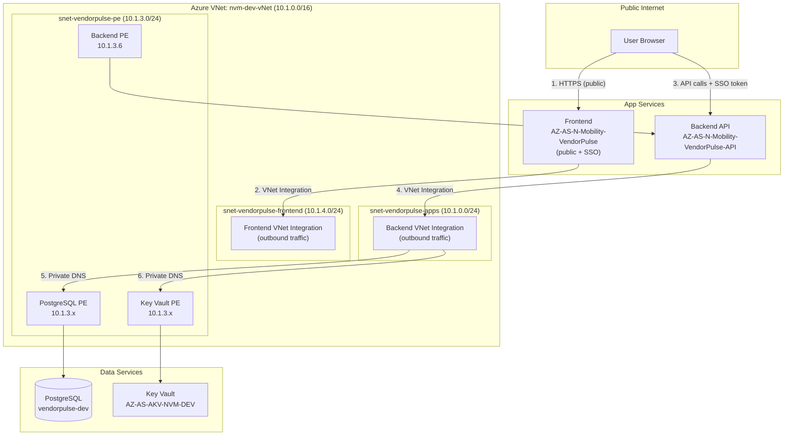

# VendorPulse — VNet & Private Networking Guide

> **Who this is for:** any developer (even one who has never heard of VNets) who needs to
> understand how VendorPulse's private networking works, why it exists, and how to
> maintain or extend it.
>
> **What it covers:** what a VNet is, why we use one, how every component connects
> privately, the exact Azure resources we created, troubleshooting, and operational
> procedures.

---

## Table of contents
1. [Why private networking?](#1-why-private-networking)
2. [Core concepts explained simply](#2-core-concepts-explained-simply)
3. [Before vs After — architecture comparison](#3-before-vs-after--architecture-comparison)
4. [Our VNet setup — the complete picture](#4-our-vnet-setup--the-complete-picture)
5. [How a request flows through the system](#5-how-a-request-flows-through-the-system)
6. [Azure resources we created](#6-azure-resources-we-created)
7. [Step-by-step: what we configured](#7-step-by-step-what-we-configured)
8. [Two directions: inbound vs outbound](#8-two-directions-inbound-vs-outbound)
9. [Private DNS — how names resolve to private IPs](#9-private-dns--how-names-resolve-to-private-ips)
10. [Network Security Groups (NSG)](#10-network-security-groups-nsg)
11. [IP access restrictions (inbound)](#11-ip-access-restrictions-inbound)
12. [How VNet, IP restrictions, and SSO work together](#12-how-vnet-ip-restrictions-and-sso-work-together)
13. [Impact on development & deployment](#13-impact-on-development--deployment)
14. [Troubleshooting](#14-troubleshooting)
15. [Key Vault references — gotchas we hit](#15-key-vault-references--gotchas-we-hit)
16. [Phase 3: making the frontend private (future)](#16-phase-3-making-the-frontend-private-future)
17. [Glossary](#17-glossary)

---

## 1. Why private networking?

### The problem with "public everything"
Without private networking, every Azure resource (your app, database, key vault) has a
**public IP address** on the internet. Anyone who knows the address can *attempt* to connect.
You rely on passwords, firewall IP rules, and SSO to keep them out.

This is like having your office building on a public street with only a locked door — anyone
can walk up and try the handle.

### What VNet solves
A **Virtual Network (VNet)** moves your resources inside a **private campus** with no public
entrance. Traffic between your app and database never touches the public internet. Even if
someone steals a database password, they can't connect because there's no network path from
the internet to the database.

### Defense in depth
Private networking doesn't replace SSO or passwords — it **adds a layer**:

| Layer | What it does | Example |
|-------|-------------|---------|
| **Network** (VNet) | Controls *who can reach* the resource | Only traffic from inside the VNet |
| **Identity** (SSO) | Controls *who can use* the app | Only Shell Entra ID users |
| **Credentials** (passwords/keys) | Controls *who can authenticate* | Database password, API keys |

All three together = defense in depth. Compromising one layer doesn't give full access.

---

## 2. Core concepts explained simply

| Concept | Plain-English meaning |
|---------|----------------------|
| **VNet (Virtual Network)** | A private, isolated network inside Azure. Think of it as your own private campus — resources inside can talk to each other, but the outside world can't reach in unless you explicitly allow it. |
| **Subnet** | A section within a VNet, like a wing in a building. Different subnets hold different types of resources. We have 3 subnets for VendorPulse. |
| **Private Endpoint** | Gives an Azure resource (like PostgreSQL) a **private IP address** inside your VNet. The resource becomes reachable only from within the VNet — its public endpoint can be disabled. |
| **VNet Integration** | Lets an App Service make **outbound calls** through the VNet. Without this, your backend would still call the database over the public internet even though the database has a private endpoint. |
| **Private DNS Zone** | A private phone book that translates hostnames (like `vendorpulse-dev.postgres.database.azure.com`) to **private IP addresses** instead of public ones. Only resources linked to the DNS zone use these private translations. |
| **NSG (Network Security Group)** | A firewall attached to a subnet. It contains rules that allow or deny traffic based on source, destination, port, and protocol. Shell policy requires every subnet to have an NSG. |
| **Private IP** | An IP address like `10.1.3.6` that only exists inside the VNet. Not reachable from the internet. |
| **Public IP** | An IP address like `52.236.0.175` that is reachable from the internet. |
| **Inbound traffic** | Traffic coming *into* a resource (users → your app). |
| **Outbound traffic** | Traffic going *out from* a resource (your app → database). |

### The single most important idea
**Private Endpoints control inbound access (who can reach a resource).
VNet Integration controls outbound access (where a resource can call out to).**
You need both for the system to work end-to-end.

---

## 3. Before vs After — architecture comparison

### BEFORE (public networking)
```
┌─────────────────── PUBLIC INTERNET ───────────────────┐
│                                                        │
│  User (Browser)                                        │
│       │                                                │
│       ▼                                                │
│  Frontend App Service  ──public URL──▶  Backend App Service
│  (public IP)                           (public IP)     │
│                                             │          │
│                                             ▼          │
│                                      PostgreSQL DB     │
│                                      (public IP +      │
│                                       firewall rules)  │
│                                             │          │
│                                      Key Vault         │
│                                      (public IP)       │
│                                                        │
│  Hacker can try to connect to any of these ⚠️          │
└────────────────────────────────────────────────────────┘

Security: Firewall IP rules + SSO login + passwords
Risk: 4 resources with public IPs. IP rules change frequently.
      Leaked credentials = direct access.
```

### AFTER (VNet + private endpoints — current state)
```
┌─── PUBLIC INTERNET ───┐     ┌──── AZURE VNET: nvm-dev-vNet (10.1.0.0/16) ─────┐
│                        │     │                                                   │
│ User (Browser)         │     │  snet-vendorpulse-frontend (10.1.4.0/24)         │
│      │                 │     │   ┌──────────────────────────────────────┐        │
│      ▼                 │     │   │ Frontend App Service                 │        │
│  Public URL ───────────┼─────┼──▶│ VNet Integration (outbound)         │        │
│  + SSO login           │     │   └──────────┬─────────────────────────┘        │
│                        │     │              │                                   │
│ Hacker ─── ❌           │     │              │ calls backend via private DNS     │
│ (can't reach           │     │              ▼                                   │
│  backend/DB/KV)        │     │  snet-vendorpulse-apps (10.1.0.0/24)             │
│                        │     │   ┌──────────────────────────────────────┐        │
└────────────────────────┘     │   │ Backend App Service                  │        │
                               │   │ Private Endpoint: 10.1.3.6 (inbound)│        │
                               │   │ VNet Integration (outbound)          │        │
                               │   └──────────┬─────────────────────────┘        │
                               │              │                                   │
                               │              │ connects via private DNS          │
                               │              ▼                                   │
                               │  snet-vendorpulse-pe (10.1.3.0/24)               │
                               │   ┌─────────────────┐  ┌──────────────────┐     │
                               │   │ PostgreSQL       │  │ Key Vault         │     │
                               │   │ PE: 10.1.3.x    │  │ PE: 10.1.3.x     │     │
                               │   │ No public needed│  │ No public needed │     │
                               │   └─────────────────┘  └──────────────────┘     │
                               └──────────────────────────────────────────────────┘
```

**What changed:**
- PostgreSQL: reachable only from inside the VNet (+ firewall rules kept for direct dev access)
- Key Vault: reachable only from inside the VNet
- Backend API: has a private endpoint (10.1.3.6) — the frontend calls it privately
- Frontend: stays public (users access it via browser) but protected by SSO
- All app-to-resource communication happens over **private IPs** inside the VNet

---

## 4. Our VNet setup — the complete picture

### VNet
| Property | Value |
|----------|-------|
| Name | `nvm-dev-vNet` |
| Address space | `10.1.0.0/16` (65,536 addresses) |
| Region | North Europe |
| Resource group | `AZ-AS-RGP-EX-N-SEQ02296-NVM-DEV` |
| Tags | `operating_environment: Non-PROD`, `NVM_ENV: DEV` |

> This VNet was pre-created by the Shell platform team. We added our subnets to it.
> It also contains 2 existing Databricks subnets (`private-subnet`, `public-subnet`)
> that belong to another team — do not modify those.

### Subnets (ours)

| Subnet | Address range | NSG | Delegation | Purpose |
|--------|--------------|-----|------------|---------|
| `snet-vendorpulse-apps` | `10.1.0.0/24` | `nsg-vendorpulse-dev` | `Microsoft.Web/serverFarms` | Backend App Service outbound calls |
| `snet-vendorpulse-pe` | `10.1.3.0/24` | `nsg-vendorpulse-dev` | None | All Private Endpoints (DB, KV, Backend) |
| `snet-vendorpulse-frontend` | `10.1.4.0/24` | `nsg-vendorpulse-dev` | `Microsoft.Web/serverFarms` | Frontend App Service outbound calls |

**Why 3 subnets?**
- Azure requires a **dedicated, delegated subnet** for each App Service's VNet Integration (outbound). Two App Services cannot share the same delegated subnet.
- Private Endpoints **cannot** be placed in a delegated subnet. They need their own.
- Result: 2 delegated subnets (one per App Service) + 1 for Private Endpoints = 3 minimum.

### Private Endpoints

| Private Endpoint | Target resource | Sub-resource | Subnet | Private IP |
|-----------------|----------------|-------------|--------|-----------|
| `pe-vendorpulse-postgres` | `vendorpulse-dev` (PostgreSQL) | `postgresqlServer` | `snet-vendorpulse-pe` | 10.1.3.x |
| `pe-vendorpulse-keyvault` | `AZ-AS-AKV-NVM-DEV` (Key Vault) | `vault` | `snet-vendorpulse-pe` | 10.1.3.x |
| `pe-vendorpulse-backend` | `AZ-AS-N-Mobility-VendorPulse-API` (Backend) | `sites` | `snet-vendorpulse-pe` | 10.1.3.6 |

### VNet Integration (outbound)

| App Service | Subnet | Route all traffic |
|-------------|--------|-------------------|
| `AZ-AS-N-Mobility-VendorPulse-API` (Backend) | `snet-vendorpulse-apps` | Yes (`WEBSITE_VNET_ROUTE_ALL=1`) |
| `AZ-AS-N-Mobility-VendorPulse` (Frontend) | `snet-vendorpulse-frontend` | Yes |

### Private DNS Zones

| DNS Zone | Linked VNet | Purpose |
|----------|-------------|---------|
| `privatelink.postgres.database.azure.com` | `nvm-dev-vNet` ✅ | Resolves PostgreSQL hostname → private IP |
| `privatelink.vaultcore.azure.net` | `nvm-dev-vNet` ✅ | Resolves Key Vault hostname → private IP |
| `privatelink.azurewebsites.net` | `nvm-dev-vNet` ✅ | Resolves Backend App Service hostname → private IP |

### NSG

| NSG | Subnets attached | Rules |
|-----|-----------------|-------|
| `nsg-vendorpulse-dev` | All 3 VendorPulse subnets | Default rules (allow VNet-to-VNet, deny inbound from internet) |

> Shell policy ("Deny subnets without NSG in NON-PRD External") requires every subnet to
> have an NSG attached. Creating a subnet without one will fail with a policy violation.

---

## 5. How a request flows through the system

### User opens the app (step by step)
```
1. User opens browser → types the frontend URL
2. Browser resolves the URL → gets the Frontend's PUBLIC IP (frontend is still public)
3. Browser downloads the React app (HTML/JS/CSS) from the Frontend App Service
4. User signs in via SSO (Entra ID) → gets an access token
5. Browser (React app) calls the Backend API with the token
   → The URL resolves to the Backend's PUBLIC IP (for browser requests)
   → If Backend public access is disabled, this would be blocked ❌
6. Backend receives the request, validates the SSO token
7. Backend needs to query PostgreSQL:
   → Backend is VNet-integrated → outbound traffic goes through the VNet
   → Private DNS resolves vendorpulse-dev.postgres.database.azure.com → 10.1.3.x (private)
   → Connection goes VNet-internally to the PostgreSQL Private Endpoint
   → Database responds privately
8. Backend needs to read a secret from Key Vault:
   → Same path: VNet → Private DNS → Key Vault Private Endpoint
9. Backend returns the API response to the browser
```

### Key insight: browser calls vs server calls
The browser (running on the user's laptop) calls the backend over the **public internet**.
The backend (running inside Azure) calls PostgreSQL/Key Vault over the **private VNet**.

```
Browser → [public internet] → Backend → [private VNet] → PostgreSQL
                                      → [private VNet] → Key Vault
```

This is why the **frontend stays public** but the **database and Key Vault are private** —
the backend acts as the secure gateway between the public and private worlds.

---

## 6. Azure resources we created

| Resource | Type | Name | Purpose |
|----------|------|------|---------|
| NSG | Network Security Group | `nsg-vendorpulse-dev` | Firewall rules for all 3 subnets |
| Subnet 1 | Subnet (delegated) | `snet-vendorpulse-apps` | Backend outbound VNet Integration |
| Subnet 2 | Subnet | `snet-vendorpulse-pe` | Private Endpoints (DB, KV, Backend) |
| Subnet 3 | Subnet (delegated) | `snet-vendorpulse-frontend` | Frontend outbound VNet Integration |
| Private Endpoint | PE for PostgreSQL | `pe-vendorpulse-postgres` | Private access to database |
| Private Endpoint | PE for Key Vault | `pe-vendorpulse-keyvault` | Private access to secrets |
| Private Endpoint | PE for Backend | `pe-vendorpulse-backend` | Private access to Backend API |
| DNS Zone | Private DNS | `privatelink.postgres.database.azure.com` | Private name resolution for DB |
| DNS Zone | Private DNS | `privatelink.vaultcore.azure.net` | Private name resolution for KV |
| DNS Zone | Private DNS | `privatelink.azurewebsites.net` | Private name resolution for Backend |

**We did NOT create the VNet itself** (`nvm-dev-vNet`) — it was pre-provisioned by the Shell
platform team. We added our subnets and resources to it.

---

## 7. Step-by-step: what we configured

### Step 1: Created 3 subnets in the existing VNet
- Added `snet-vendorpulse-apps`, `snet-vendorpulse-pe`, `snet-vendorpulse-frontend`
- Each with `nsg-vendorpulse-dev` attached (required by Shell policy)
- Two subnets delegated to `Microsoft.Web/serverFarms` for App Service integration

### Step 2: Created Private Endpoint for PostgreSQL
- Portal: `vendorpulse-dev` → Networking → Private endpoint connections → Add
- Placed in `snet-vendorpulse-pe` subnet
- Auto-created DNS zone `privatelink.postgres.database.azure.com` linked to `nvm-dev-vNet`

### Step 3: Created Private Endpoint for Key Vault
- Portal: `AZ-AS-AKV-NVM-DEV` → Networking → Private endpoint connections → Create
- Placed in `snet-vendorpulse-pe` subnet
- Auto-created DNS zone `privatelink.vaultcore.azure.net` linked to `nvm-dev-vNet`

### Step 4: Enabled VNet Integration on Backend App Service
- Portal: `AZ-AS-N-Mobility-VendorPulse-API` → Networking → Outbound → VNet integration
- Connected to `snet-vendorpulse-apps` subnet
- Set `WEBSITE_VNET_ROUTE_ALL=1` (App Setting) to route all outbound traffic through VNet

### Step 5: Enabled VNet Integration on Frontend App Service
- Portal: `AZ-AS-N-Mobility-VendorPulse` → Networking → Outbound → VNet integration
- Connected to `snet-vendorpulse-frontend` subnet
- Route all outbound traffic enabled

### Step 6: Created Private Endpoint for Backend App Service
- Portal: `AZ-AS-N-Mobility-VendorPulse-API` → Networking → Inbound → Private endpoints → Add
- Placed in `snet-vendorpulse-pe` subnet
- Auto-created DNS zone `privatelink.azurewebsites.net` linked to `nvm-dev-vNet`
- Backend now has private IP `10.1.3.6`

### What we intentionally did NOT do (yet)
- **Private Endpoint for Frontend** — skipped. Frontend stays public so users
  can access it from any browser. Protected by SSO instead of network restriction.
- **Disable public access** — not fully done. Public access is restricted to Shell/Zensar
  IPs (see §11). Full disable requires Azure Front Door or API Management as a proxy
  because browsers call the backend over the public internet.

---

## 8. Two directions: inbound vs outbound

This is the **most common source of confusion**. There are two separate networking problems:

```
                    INBOUND                              OUTBOUND
            (who can reach me?)                  (where can I call out to?)

            User/Browser → App                   App → Database/KeyVault
            ──────────────────                   ──────────────────────

 Feature:   Private Endpoint                     VNet Integration
            (gives the resource a                (lets the app make outbound
             private IP inside the VNet)          calls through the VNet)

 Controls:  Who can access the App               Whether the app reaches DB/KV
            Service from outside                 via public or private path

 Without:   App has only a public IP             App calls DB over public internet
            (anyone can try to connect)          (even if DB has a private endpoint)

 With:      App has a private IP                 App calls DB over the VNet
            (only VNet traffic can reach it)     (using the private endpoint)
```

**You need both for full private connectivity.** Having a Private Endpoint on PostgreSQL
but no VNet Integration on the Backend means the Backend would still try to reach
PostgreSQL over the public internet.

---

## 9. Private DNS — how names resolve to private IPs

### The problem
Your backend code connects to `vendorpulse-dev.postgres.database.azure.com`. Without
Private DNS, this hostname resolves to a **public IP** — defeating the purpose of the
Private Endpoint.

### The solution
A **Private DNS Zone** (`privatelink.postgres.database.azure.com`) contains a record:
```
vendorpulse-dev → 10.1.3.x (private IP of the Private Endpoint)
```

When the Backend App Service (which is VNet-integrated) does a DNS lookup, it checks
the Private DNS Zone first and gets the **private IP**. Traffic stays inside the VNet.

### Our DNS zones and their links

| DNS Zone | Resolves | Private IP | Linked to VNet? |
|----------|---------|-----------|-----------------|
| `privatelink.postgres.database.azure.com` | `vendorpulse-dev.postgres...` | 10.1.3.x | ✅ `nvm-dev-vNet` |
| `privatelink.vaultcore.azure.net` | `az-as-akv-nvm-dev.vault...` | 10.1.3.x | ✅ `nvm-dev-vNet` |
| `privatelink.azurewebsites.net` | `az-as-n-mobility-vendorpulse-api...` | 10.1.3.6 | ✅ `nvm-dev-vNet` |

### Verifying DNS links
Portal → Private DNS zones → select a zone → Virtual Network Links → confirm `nvm-dev-vNet`
is listed with status **"Completed"**.

If a link is missing, DNS won't resolve to private IPs and connections will fail or go over
the public path.

---

## 10. Network Security Groups (NSG)

### What it is
An NSG is a cloud firewall attached to a subnet. It contains **inbound** and **outbound**
rules that allow or deny traffic.

### Our NSG
| Property | Value |
|----------|-------|
| Name | `nsg-vendorpulse-dev` |
| Attached to | `snet-vendorpulse-apps`, `snet-vendorpulse-pe`, `snet-vendorpulse-frontend` |
| Rules | Default Azure rules (allow VNet-to-VNet, deny inbound from internet) |

### Why we need it
Shell Azure Policy ("Deny subnets without NSG in NON-PRD External") **blocks subnet
creation** if no NSG is attached. Our first attempt to create subnets failed because
of this policy. We had to create the NSG first, then attach it to each subnet.

### Current rules
The default NSG rules are sufficient for our setup:
- ✅ Allow traffic between resources in the same VNet
- ✅ Allow outbound to the internet (for App Services to reach external APIs like Microsoft Graph)
- ❌ Deny unsolicited inbound traffic from the internet

For production, you may want to add more restrictive rules (e.g., only allow port 5432
from specific subnets to the PE subnet).

---

## 11. IP access restrictions (inbound)

IP restrictions control **who can reach the app from the internet**. This is separate from
VNet (which controls outbound private connectivity to DB/KV).

### Current configuration
Both App Services are set to **"Enabled from select virtual networks and IP addresses"**
with the following allow rules (applied to **Main site** and **Advanced tool site/SCM**):

| Rule name | IP / CIDR | Priority | Why |
|-----------|----------|----------|-----|
| `Shell-Network` | `167.103.0.0/16` | 100 | Shell direct internet egress |
| `Zscaler` | `136.226.0.0/16` | 150 | Shell/Zensar traffic routed through Zscaler cloud proxy |
| `Zensar-1` | `151.186.177.111/32` | 200 | Zensar office direct egress |
| `Zensar-2` | `115.110.105.36/32` | 300 | Zensar office direct egress |
| (default) | Any | — | **Deny** (block everything else) |

> **Zscaler gotcha:** Shell and Zensar route all browser traffic through **Zscaler** (a cloud
> security proxy). Your machine's real IP might be `115.110.105.36`, but Azure sees Zscaler's
> egress IP (e.g. `136.226.255.104`). If you only allow the real IP, you still get 403.
> Always check your IP as Azure sees it: open `https://ifconfig.me` — the IP shown there is
> what Azure checks against. The `X-Forwarded-For` header shows the chain
> (real IP → Zscaler IP → CDN).

### Where to add IPs (3 places)

Access to VendorPulse is controlled at **three** independent layers. To give a new
teammate full access, you may need to update **all three**:

| # | Resource | What it controls | Where in portal |
|---|----------|-----------------|-----------------|
| 1 | **Frontend App Service** | Can the browser load the web app? | `AZ-AS-N-Mobility-VendorPulse` → Networking → Access Restrictions |
| 2 | **Backend App Service** | Can the browser call the API? | `AZ-AS-N-Mobility-VendorPulse-API` → Networking → Access Restrictions |
| 3 | **PostgreSQL Firewall** | Can a dev connect to the DB directly from their laptop? | `vendorpulse-dev` → Networking → Firewall rules |

> **Note:** #1 and #2 are required for the app to work. #3 is only needed if the person
> needs to run SQL queries directly against the database (e.g., for debugging).

### How to add a teammate's IP — step by step

#### Step 0: Find their IP (as Azure sees it)
Ask the teammate to open **`https://ifconfig.me`** in their browser. The IP shown at the
top is what Azure checks. If they use Zscaler, their IP will be in the `136.226.x.x`
range (already covered by the Zscaler rule — they may not need any change).

#### Step 1: Add to Frontend App Service (portal)
1. Go to **`AZ-AS-N-Mobility-VendorPulse` → Networking → Access Restrictions**
2. Under **Main site** tab → click **+ Add**
3. Type: **IPv4**, IP: enter their IP with `/32` (e.g. `203.0.113.50/32`)
4. Action: **Allow**, Name: descriptive (e.g. `TeammateName`)
5. Priority: pick a number between existing rules (e.g. `350`)
6. Click **Add rule**
7. **Repeat on the "Advanced tool site" tab** (needed for deployments)
8. Click **Save**

#### Step 2: Add to Backend App Service
Same steps as above, but on **`AZ-AS-N-Mobility-VendorPulse-API`**.

#### Step 3: Add to PostgreSQL Firewall (only if they need direct DB access)
1. Go to **`vendorpulse-dev` → Networking → Firewall rules**
2. Click **+ Add current client IP address** (or manually enter the IP)
3. Give it a name (e.g. `TeammateName`)
4. Click **Save**

#### CLI alternative (faster for multiple additions)
```powershell
# Replace <IP> with their IP (e.g. 203.0.113.50/32) and <NAME> with a label

# Frontend (main + SCM)
az webapp config access-restriction add -g AZ-AS-RGP-EX-N-SEQ02296-NVM-DEV -n AZ-AS-N-Mobility-VendorPulse --rule-name "<NAME>" --action Allow --ip-address <IP> --priority 350
az webapp config access-restriction add -g AZ-AS-RGP-EX-N-SEQ02296-NVM-DEV -n AZ-AS-N-Mobility-VendorPulse --rule-name "<NAME>" --action Allow --ip-address <IP> --priority 350 --scm-site

# Backend (main + SCM)
az webapp config access-restriction add -g AZ-AS-RGP-EX-N-SEQ02296-NVM-DEV -n AZ-AS-N-Mobility-VendorPulse-API --rule-name "<NAME>" --action Allow --ip-address <IP> --priority 350
az webapp config access-restriction add -g AZ-AS-RGP-EX-N-SEQ02296-NVM-DEV -n AZ-AS-N-Mobility-VendorPulse-API --rule-name "<NAME>" --action Allow --ip-address <IP> --priority 350 --scm-site

# PostgreSQL (only if they need direct DB access)
az postgres flexible-server firewall-rule create -g AZ-AS-RGP-EX-N-SEQ02296-NVM-DEV -n vendorpulse-dev --rule-name "<NAME>" --start-ip-address <IP_WITHOUT_CIDR> --end-ip-address <IP_WITHOUT_CIDR>
```

#### How to remove an IP
```powershell
# App Service (repeat for both apps, with and without --scm-site)
az webapp config access-restriction remove -g AZ-AS-RGP-EX-N-SEQ02296-NVM-DEV -n AZ-AS-N-Mobility-VendorPulse --rule-name "<NAME>"

# PostgreSQL
az postgres flexible-server firewall-rule delete -g AZ-AS-RGP-EX-N-SEQ02296-NVM-DEV -n vendorpulse-dev --rule-name "<NAME>" --yes
```

### Why not fully disable public access?
The browser (running on the user's laptop) calls the backend API **directly over the
public internet**. If you set public access to "Disabled", the frontend app breaks —
browsers can't reach private endpoints.

To fully disable public access, you'd need **Azure Front Door** or **API Management**
in front of the backend to proxy browser calls:
```
Browser → Front Door (public) → Backend (private endpoint only)
```
This is a future production enhancement.

---

## 12. How VNet, IP restrictions, and SSO work together

A common question: *"If I restrict IPs, what's the point of VNet?"*

They solve **different problems** and protect **different traffic directions**:

| Layer | Direction | What it protects | Without it |
|-------|-----------|-----------------|------------|
| **VNet + Private Endpoints** | Outbound (app → DB/KV) | Backend-to-database traffic stays private, never traverses public internet | DB/secrets reachable over public internet; DNS hijack or endpoint compromise could intercept data |
| **IP Restrictions** | Inbound (users → app) | Only Shell/Zensar networks can reach the web app | Anyone on the internet can call your API URLs |
| **SSO (Entra ID)** | Application layer | Only authenticated Shell users can use the app; API returns 401 without valid token | Anonymous access to all API endpoints |

```
         IP Restrictions          SSO              VNet + Private Endpoints
         (front door)          (identity)          (back room plumbing)
              │                    │                        │
   Internet ──┤                    │                        │
   user       │ ── allowed IP? ──▶ │ ── valid token? ──▶    │ ── private path ──▶ DB
              │    Yes/No          │    Yes/No              │                     KV
              │                    │                        │
   Attacker ──┤                    │                        │
   (random    │ ── blocked ❌      │                        │
    IP)       │                    │                        │
```

All three layers work together — **defense in depth**. Compromising one layer doesn't
give full access:
- Attacker on a random IP → blocked by IP restrictions (never reaches the app)
- Attacker on a Shell IP but not logged in → blocked by SSO (401 on every API call)
- Attacker with a stolen SSO token → can call the API, but can't directly access
  the database because it's only reachable via the private VNet path

---

## 13. Impact on development & deployment

### What stays the same
- **Code:** zero code changes required. The app connects to the same hostnames
  (`vendorpulse-dev.postgres.database.azure.com`). DNS handles the routing.
- **Local development:** unaffected. Your laptop uses the public endpoints via
  firewall IP rules.
- **Frontend deploy:** unchanged — `az webapp deploy` works the same way.
- **Environment variables:** same values. No URLs change.

### What changes
| Area | Before VNet | After VNet |
|------|------------|-----------|
| **Backend deploy** | Works from any internet connection | Works only if public access is enabled on the backend. If disabled, need self-hosted runner or temporary re-enable. |
| **Database direct access** | Connect from laptop via firewall IP rules | Still works if public access + firewall rules are kept. After disabling public access, need VPN/jump box. |
| **New App Setting** | N/A | `WEBSITE_VNET_ROUTE_ALL=1` on the backend forces all outbound through VNet |
| **Backend public access** | Always enabled | Can be disabled once private path is verified. Currently enabled for testing. |
| **Startup time** | ~10 seconds | May be ~30-40 seconds (DNS resolution through private path is slightly slower on cold start) |

### Deploy commands (unchanged)
```
# Frontend (unchanged)
cd VendorPulse-code/frontend
npm run build
tar -a -c -f dist.zip -C dist .
az webapp deploy -g AZ-AS-RGP-EX-N-SEQ02296-NVM-DEV -n AZ-AS-N-Mobility-VendorPulse --src-path dist.zip --type zip

# Backend (unchanged, but use config-zip for reliable builds)
cd VendorPulse-code/backend
tar -a -c -f backend.zip --exclude=./.venv --exclude=./__pycache__ --exclude=./data --exclude=./logs --exclude=./.env -C . .
az webapp deployment source config-zip -g AZ-AS-RGP-EX-N-SEQ02296-NVM-DEV -n AZ-AS-N-Mobility-VendorPulse-API --src backend.zip
```

---

## 14. Troubleshooting

| Symptom | Likely cause | Fix |
|---------|-------------|-----|
| Backend fails to start after VNet setup ("Worker failed to boot") | Dependencies not installed (pip install didn't run) | Redeploy with `az webapp deployment source config-zip` (always triggers build). Verify `SCM_DO_BUILD_DURING_DEPLOYMENT=true` in App Settings. |
| Backend can't connect to PostgreSQL | Private DNS zone not linked to VNet, OR NSG blocking port 5432 | Check `privatelink.postgres.database.azure.com` → Virtual Network Links → confirm `nvm-dev-vNet` is linked. |
| Backend can't read Key Vault secrets | Private DNS zone not linked, OR Managed Identity access policy missing | Check `privatelink.vaultcore.azure.net` → Virtual Network Links. Check KV access policies. |
| Frontend can't call Backend API | Backend public access disabled + browser calls go over public internet | Keep backend public access enabled, OR use API Management/Front Door as a proxy. |
| Deploy fails with 403 | Backend public access is disabled | Re-enable public access → deploy → optionally disable again. |
| Subnet creation fails with policy violation | Missing NSG or missing required tags | Create NSG first (`nsg-vendorpulse-dev`), attach it to the subnet. Add tags: `operating_environment: Non-PROD`, `NVM_ENV: DEV`. |
| VNet creation fails with policy violation | Shell policy blocks VNet creation in this subscription | Use the existing `nvm-dev-vNet` instead. It was pre-provisioned by the platform team. |
| Build takes only 2-3 seconds | `SCM_DO_BUILD_DURING_DEPLOYMENT` not working with `az webapp deploy` | Use `az webapp deployment source config-zip` instead. |
| Backend startup fails with `password authentication failed` after password change | `DATABASE_URL` (full connection string) takes precedence over individual `PG_*` settings; old password baked into `DATABASE_URL` | See §15 — remove `DATABASE_URL` or update it. Always check **both** secrets. |
| Key Vault reference shows "Resolved" but app still uses old value | App caches env vars; restart doesn't always refresh KV references | **Stop** the app (not just restart), wait 10s, then **Start**. |
| Deploy blocked with 403 after enabling IP restrictions | Your IP is not in the allow list on the **Advanced tool site** (SCM) tab | Add your IP to the SCM access rules, or temporarily switch to "Enabled from all networks" for the deploy. |

### Diagnostic commands
```
# Check backend logs for startup errors
az webapp log tail -g AZ-AS-RGP-EX-N-SEQ02296-NVM-DEV -n AZ-AS-N-Mobility-VendorPulse-API

# Verify VNet Integration is active
az webapp vnet-integration list -g AZ-AS-RGP-EX-N-SEQ02296-NVM-DEV -n AZ-AS-N-Mobility-VendorPulse-API -o table

# Check App Settings (verify WEBSITE_VNET_ROUTE_ALL)
az webapp config appsettings list -g AZ-AS-RGP-EX-N-SEQ02296-NVM-DEV -n AZ-AS-N-Mobility-VendorPulse-API --query "[?name=='WEBSITE_VNET_ROUTE_ALL']" -o table

# Restart the backend
az webapp restart -g AZ-AS-RGP-EX-N-SEQ02296-NVM-DEV -n AZ-AS-N-Mobility-VendorPulse-API
```

---

## 15. Key Vault references — gotchas we hit

During the August 2026 deployment, the backend failed to start for hours because of a
Key Vault reference issue. Here's what happened and how to avoid it.

### The problem: two secrets storing the same credential
The backend had **two** App Settings that contained the database password:

| App Setting | Key Vault Secret | Content |
|-------------|-----------------|----------|
| `PG_PASSWORD` | `VENDORPULSE-PG-PASSWORD` | Just the password: `Mobility@12345` |
| `DATABASE_URL` | `VENDORPULSE-DATABASE-URL` | Full connection string with password baked in |

The code checks `DATABASE_URL` **first** (see `config.py` → `effective_database_url`).
If it exists, all `PG_*` settings are ignored.

When the PostgreSQL password was changed:
1. `VENDORPULSE-PG-PASSWORD` was updated ✅
2. `VENDORPULSE-DATABASE-URL` was **not** updated — still had the old password ❌
3. The app used `DATABASE_URL` (old password) → `FATAL: password authentication failed`

### The fix
We **removed the `DATABASE_URL` App Setting** entirely. Now the app constructs the DSN
from individual `PG_*` settings, where `PG_PASSWORD` points to the correct Key Vault
secret. The `effective_database_url` property in `config.py` handles URL-encoding
(`quote_plus`) automatically.

### Lessons learned
- **Don't store the same credential in multiple Key Vault secrets.** If you must, document
  which ones need to be updated together.
- **Prefer individual settings** (`PG_HOST`, `PG_USER`, `PG_PASSWORD`) over a monolithic
  `DATABASE_URL`. Rotating one piece is safer than rebuilding the entire string.
- **Check precedence in your code.** `DATABASE_URL` silently overrides `PG_*` settings —
  the app logs showed `PG_HOST` correctly but used the password from `DATABASE_URL`.
- **Stop + Start (not just Restart)** to force Key Vault reference refresh.

---

## 16. Phase 3: making the frontend private (future)

Currently, the frontend is **public** (accessible from any browser). This is intentional for
the dev/demo phase. For production, Shell may require the frontend to be private too.

### What's needed for Phase 3
1. **Create a Private Endpoint** for the Frontend App Service (same process as Step 6)
2. **Disable public access** on the Frontend
3. **Configure ZPA (Zscaler Private Access)** — Shell network team must set up a private
   application segment so Shell-managed devices can reach the frontend through the VPN/ZPA tunnel

### ZPA request — what to provide the Shell network team
| Field | Value |
|-------|-------|
| Application FQDN | `az-as-n-mobility-vendorpulse-afcyb2d5frhsf9cz.northeurope-01.azurewebsites.net` |
| Private subnet | `10.1.3.0/24` |
| Protocol | HTTPS (443) |
| Authorized users | Shell Entra group(s) for VendorPulse |

### Impact on Zensar access
If the frontend is made private, Zensar developers must be on Shell VPN/ZPA to access the
app. Without ZPA access provisioned, they will be unable to reach the application.

---

## 17. Glossary

| Term | Meaning |
|------|---------|
| **VNet** | Virtual Network — a private, isolated network in Azure. Resources inside communicate privately. |
| **Subnet** | A subdivision of a VNet with its own address range and rules. |
| **Private Endpoint (PE)** | Gives an Azure resource a private IP inside a VNet. Makes the resource reachable only from the VNet. |
| **VNet Integration** | Allows an App Service to make outbound calls through the VNet instead of over the public internet. |
| **Private DNS Zone** | A private DNS that resolves hostnames to private IPs for resources inside the VNet. |
| **NSG** | Network Security Group — a subnet-level firewall with allow/deny rules. |
| **Delegation** | Assigning a subnet exclusively for a specific Azure service (e.g., `Microsoft.Web/serverFarms` for App Services). |
| **Inbound** | Traffic coming into a resource from outside. |
| **Outbound** | Traffic going out from a resource to another destination. |
| **Route all traffic** | App Setting (`WEBSITE_VNET_ROUTE_ALL=1`) that forces all outbound App Service traffic through the VNet, not just traffic to VNet addresses. |
| **ZPA** | Zscaler Private Access — Shell's VPN/private access service for connecting user devices to private Azure resources. |
| **Defense in depth** | Using multiple security layers (network + identity + credentials) so compromising one doesn't give full access. |
| **IP Restriction** | An allow/deny rule on an App Service that controls which IP addresses can reach it from the internet. |
| **Access Restriction** | Azure's name for the IP restriction feature on App Services (portal: Networking → Access Restrictions). |
| **SCM / Advanced tool site** | The deployment/admin endpoint of an App Service (Kudu). Has its own separate access restriction rules. |
| **Front Door** | Azure's global load balancer/CDN/WAF. Can proxy public browser traffic to a private backend. Future production enhancement. |
| **Key Vault Reference** | An App Setting that reads its value from Key Vault at startup: `@Microsoft.KeyVault(SecretUri=...)`. No code changes needed. |

---

## Architecture diagram — complete view



---

*This document reflects the VendorPulse Non-PROD (dev) private networking setup as of
August 2026. The VNet (`nvm-dev-vNet`) is shared infrastructure provisioned by the Shell
platform team. VendorPulse owns 3 subnets, 3 Private Endpoints, 1 NSG, and VNet Integration
on both App Services. Both apps have IP restrictions limiting access to Shell/Zensar networks.
The frontend remains publicly accessible (protected by SSO + IP restrictions). For
production, coordinate with the Shell network team (ZPA), security team (review), and DNS
team (private DNS forwarding) before making the frontend fully private. Consider Azure
Front Door for proxying browser traffic to a private backend.*
