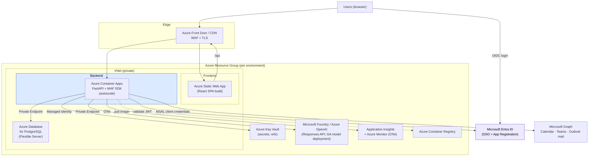
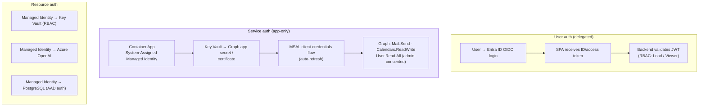
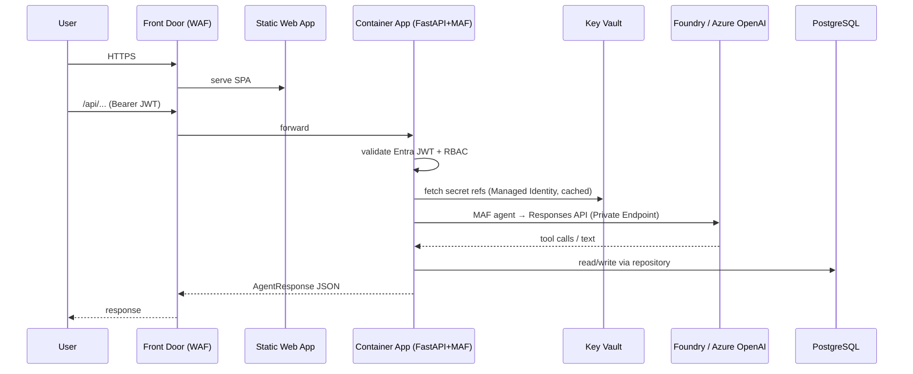
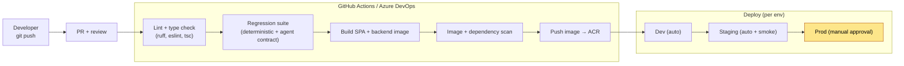
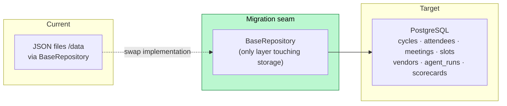
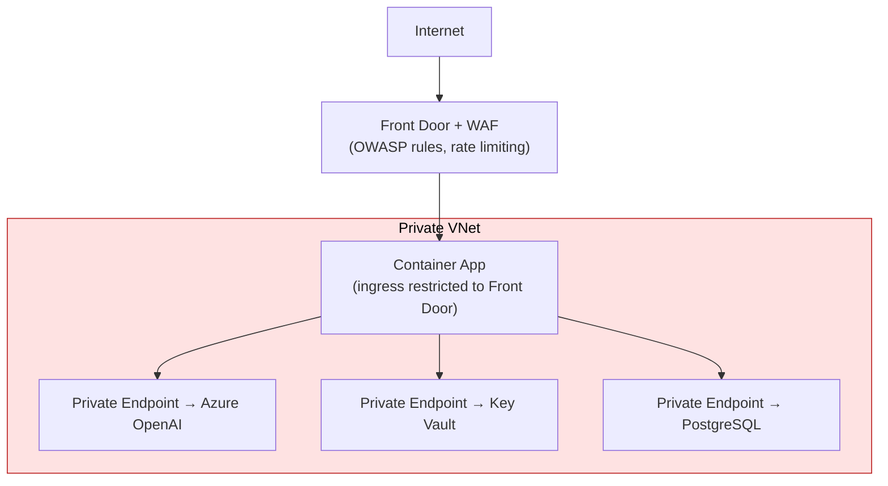
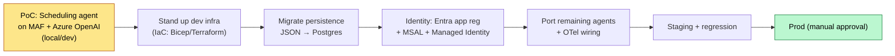

# VendorPulse on Microsoft Agent Framework — Deployment Architecture

> **Companion docs:** [README](README.md) · [Solution Architecture](SOLUTION_ARCHITECTURE.md)
> **Scope:** Physical hosting, identity, data, network, CI/CD, and environments for the MAF target state on Azure.

---

## 1. Azure deployment topology

| Component | Azure service | Rationale |
|-----------|--------------|-----------|
| Frontend | **Static Web Apps** | Built SPA, global CDN, cheap |
| Backend | **Container Apps** | Containerized FastAPI + MAF SDK; scale-to-zero, KEDA autoscale, simpler than AKS |
| Database | **PostgreSQL Flexible Server** | Replaces JSON-file persistence via the `BaseRepository` seam |
| Secrets | **Key Vault** | Azure key, Graph app secret, DB creds — referenced, never in env files |
| LLM | **Microsoft Foundry / Azure OpenAI** | Existing deployment, reached via the **Responses API** (Foundry's single entry point); pin a **GA** chat model (fixes current `computer-use-preview` bug) |
| Telemetry | **App Insights / Monitor** | MAF OpenTelemetry sink |
| Registry | **ACR** | Backend container images |
| Identity | **Entra ID** | User SSO + app-only Graph access |

> **Hosting alternative (BUILD 2026):** the FastAPI+MAF backend can run on **Azure Container Apps** (shown above — full control, GA, the chosen baseline) *or* the MAF agent layer can be packaged as a **Microsoft Foundry Hosted Agent** (public preview) — same prompt-owning code, but Foundry provides the managed endpoint, per-agent Entra identity, scale-to-zero, session state, and built-in tracing. Hosted Agents support BYO-VNet with VM-isolated sessions. Revisit once Hosted Agents exits preview; until then, Container Apps is the production target.

---

## 2. Identity & access flows

**Key change from current build:** the pasted ~1-hour `GRAPH_ACCESS_TOKEN` is replaced by **MSAL client-credentials** backed by an **Entra app registration** with admin-consented application permissions, enabling unattended operation. Resource access (Key Vault, OpenAI, Postgres) uses **Managed Identity** — no secrets in app config.

| Capability | Delegated scope | Application permission |
|-----------|-----------------|------------------------|
| Send mail | `Mail.Send` | `Mail.Send` (+ Application Access Policy → one mailbox) |
| Track replies | `Mail.Read` | `Mail.Read` |
| Scheduling | `Calendars.ReadWrite` | `Calendars.ReadWrite` |
| User lookup | `User.Read` | `User.Read.All` |

---

## 3. Request → response runtime flow

---

## 4. CI/CD pipeline

**Gate:** production deploy requires manual approval. The regression stage is the safety net for the missing automated-test debt — it must cover the approval gate, deterministic path, and `AgentResponse` shape before any agent change ships.

---

## 5. Environments

| Env | Frontend | Backend | DB | Azure OpenAI | Identity |
|-----|----------|---------|----|--------------|----------|
| **Dev** | SWA (preview) | Container App (1 replica, scale-to-zero) | Postgres (Burstable) | Shared dev deployment | Dev app registration |
| **Staging** | SWA (staging slot) | Container App (autoscale 1–3) | Postgres (GP, small) | Staging deployment | Staging app registration |
| **Prod** | SWA (prod) | Container App (autoscale 2–N, zone-redundant) | Postgres (GP, HA) | Prod deployment, **pinned GA model** | Prod app registration + admin consent |

Config differences live in environment-scoped Key Vaults + Container App env vars; no code differences between environments.

---

## 6. Data architecture & migration

- Persistence moves JSON → **PostgreSQL** by reimplementing only `BaseRepository`; routes/agents/services untouched.
- A **relational schema** must be designed first (JSON records are the current contract — no SQL schema exists yet).
- `agent_runs` and request-log bodies hold **confidential** data → define **retention/purge** and a per-cycle **erasure** path.

---

## 7. Network & security controls

| Control | Implementation |
|---------|---------------|
| Edge protection | Front Door + WAF (OWASP), TLS termination, rate limiting |
| Network isolation | Backend in VNet; PaaS reached via **Private Endpoints**; ingress locked to Front Door |
| Secrets | Key Vault + Managed Identity; **rotate** all current `.env` secrets; nothing in images |
| AuthN/AuthZ | Entra ID SSO + RBAC at the API (replaces today's open API) |
| CORS | Restrict to known origins (current `["*"]` is dev-only) |
| Data residency | Pin Azure OpenAI + Postgres to an **approved region**; confirm no-training assurance in DPA |
| Audit | `agent_runs` + OTel traces with correlation IDs; never log secrets/tokens |

---

## 8. Resolved tech-debt (mapped from current build)

| Current issue | Resolution in target deployment |
|---------------|--------------------------------|
| `AZURE_OPENAI_DEPLOYMENT_NAME=computer-use-preview` (400s) | Pin a **GA chat model** (e.g. `gpt-4o`) per environment |
| Pasted ~1h Graph bearer token | **MSAL client-credentials** + Managed Identity, auto-refresh |
| Live secrets in `.env` | **Key Vault** + rotation |
| JSON-file persistence | **PostgreSQL** via repository seam |
| No app-level authN/authZ | **Entra ID SSO + RBAC** |
| Preview Azure OpenAI API version | Pin **GA API version** + dated model snapshot |
| No automated tests | CI regression stage gating deploys |
| CORS `["*"]` with credentials | Restrict to known origins |

---

## 9. Deployment sequencing

Infra defined as code (Bicep or Terraform) so dev/staging/prod are reproducible. The PoC (P0) is the go/no-go gate before any Azure infra spend.
