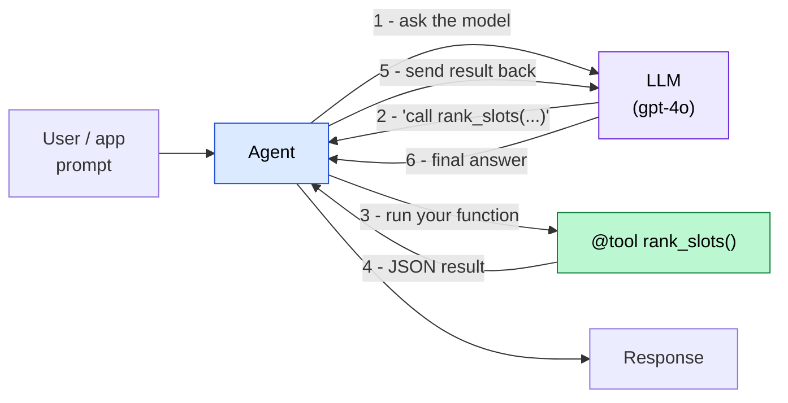
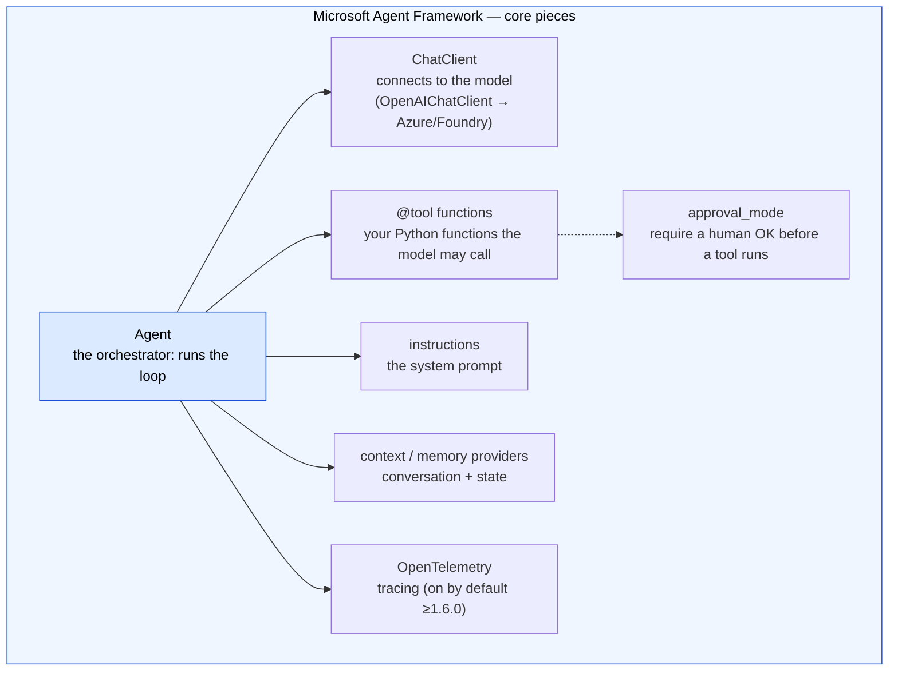
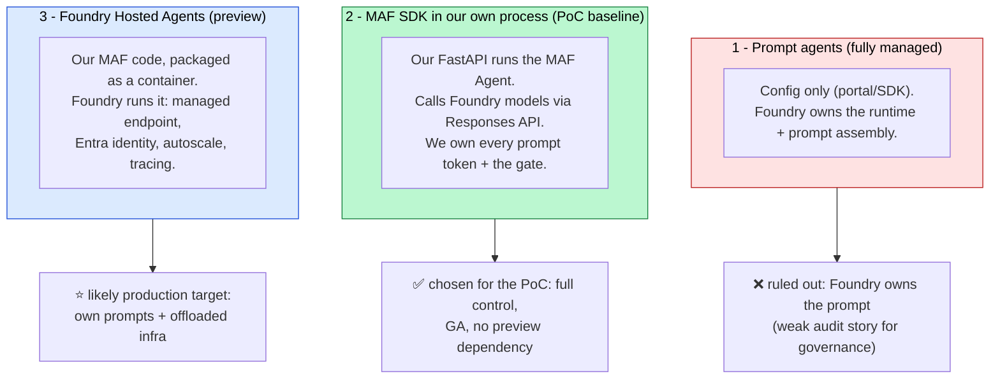
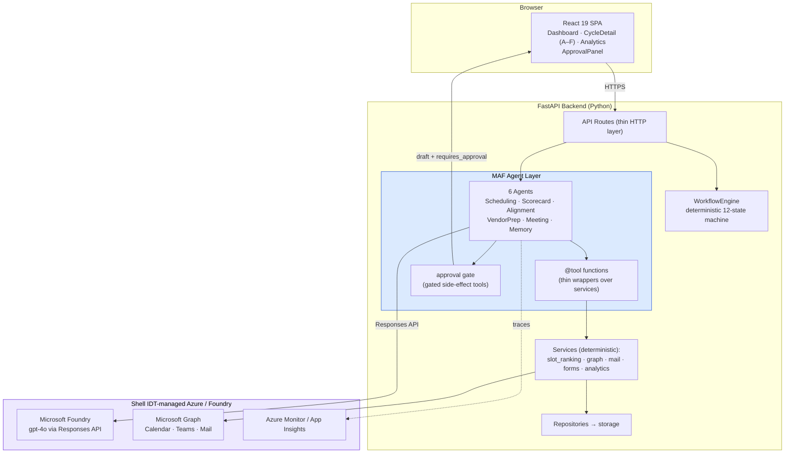
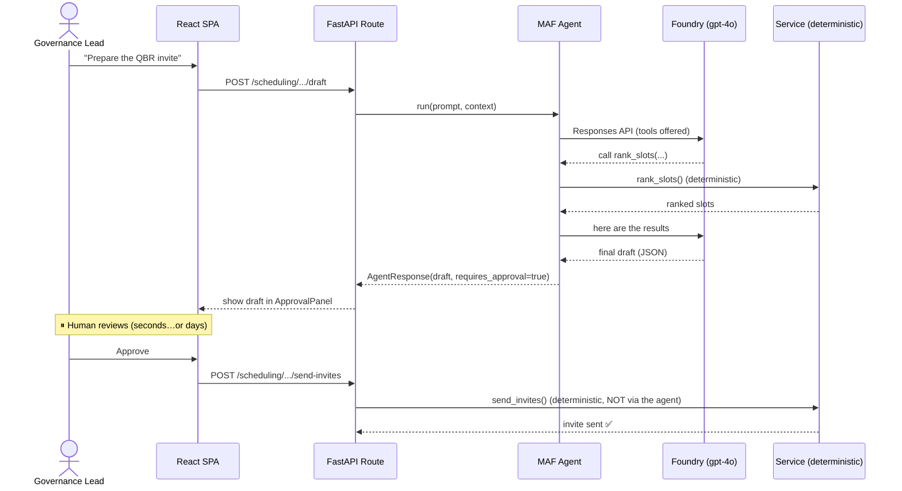
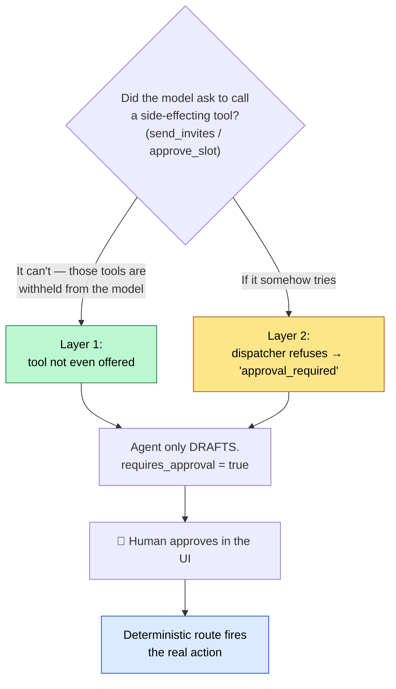
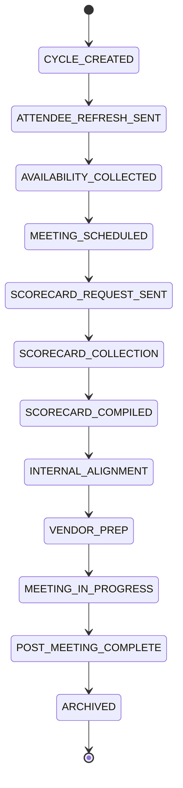
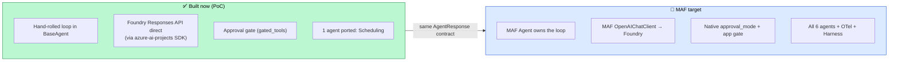

# VendorPulse on Microsoft Agent Framework — Team Onboarding Guide

> **Who this is for:** the VendorPulse team, learning the **Microsoft Agent Framework (MAF)** for the first time.
> **Goal:** explain MAF from scratch, then show how VendorPulse's new architecture maps onto it.
> **Companion docs:** [README](README.md) · [Solution Architecture](SOLUTION_ARCHITECTURE.md) · [Deployment](DEPLOYMENT_ARCHITECTURE.md) · [Shell Compliance Checklist](SHELL_COMPLIANCE_CHECKLIST.md)
> **As of:** June 2026 — MAF 1.x (1.0 GA'd April 2026). Pin the exact SDK version; the API churned post-GA.

---

## 0. TL;DR (read this first)

- **MAF** is Microsoft's open-source SDK for building AI agents (the merger of Semantic Kernel + AutoGen). It owns the "agent loop": talk to a model, let it call your functions (tools), feed results back, repeat until done.
- An **agent** = a **model** + **instructions** + **tools**. That's it.
- VendorPulse uses MAF for **one job only**: turning structured data into human-readable text (briefs, minutes, summaries). **All real decisions stay deterministic** (scores, slot ranking, workflow). The AI never acts on its own — a human approves first.
- We run the model through **Microsoft Foundry** (Shell's sanctioned Azure AI platform) using the **Responses API**.
- This guide builds up from "what is an agent" to "how VendorPulse is wired."

---

## 1. MAF in five minutes (for first-timers)

### 1.1 The one idea behind every agent framework
A plain LLM call is: *send text → get text back*. An **agent** adds a loop so the model can **use tools** (your functions) to fetch data or take actions before answering:



Steps 1–5 repeat until the model stops asking for tools (step 6). **MAF writes this loop for you** — you just declare the tools and the instructions. (Today, VendorPulse hand-wrote this loop in `BaseAgent`; MAF would replace it.)

### 1.2 The core building blocks


| Term | What it is | VendorPulse equivalent |
|------|-----------|------------------------|
| **Agent** | Runs the tool-calling loop | Today: `BaseAgent` + 6 subclasses |
| **ChatClient** | Connection to the model | Today: `LLMService` (Azure OpenAI / Foundry) |
| **@tool** | A Python function the model may call | `get_attendee_list`, `rank_slots`, … |
| **instructions** | System prompt | `SCHEDULING_SYSTEM_PROMPT` etc. |
| **approval_mode** | In-run human gate on a tool | Our `gated_tools` + approval routes |
| **Message** | One turn in the conversation | the `messages` list in the loop |
| **OpenTelemetry** | Automatic tracing of every step | maps to Shell's logging/observability needs |

### 1.3 What a MAF agent looks like in code (illustrative)
> Exact import paths/signatures must be verified against the **pinned** SDK version — the API changed across 1.0→1.8 (e.g. `ChatAgent`→`Agent`, `approval_mode` is now an `ApprovalMode` enum).

```python
from agent_framework import Agent, tool, ApprovalMode
from agent_framework.openai import OpenAIChatClient
from azure.identity import DefaultAzureCredential

# 1) Declare tools — just decorate your functions
@tool
def rank_slots(date_range_start: str, date_range_end: str) -> str:
    """Return the top-ranked meeting slots (deterministic)."""
    return scheduling_service.rank_slots(...)        # your existing service

@tool(approval_mode=ApprovalMode.REQUIRED)           # <-- in-run human gate
def send_invites(slot_id: str) -> str:
    """Send calendar invites. Requires human approval."""
    return scheduling_service.send_invites(...)

# 2) Point a client at Foundry/Azure (Entra auth, no API key)
client = OpenAIChatClient(
    azure_endpoint="https://<resource>.services.ai.azure.com/api/projects/<project>",
    model="gpt-4o",
    credential=DefaultAzureCredential(),
)

# 3) Build the agent and run it
agent = Agent(client=client, instructions=SCHEDULING_SYSTEM_PROMPT,
              tools=[rank_slots, send_invites])
result = await agent.run("Schedule the Q3 review for NovaTech")

# 4) If a gated tool was requested, MAF pauses and hands you the request
for req in result.user_input_requests:               # human-in-the-loop
    # surface to the approver; resume after they decide
    ...
```

The big difference from today's code: **you stop writing the loop, the message bookkeeping, and the tool dispatch by hand.** You declare tools + instructions; MAF runs it.

---

## 2. Where MAF runs — the three Foundry hosting tiers

MAF is just an SDK; it needs a model endpoint. At Shell that means **Microsoft Foundry** (`ai.azure.com`). There are three ways to host, from least to most managed:



> All three reach models through the **Responses API** (Foundry's single entry point). The current PoC technically used the **Foundry SDK + Responses API directly** (a variant of tier 2 *without* the MAF SDK) — see §4.

---

## 3. The new VendorPulse architecture on MAF

### 3.1 Big picture


### 3.2 The golden rule: deterministic vs AI
This is the heart of VendorPulse and the reason it aligns with Shell's IRM guidelines.

```mermaid
flowchart LR
    subgraph DET["Deterministic (NEVER the LLM)"]
        D1["Slot ranking algorithm"]
        D2["Score validation & outliers"]
        D3["Workflow state transitions"]
        D4["Sending invites / emails"]
    end
    subgraph AI["AI (LLM via MAF) — text only"]
        A1["Draft invite wording"]
        A2["Summarise score changes"]
        A3["Generate meeting minutes"]
        A4["Draft vendor brief"]
    end
    AI -->|"produces drafts"| HUMAN["👤 Human approves"]
    HUMAN -->|"then triggers"| DET
    style DET fill:#bbf7d0,stroke:#15803d,color:#000
    style AI fill:#dbeafe,stroke:#1d4ed8,color:#000
    style HUMAN fill:#fde68a,stroke:#b45309,color:#000
```



> Because every business-critical decision is deterministic and the AI's text output is human-approved, **hallucinations can't drive real actions** — directly satisfying Shell IRM 3.6.6 (hallucination) and 3.6.3 (human approval).

### 3.3 How one agent run works (sequence)


### 3.4 The approval gate (the most important safety pattern)
Two layers protect against the AI taking an action on its own:



In MAF, Layer 2 can also be the native `@tool(approval_mode=ApprovalMode.REQUIRED)` — the run pauses and returns a `user_input_requests` object for the human to approve/reject.

### 3.5 The workflow engine is OUTSIDE the AI
The 12-state machine is deterministic and the single source of truth. Agents work *within* a state — they never decide the next state.



---

## 4. What's built today vs the MAF target



**Important nuance:** the PoC proved *Foundry + Responses API + tool-calling + the gate* using the **Foundry SDK directly** (`azure-ai-projects` → `responses.create`). It did **not** yet adopt the **MAF SDK** (`agent_framework.Agent`). Both are valid; MAF gives more built-in controls (native HITL, on-by-default tracing, the Agent Harness) — which matters for Shell because those controls then come from a pre-assessed platform instead of code we must defend in security review.

---

## 5. Glossary (MAF terms you'll hear)

| Term | Plain meaning |
|------|---------------|
| **Agent** | The thing that runs the model + tools loop |
| **Tool** | A function the model can call (`@tool`) |
| **ChatClient** | The model connection (`OpenAIChatClient` → Azure/Foundry) |
| **Responses API** | Foundry's modern endpoint for model calls (replaces Chat Completions as the default) |
| **approval_mode** | Flag making a tool require human approval before it runs |
| **user_input_requests** | What a run returns when it's paused waiting for approval |
| **Agent Harness** | BUILD-2026 add-on: auto context compaction + built-in memory/file/task helpers |
| **CodeAct** | Optimization where the model writes code to call several tools in one turn |
| **Hosted Agent** | Your MAF code, packaged and run *by* Foundry (preview) |
| **OpenTelemetry (OTel)** | Standard tracing; on by default in MAF ≥1.6.0 → Azure Monitor |
| **HITL** | Human-in-the-loop (approval before action) |

---

## 6. Compliance guardrails (Shell) — keep these in view

VendorPulse serves **Shell**; every change must respect Shell **IRM 3.492** + the **EU AI Act**. The non-negotiables (full list in [SHELL_COMPLIANCE_CHECKLIST.md](SHELL_COMPLIANCE_CHECKLIST.md)):

- 🔒 **Human approval before any send/act** (IRM 3.6.3) — our gate.
- 🧮 **Deterministic core; AI = text only** (IRM 3.6.6) — our golden rule.
- 🏛️ **Run on Shell IDT-managed Azure/Foundry; Azure OpenAI needs Shell.AI + TRB approval** (IRM 3.3 / 3.5.1).
- 📋 **Register in AI Registry + ServiceNow; complete IRM risk assessment / IAQ** before deploying (IRM 3.4).
- 🔑 **Entra SSO + RBAC, Key Vault secrets, content filters, OTel logging** (IRM 3.6.2 / 3.6.3 / 3.5.1).
- 👁️ **Tell users when they're interacting with AI** (IRM 3.5.3 / EU AI Act transparency).
- 🔍 **AI-assisted code passes security/quality review** (IRM 3.3).

> Never commit Shell INTERNAL/CONFIDENTIAL documents to the repo (they're git-ignored).

---

## 7. Getting started locally (PoC)

```powershell
# 1) One-time: verify the Foundry endpoint + your Entra login + model
cd VendorPulse-code/backend
python test_foundry_endpoint.py        # browser login opens; expect a one-word reply

# 2) Run the Scheduling agent over Foundry (read-only demo)
python poc_scheduling_foundry.py

# 3) See the approval gate refuse a side effect
python poc_scheduling_foundry.py --gate
```

When you move to the **MAF SDK** path: `pip install agent-framework` (pin the exact version), build a `agent_framework.Agent` with your `@tool`-wrapped services, and keep the deterministic routes + approval gate exactly as they are. The `AgentResponse` envelope stays the contract between the agent layer and the frontend, so the UI never changes.

---

### Where to go next
- Conceptual design → [SOLUTION_ARCHITECTURE.md](SOLUTION_ARCHITECTURE.md)
- Azure hosting / identity / security → [DEPLOYMENT_ARCHITECTURE.md](DEPLOYMENT_ARCHITECTURE.md)
- Compliance obligations → [SHELL_COMPLIANCE_CHECKLIST.md](SHELL_COMPLIANCE_CHECKLIST.md)
- Migration decisions & open items → [README.md](README.md) and GitHub issue #13
