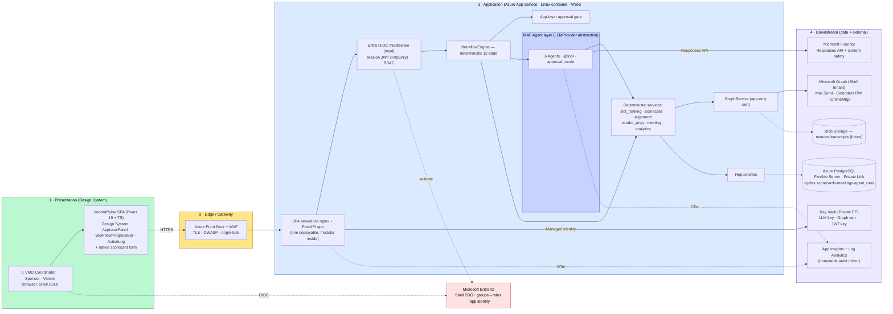
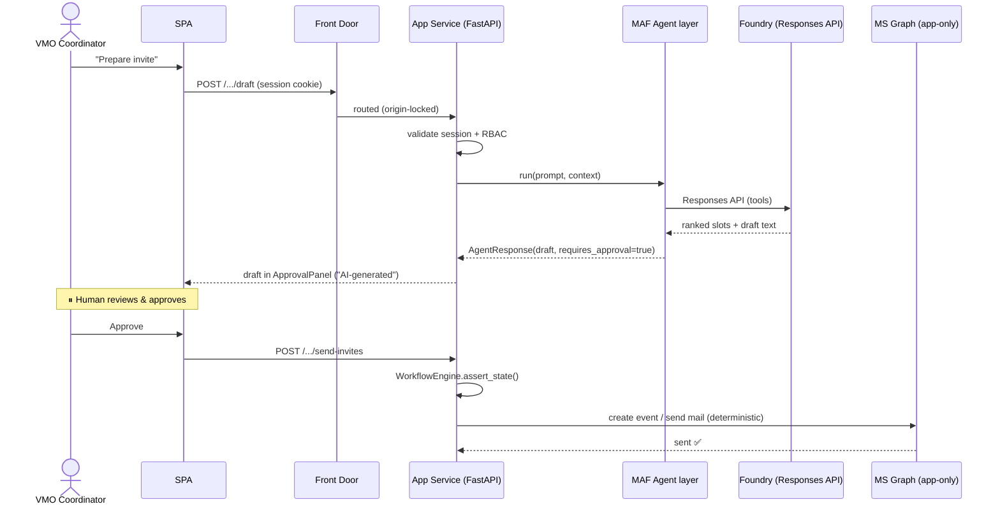
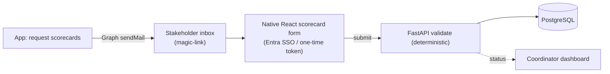

# VendorPulse — Production Solution Architecture (Shell)

> **Document type:** Production solution architecture, rendered in a layered (4-tier) visual format.
> **Client:** Shell — single-tenant inside Shell's Microsoft 365 / Azure estate. Must satisfy **IRM 3.492** (NIST AI RMF / ISO 42001) + **EU AI Act**.
> **Authoritative source:** this view is aligned to the client-reviewed v2.0 Shell pack in `docs-archive/updated/` — esp. [02 Solution Architecture](../docs-archive/updated/02_Solution_Architecture_Shell.md), [07 Gmail→Outlook](../docs-archive/updated/07_Gmail_to_Outlook_Migration_Plan.md), [12 Deployment](../docs-archive/updated/12_Deployment_Architecture_Shell.md). Where the two differ, the v2.0 pack and its ADRs win.
> **What this doc adds:** the same architecture drawn in the 4-layer visual format **and** the realized LLM/agent tier — **MAF SDK → Microsoft Foundry Responses API** (this session's decision, GitHub issue #13), which fills in ADR-006's `LLMProvider` abstraction with a concrete choice.
> **Companion docs:** [README](README.md) · [MAF Onboarding](MAF_TEAM_ONBOARDING.md) · [Shell Compliance Checklist](SHELL_COMPLIANCE_CHECKLIST.md)

---

## 0. Shape, in one line

A **single-tenant, deterministic-first, AI-second** workflow app: one FastAPI application (modular internally — *not* microservices) on **Azure App Service**, fronted by **Front Door + WAF**, using **Entra SSO**, **Microsoft Graph** (app-only cert), **PostgreSQL**, **Key Vault**, and a **MAF agent layer** that calls **Foundry** only to draft text behind a human-approval gate.

> The reference diagram's visual *format* is used below; its microservice *content* is not — VendorPulse is one bounded context, so per ADR-001/002 it ships as a single modular App Service app.

---

## 1. Top-level production architecture (4 layers)

---

## 2. Layer 1 — Presentation (Design System)

| Element | Production choice | Source |
|---------|-------------------|--------|
| SPA | React 19 + TS + Zustand; design-system components (ApprovalPanel, WorkflowProgressBar, ActionLog) | pack §04 |
| **Scorecard intake** | **Native in-app React form** (magic-link → Entra SSO internal / one-time token external) — *not* Google/MS Forms | **ADR-005**, pack §5.3 Option B |
| Hosting of SPA | Served via nginx from the same App Service (or Front Door CDN) | pack §2 |
| Login | **Entra ID OIDC** (Shell SSO); session JWT in HttpOnly/Secure cookie | ADR-009, pack §3.1 |
| RBAC | Entra groups → app roles (`vmo_coordinator`, `vmo_admin`, `executive_sponsor`, `viewer`) | pack §3.2 |
| **AI transparency** | "AI-generated — pending approval" badge on every AI draft | EU AI Act / IRM 3.5.3 |

## 3. Layer 2 — Edge / Gateway

| Element | Production choice |
|---------|-------------------|
| Edge | **Azure Front Door + WAF** — TLS 1.2+, OWASP, rate-limit; **origin-lock** so App Service is reachable only from Front Door (Service Tag) |
| Auth point | Handled **in-app** (Entra OIDC middleware), not a separate API gateway. *Azure API Management is optional* if a Shell standard mandates a managed gateway. |

## 4. Layer 3 — Application (single modular app on App Service)

One FastAPI app (Python 3.11), **modular inside**, on **Azure App Service (Linux containers)** with VNet integration. Per ADR-001/002 this is single-tenant and *not* split into microservices.

| Module (internal) | Responsibility | Det / AI |
|-------------------|----------------|----------|
| **WorkflowEngine** | 12-state machine — the single source of truth for transitions | Deterministic |
| **Approval gate** | Drafts set `requires_approval`; side-effecting tools gated; external actions fire from deterministic routes after a human approves | Deterministic |
| **MAF Agent layer** | 6 agents (`agent_framework.Agent` + `@tool` + `approval_mode`), behind the `LLMProvider` abstraction; calls Foundry; `AgentResponse` adapter | **AI (text only)** |
| **Deterministic services** | slot_ranking · scorecard validation · alignment · vendor_prep · meeting · analytics | Deterministic |
| **GraphService** | App-only (certificate) calls: Mail.Send, Calendars.ReadWrite, OnlineMeetings, User.Read.All — mailbox-scoped via Application Access Policy | Deterministic |
| **Async tasks** | Scorecard polling, tiered reminders (in-process scheduler / WebJobs) | Deterministic |
| **Repositories** | Data access → PostgreSQL (replaces JSON/SQLite via the `BaseRepository` seam) | Deterministic |

**LLM tier (the reconciliation):** ADR-006 specifies a config-switchable `LLMProvider` abstraction (Anthropic *or* Azure OpenAI). This session's decision (issue #13) fills it in: the realized provider is **Microsoft Foundry (Azure OpenAI family) via the Responses API, orchestrated by the MAF SDK** — the agent framework gives platform-provided HITL (`approval_mode`), content filters, and on-by-default OpenTelemetry, which shrinks the hand-rolled control surface Shell must security-review (IRM 3.3). The abstraction stays, so Anthropic remains a config alternative if Shell procurement chooses it.

## 5. Layer 4 — Downstream (data + external)

| Element | Production choice | Source |
|---------|-------------------|--------|
| Primary DB | **Azure PostgreSQL Flexible Server** (Private Link, `sslmode=require`); pgvector later | ADR-004, pack §4 |
| Secrets | **Key Vault** (Private EP) — LLM key, **Graph certificate**, JWT signing key; Managed Identity, no `.env` | pack §7.2 |
| Observability | **App Insights** + **Log Analytics** (immutable audit mirror of `agent_runs`); `cycle_id`/`agent_run_id` correlation | ADR-008, pack §6 |
| Object store | **Blob Storage** (Private EP) — minutes/transcripts (future) | pack §4.1 |
| LLM | **Microsoft Foundry — Responses API** + content safety (Anthropic selectable via abstraction) | issue #13 / ADR-006 |
| Productivity | **Microsoft Graph** (Shell tenant, app-only cert) — Outlook mail, calendar, Teams | pack §5.1 |
| Identity | **Entra ID** — SSO, groups→roles, app registration `VendorPulse-Prod` | ADR-009 |

---

## 6. Key runtime flows

### 6.1 Draft → approve → act

### 6.2 Scorecard via native in-app form (ADR-005)

---

## 7. Cross-cutting (mapped to Shell IRM + the pack's ADRs)

| Concern | Approach | IRM / ADR |
|---------|----------|-----------|
| Human approval | App-layer gate on every outbound action; MAF `approval_mode`; coordinators only "approve", never direct-send | 3.6.3 / ADR-007 |
| Hallucination | Deterministic core; grounded prompts; code-stamped IDs/timestamps (onboarding §8) | 3.6.6 |
| Identity | Entra SSO + groups→roles; app-only **certificate** to Graph, mailbox-scoped | 3.6.2 / ADR-003/009 |
| Auditability | `agent_runs` in Postgres + immutable Log Analytics mirror; correlation IDs | 3.5.5 / ADR-008 |
| Data protection | Single-tenant EU region; stakeholder comments = Confidential, never vendor-visible; retention per §6.3 | scope / 3.5.6 |
| Content safety | Foundry content filters / XPIA | 3.6.3/3.6.5 |
| Secrets | Key Vault + Managed Identity; **no `.env` in any environment** | 3.6.2 |
| Registration | AI Registry + ServiceNow + IRM IAQ; Shell.AI + TRB approval | 3.4 / 3.3 |

---

## 8. What this changes from the POC (delta)

Aligned with pack §00 + [§07](../docs-archive/updated/07_Gmail_to_Outlook_Migration_Plan.md):

| POC | Shell production |
|-----|------------------|
| Gmail + Google Forms | **Graph Outlook mail + native in-app scorecard form** (Google fully removed) |
| Pasted ~1h delegated Graph token | **App-only certificate** auth, mailbox-scoped |
| Hand-rolled tool loop | **MAF SDK** agents behind `LLMProvider` |
| SQLite / JSON files | **PostgreSQL Flexible Server** |
| No auth, CORS `*` | **Entra SSO + RBAC** |
| `.env` secrets | **Key Vault + Managed Identity** |
| stdout logging | **App Insights + Log Analytics** |
| laptop `uvicorn` | **Azure App Service (Linux container)** |

---

## 9. Open items (defer to the pack)

Full registers live in the v2.0 pack: ADRs ([§02 ADR log](../docs-archive/updated/02_Solution_Architecture_Shell.md#8-architectural-decisions-log-adrs)), risks ([§09](../docs-archive/updated/09_Assumptions_and_Risks.md)), access ([§08](../docs-archive/updated/08_Dependencies_and_Access_Requirements.md)). The items this view *adds*:
1. Confirm **MAF SDK** as the realized agent framework over Foundry (refines ADR-006) — pin exact SDK version.
2. Decide **AI Agent layer hosting**: in-process on App Service (baseline) vs **Foundry Hosted Agent** once GA.
3. Re-verify MAF bugs #4411 / #4376 on the AAD-routed client during the spike (issue #13).
