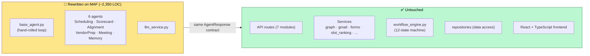
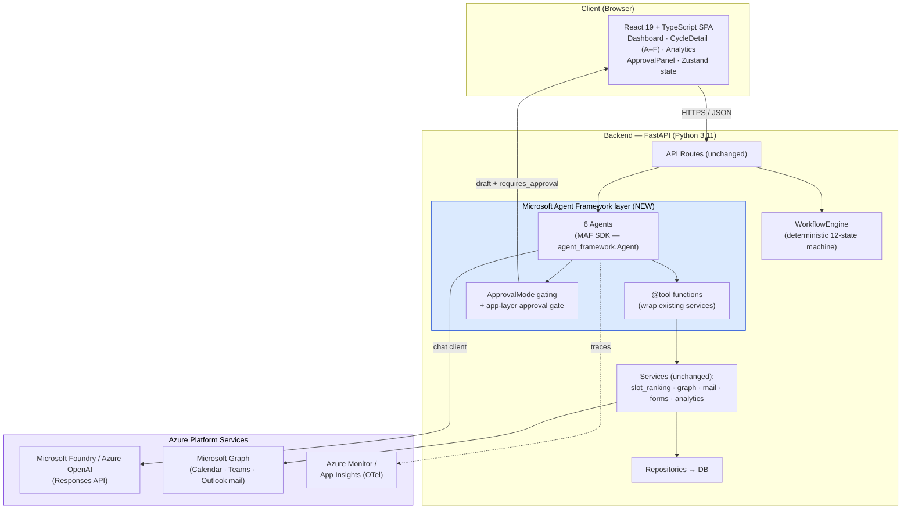

# VendorPulse on Microsoft Agent Framework — Target Architecture

> **Document type:** Architecture package (index)
> **System:** VendorPulse — Vendor Governance Cycle Automation Platform
> **Client:** Shell — all AI work must satisfy **Shell IRM 3.492** (NIST AI RMF / ISO 42001) + the **EU AI Act**. See [SHELL_COMPLIANCE_CHECKLIST.md](SHELL_COMPLIANCE_CHECKLIST.md).
> **Scope:** Rebuilding the agent layer on the **Microsoft Agent Framework (MAF)** Python SDK, while preserving the deterministic core and human-approval gate. We run the SDK in our own process today; **Microsoft Foundry Hosted Agents** is a now-viable hosting option (see §3).
> **Audience:** Engineers, technical leads, enterprise architecture & security reviewers. **New to MAF? Start with [MAF_TEAM_ONBOARDING.md](MAF_TEAM_ONBOARDING.md).**
> **Status:** Proposed (target state). **Phase-0 PoC done (June 2026):** Foundry project verified, `SchedulingAgent` ported to the Foundry Responses API, approval gate closed — tracked in GitHub issue #13. Hosting/SDK decision (see §3) pending.
> **Last refreshed:** June 2026 — aligned to MAF 1.x post-GA API (≈1.8) and the BUILD 2026 / Microsoft Foundry rebrand. Pin the exact SDK version at build time; the API has churned through 1.3 / 1.6 / 1.8 since the April 2026 GA.

---

## 1. What this package contains

| Doc | Purpose |
|-----|---------|
| **README.md** (this file) | Orientation, decisions, why MAF, migration scope, top-level diagrams |
| [MAF_TEAM_ONBOARDING.md](MAF_TEAM_ONBOARDING.md) | **Start here if new to MAF** — explains the framework + the new architecture from scratch, with diagrams |
| [SOLUTION_ARCHITECTURE.md](SOLUTION_ARCHITECTURE.md) | Logical design — components, the MAF agent layer, workflow state machine, the approval-gate sequence, dual execution path |
| [DEPLOYMENT_ARCHITECTURE.md](DEPLOYMENT_ARCHITECTURE.md) | Physical design — Azure topology, identity (Entra ID / MSAL / Managed Identity), data, CI/CD, environments, security |
| [SHELL_COMPLIANCE_CHECKLIST.md](SHELL_COMPLIANCE_CHECKLIST.md) | Shell IRM 3.492 + EU AI Act controls mapped to the build; blocking procedural prerequisites |

All diagrams are authored in **Mermaid** and render natively in GitHub, VS Code (with a Mermaid extension), and most Markdown viewers.

---

## 2. The decision in one paragraph

VendorPulse currently runs a **hand-rolled tool-calling loop** (`BaseAgent._tool_calling_loop`) over the **OpenAI SDK against Azure OpenAI**, with a deterministic fallback path (`ENABLE_LLM=false`) and a human-approval gate enforced in the application layer. The target architecture replaces *only the agent orchestration layer* with the **Microsoft Agent Framework Python SDK** (1.0 GA April 2026 — the merger of Semantic Kernel + AutoGen; we target the current 1.x line, ≈1.8 as of June 2026). We run the **SDK in our own process** and call **Foundry / Azure OpenAI models** through it, keeping full prompt ownership, the deterministic fallback, and the app-layer approval gate — the audit-transparency and human-gating guarantees that are the whole point of a vendor-governance product. **Microsoft Foundry "Hosted Agents"** (BUILD 2026, public preview) is now a legitimate *hosting* option for this same MAF code — it lets us bring our own prompt-owning agent code and have Foundry run it — and is evaluated in §3 rather than rejected outright. Routes, services, the workflow engine, repositories, and the entire frontend are **unchanged**.

---

## 3. Why Microsoft Agent Framework (and which hosting model)

| Driver | Detail |
|--------|--------|
| **Already on Azure OpenAI / Foundry models** | Same deployment reused — no re-prompting, no model eval |
| **Delete hand-rolled plumbing** | MAF owns the tool loop, message-history assembly, and tool dispatch we wrote by hand; the **Agent Harness** (BUILD 2026) adds built-in context compaction + memory/file/task providers we'd otherwise hand-write |
| **Native HITL tool approval** | `@tool(approval_mode=ApprovalMode.REQUIRED)` → run returns `user_input_requests`; `ToolApprovalAgent` middleware adds "don't ask again" rules (belt-and-suspenders for any in-run side effect) |
| **Enterprise features** | OpenTelemetry tracing (**on by default** since 1.6.0), Entra ID auth, Azure Monitor, graph-based workflows |
| **Strategic direction** | Semantic Kernel + AutoGen are now maintenance-mode; MAF is where new features land |

**Hosting model — three options, not a binary.** As of BUILD 2026, Microsoft Foundry Agent Service is no longer "managed-or-nothing." The real choices are:

| Option | What it is | Fit for VendorPulse |
|--------|-----------|---------------------|
| **Prompt agents** | Fully managed, config-only; Foundry owns the runtime | ❌ Foundry owns instruction assembly — weakest prompt ownership/audit story |
| **MAF SDK in our own process** *(chosen baseline)* | We host the SDK in our FastAPI container; call Foundry/Azure OpenAI via the **Responses API** | ✅ Full prompt ownership, deterministic fallback, app-layer gate, runs where our backend runs |
| **Foundry Hosted Agents** *(preview — evaluate)* | **Our own MAF code**, packaged as a container/zip, run by Foundry with managed endpoint + Entra identity + scaling + tracing | ✅ Same prompt ownership as self-host; offloads infra. Public preview — validate before committing |

The earlier objection ("managed service injects hidden prompts / doesn't enforce grounding") applied to **Prompt agents** and is *not* a reason to avoid Foundry entirely — **Hosted Agents** run our own prompt-owning code. See the updated trade-off table in [SOLUTION_ARCHITECTURE.md §7](SOLUTION_ARCHITECTURE.md#7-maf-sdk-hosting-options). Note that all three paths now front Foundry models through the **Responses API** single entry point.

---

## 4. Migration scope (what changes vs what stays)

**Migration surface:** `BaseAgent` + 6 agents + `LLMService` (~2,350 lines). Everything else stays behind the unchanged `AgentResponse` envelope.

---

## 5. Top-level target architecture

---

## 6. Key architectural principles (preserved from current build)

1. **Deterministic vs AI split** — slot ranking, score validation, workflow transitions, and outlier detection stay deterministic. MAF agents only produce human-readable text and orchestrate *within* a state.
2. **Human-approval gate stays in the app layer** — agents generate drafts (`requires_approval=true`); external actions fire from separate deterministic routes after a human approves. MAF's `approval_mode` is an *additional* in-run safeguard, not the primary gate.
3. **`AgentResponse` contract is sacred** — a thin adapter maps MAF output back to the existing envelope so the frontend never changes.
4. **Workflow engine outside the framework** — the 12-state machine remains the single source of truth for transitions; MAF never decides cross-state flow.
5. **Full auditability** — every agent run logged to `agent_runs`, now augmented with OpenTelemetry traces to Azure Monitor.

---

## 7. Migration phases & effort

| Phase | Work | Effort | Status |
|-------|------|--------|--------|
| −1. **Shell compliance prerequisites** (blocking) | AI Registry + ServiceNow registration, IRM risk assessment / IAQ, EU AI Act class, Shell.AI + TRB approval, IDT-managed hosting — see [checklist §A](SHELL_COMPLIANCE_CHECKLIST.md) | parallel; has lead time | ⛔ not started |
| 0. Spike / PoC | One agent (Scheduling) on Foundry + **Responses API** + tool-calling + approval gate; re-verify bugs #4411 / #4376 | ~1.5 weeks | ✅ **done** (via Foundry SDK direct; MAF-SDK variant still open — see §3) |
| 1. Foundation | MAF base abstraction, `AgentResponse` adapter, preserve deterministic fallback, `agent_runs` hook | 3–4 days | ⬜ |
| 2. Port 6 agents | Mechanical per-agent port + verification | 7–9 days | ⬜ (1/6 scheduling done on Responses-direct) |
| 3. Observability | OpenTelemetry → Azure Monitor (**largely free** — OTel is on by default since 1.6.0; wire the exporter + correlation IDs) | 1–2 days | ⬜ |
| 4. Regression | Manual (no automated suite) — approval gate, deterministic path, frontend contract | 3–5 days | ⬜ |
| 5. Deploy + docs | Topology, identity, buffer | 2–3 days | ⬜ |
| **Total** | | **~5–6 weeks (1 dev)** | |

**Go/no-go gate — ✅ MET (June 2026):** the Phase-0 PoC proved tool-calling + the approval gate over the Foundry **Responses API** (read tools, `simulate_responses → rank_slots` chaining, side-effecting tools withheld + refused). It used the **Foundry SDK directly**, *not yet* the MAF `Agent` class — that's the remaining decision in §3. Clean fallback if MAF is blocked: stay on the proven Responses-direct path with side-effects deterministic and outside the agent.

---

## 8. Known risks to validate

| Risk | Source | Mitigation |
|------|--------|-----------|
| **Compliance prerequisites not started** | Shell IRM 3.4 / 3.3 (registration, IAQ, Shell.AI + TRB) | **Highest-priority blocker** — start the IRM conversation now (lead time); nothing deploys at Shell without it. See [checklist §A](SHELL_COMPLIANCE_CHECKLIST.md). |
| Duplicate `tool_calls` → HTTP 400 | MAF GitHub issue **#4411** (OpenAIChatClient + approval) | Re-verify against the rc6+ client rewrite; **PoC's `previous_response_id` chaining worked** (suggests not reproducing on the Responses path); fallback = app-layer gate |
| Responses API behaviours (`store=False`, etc.) | MAF GitHub issue **#4376** | **PoC validated multi-turn chaining on the Responses API** — design *for* it (now Foundry's single entry point); pin tested SDK version |
| API churn since 1.0 (real) | 1.0 GA April 2026 → breaking changes through **1.3 / 1.6 / 1.8** (June 2026): `ChatAgent`→`Agent`, `approval_mode` string→`ApprovalMode` enum, tool `**kwargs`→`FunctionInvocationContext`, settings no longer auto-load `.env` | Pin **exact** SDK version; thin adapter isolates blast radius; budget for an upgrade pass per release |
| `Prompt agents` ≠ prompt ownership | Foundry managed-runtime tier owns instruction assembly | Use **SDK-in-process** or **Hosted Agents** (your own code), never Prompt agents, for the governance use case |
| Hosted Agents still preview | BUILD 2026 public preview | Keep SDK-in-process as the shippable baseline; treat Hosted Agents as an opt-in hosting upgrade |
| No automated test suite | Existing tech debt | Add regression harness during Phase 4 |

---

## 9. Related documents

- [MAF_TEAM_ONBOARDING.md](MAF_TEAM_ONBOARDING.md) — **new to MAF? start here** (framework + architecture from scratch)
- [SOLUTION_ARCHITECTURE.md](SOLUTION_ARCHITECTURE.md) — logical design + diagrams
- [DEPLOYMENT_ARCHITECTURE.md](DEPLOYMENT_ARCHITECTURE.md) — physical design + diagrams
- [SHELL_COMPLIANCE_CHECKLIST.md](SHELL_COMPLIANCE_CHECKLIST.md) — Shell IRM / EU AI Act controls + prerequisites
- Current build: [`VendorPulse-code/docs/TECHNICAL_ARCHITECTURE.md`](../VendorPulse-code/docs/TECHNICAL_ARCHITECTURE.md)
- PoC tracking: GitHub issue #13 (findings + go/no-go to-do)
