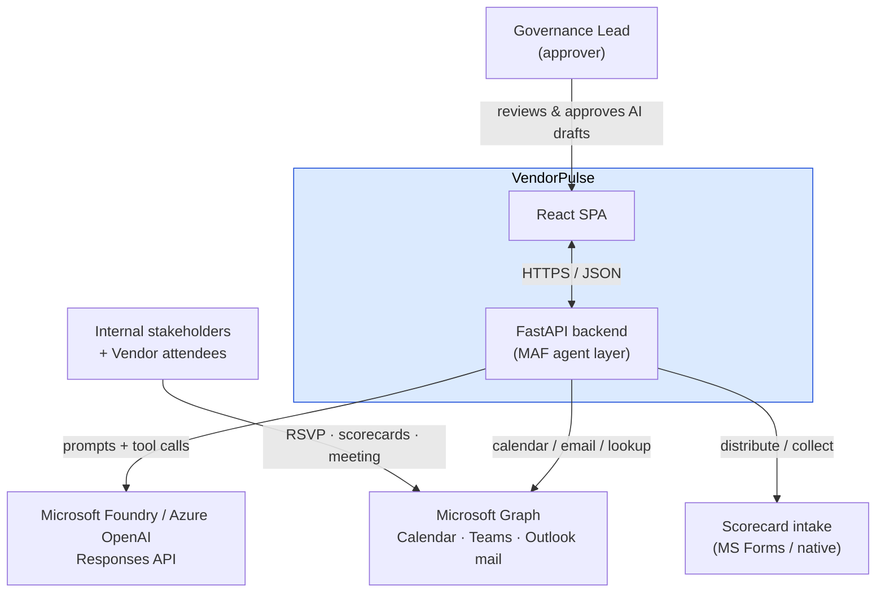
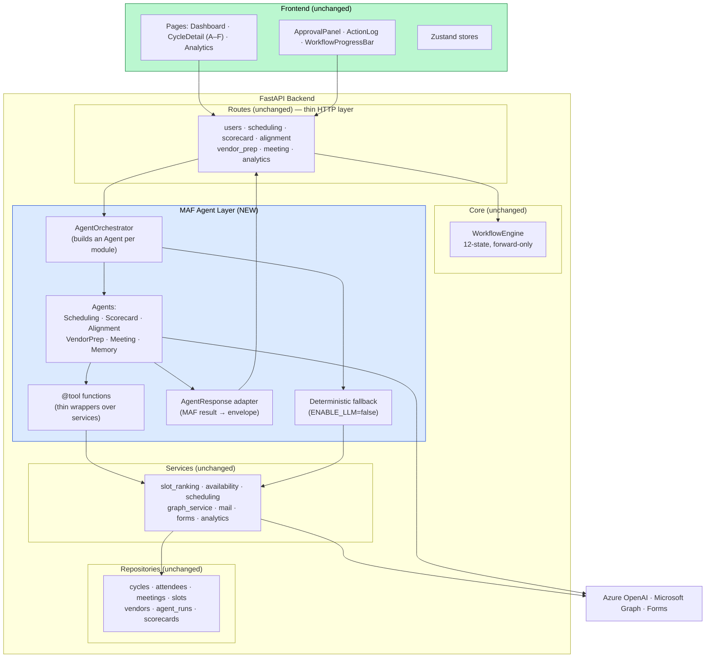
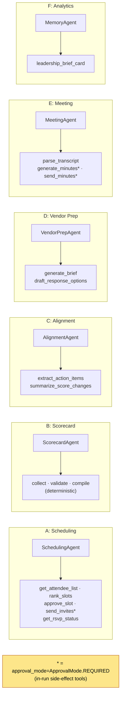
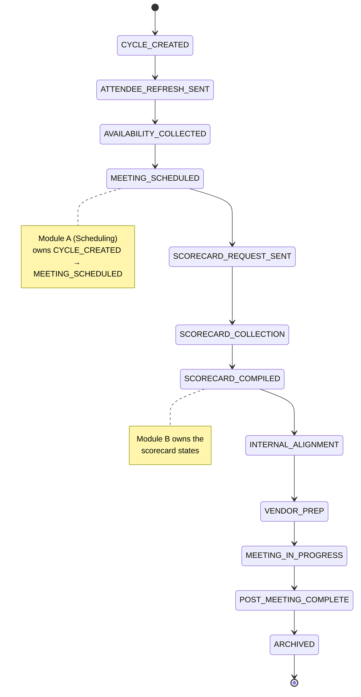
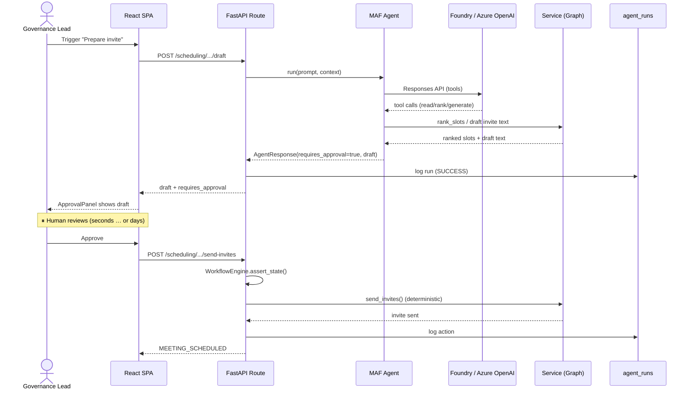
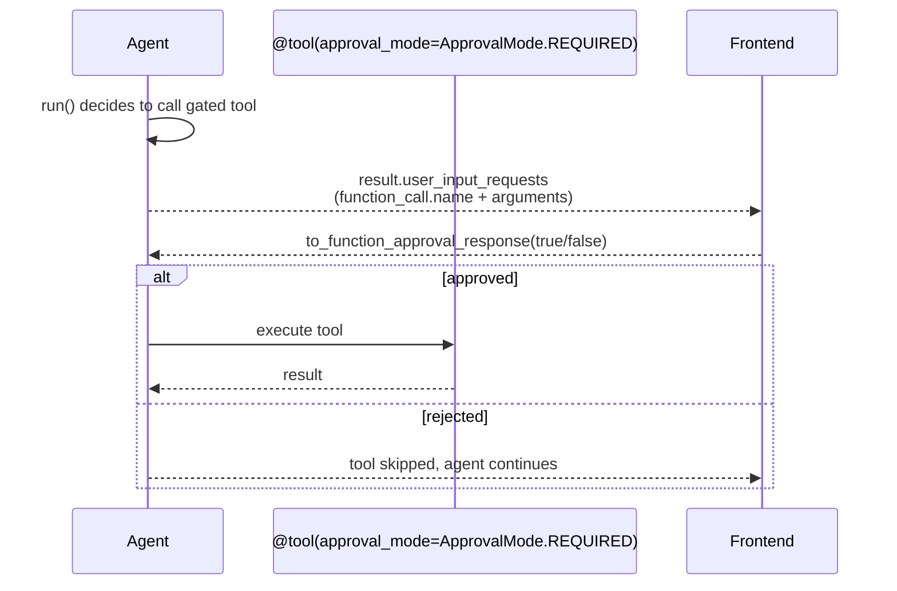
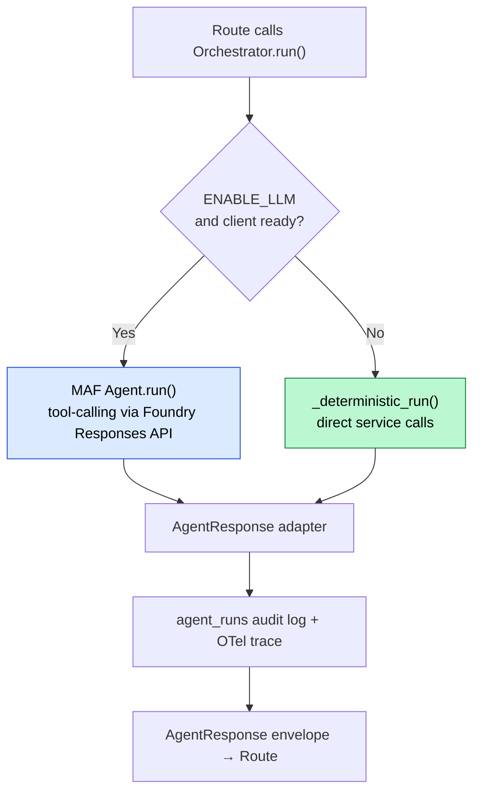

# VendorPulse on Microsoft Agent Framework — Solution Architecture

> **Companion docs:** [README](README.md) · [MAF Onboarding](MAF_TEAM_ONBOARDING.md) · [Deployment Architecture](DEPLOYMENT_ARCHITECTURE.md) · [Shell Compliance Checklist](SHELL_COMPLIANCE_CHECKLIST.md)
> **Scope:** Logical / component design of the target state. Physical hosting is in the Deployment doc.
> **Client:** Shell — design choices below are mapped to Shell IRM 3.492 controls where relevant (see §8 + the compliance checklist).

---

## 1. System context

VendorPulse orchestrates Quarterly Business Reviews across a forward-only 12-state workflow. AI is confined to **text generation** behind a **human-approval gate**; all business-critical decisions remain deterministic.

---

## 2. Logical component view

**Layering rule (unchanged):** dependencies flow strictly downward — Routes → Core/Agents → Services → Repositories. The MAF layer slots in exactly where `BaseAgent` was, behind the same `AgentResponse` adapter.

---

## 3. Module → Agent → Tools map

Tools marked `*` perform external side effects and are gated; read/generate tools execute freely. `approval_mode` takes the `ApprovalMode` enum (the old `"always_require"` string form was replaced before/at GA and is enforced as of 1.3.0). Note that the **primary** approval gate is still the app-layer `requires_approval` flow (see §5).

---

## 4. Workflow state machine (unchanged, deterministic)

The `WorkflowEngine` is the **single source of truth** for allowed transitions. MAF agents orchestrate work *within* a state — they never advance the machine. Invalid transitions raise `WorkflowViolationError` (→ HTTP 409).

---

## 5. The human-approval gate (sequence) — the critical pattern

> **Shell IRM 3.6.3.b.2** (near-verbatim): *"Implement human oversight and consent for privileged actions — for instance, sharing of output through email, embed a step where a human approves before sending the information."* This gate is the direct implementation. **Status:** the side-effecting tools (`send_invites`, `approve_slot`) are now withheld from the model and refused inside an agent run (PoC, GitHub issue #13); the real action fires only from the deterministic route after approval.

VendorPulse's gate is **asynchronous and out-of-band**: the agent run completes producing a *draft*, a human approves later, and the external action fires from a separate deterministic route. This is preserved unchanged; MAF's in-run `approval_mode` is a secondary safeguard.

**Why this matters:** the external side effect (`send_invites`) is *not* executed inside the agent run. The agent only drafts. This decouples approval latency from the LLM call and keeps the action deterministic and auditable — strictly safer than running a side-effect tool inside the agent loop.

### 5.1 Optional in-run gate (MAF native)

For any tool that genuinely must act *during* a run, MAF supports native gating:

This is **belt-and-suspenders**, used sparingly; the app-layer gate in §5 remains the primary control.

---

## 6. Dual execution path (preserved)

Every module still works with **zero LLM** (`ENABLE_LLM=false`). MAF replaces only the left branch. The adapter guarantees both branches emit the identical `AgentResponse` envelope the frontend depends on.

---

## 7. MAF SDK hosting options

As of BUILD 2026, Microsoft Foundry Agent Service is a **three-tier spectrum**, not a single managed product. The 2025-era objection ("managed = hidden prompts, no grounding control") applies only to the **Prompt agents** tier — the other two run *our own MAF code*.

| Design property (VendorPulse) | Prompt agents (Foundry-managed) | **MAF SDK in-process — chosen baseline** | Foundry Hosted Agents (preview) |
|---|---|---|---|
| Full prompt ownership (audit) | ❌ Foundry assembles instructions | ✅ you own every token | ✅ your own agent code |
| Deterministic `ENABLE_LLM=false` core | ❌ assumes LLM drives | ✅ unchanged | ✅ unchanged (your code) |
| App-layer approval gate | ⚠️ fights the "act" default | ✅ fully preserved | ✅ preserved (your code) |
| Foundry / Azure OpenAI models (Responses API) | ✅ | ✅ | ✅ |
| `AgentResponse` contract | ⚠️ adapter needed | ⚠️ adapter needed (minor) | ⚠️ adapter needed (minor) |
| Data residency / regions | ⚠️ Foundry-region bound | ✅ runs where your backend runs | ⚠️ Foundry-region bound; BYO-VNet available |
| Infra burden | none | you own the container | Foundry-managed endpoint + identity + scaling |
| Maturity | GA | GA | **public preview** |

**Decision:** **MAF SDK in-process** as the shippable baseline — it preserves audit-transparency, the deterministic fallback, and the approval gate (the core value of a governance product) with no preview dependency. **Foundry Hosted Agents** is a credible future hosting upgrade for the *same* code once it exits preview, since it offers identical prompt ownership while offloading infra. **Prompt agents** are ruled out for the governance use case. All three call models through the **Responses API**.

---

## 8. Cross-cutting concerns

| Concern | Approach |
|---------|----------|
| **Observability** | MAF native OpenTelemetry (**enabled by default since 1.6.0** — wire the exporter, don't opt in) → Azure Monitor / App Insights; plus existing `agent_runs` audit log and `RequestLoggingMiddleware` |
| **Error handling** | Workflow violations → 409; agents always return structured `AgentResponse` (even on failure, `next_actions:["RETRY"]`); LLM JSON-parse fallback to deterministic builders |
| **Config** | `pydantic-settings` from `.env` → moves to Key Vault refs + Managed Identity in prod (see Deployment doc) |
| **Security** | LLM emits text only; decisions deterministic; output human-gated; secrets vaulted |
| **Auditability** | Every run logged with input/output payloads + trace IDs correlating HTTP ↔ agent ↔ model call |
| **Compliance (Shell)** | Maps to **IRM 3.492** + EU AI Act: human approval (3.6.3), deterministic core vs hallucination (3.6.6), auditability (3.5.5), IDT-managed Azure/Foundry + Shell.AI/TRB approval (3.3 / 3.5.1), AI-use transparency notice (3.5.3), Entra SSO/RBAC (3.6.2). Full mapping + blocking prerequisites in [SHELL_COMPLIANCE_CHECKLIST.md](SHELL_COMPLIANCE_CHECKLIST.md) |

---

## 9. Open items before build

0. **Shell compliance prerequisites (blocking):** AI Registry + ServiceNow registration, IRM risk assessment / IAQ, EU AI Act classification, Shell.AI + TRB approval, IDT-managed hosting. Start in parallel — these have lead time. See [SHELL_COMPLIANCE_CHECKLIST.md §A](SHELL_COMPLIANCE_CHECKLIST.md).
1. ✅ **PoC complete (June 2026):** tool-calling + the approval gate proven over the Foundry **Responses API** across 2 agents / both shapes (GitHub issue #13); `previous_response_id` chaining worked, so #4376 didn't reproduce. ✅ **Decision made (June 2026): production builds on the MAF SDK** (`agent_framework.Agent` + `@tool(approval_mode=...)`), with the Responses-direct path retained as fallback. Rationale: platform-provided HITL / content filters / on-by-default OTel mean fewer hand-rolled controls through Shell's code security review (IRM 3.3). **Next:** ~1.5-wk MAF spike porting one agent + re-verifying bugs #4411/#4376 on the AAD client.
2. Pin **exact** MAF SDK version. The API has genuinely churned post-GA (`ChatAgent`→`Agent`, `ChatMessage`→`Message`, `approval_mode` string→`ApprovalMode` enum, tool `**kwargs`→`FunctionInvocationContext`, `pydantic-settings` removed → call `load_dotenv()` + `load_settings()` explicitly). Budget an upgrade pass per minor release.
3. Decide whether `MemoryAgent`/`MeetingAgent` one-shot paths become MAF agents or stay a simple single-call path (they are single-prompt, not multi-step — may not need the agent loop).
4. Evaluate the **Agent Harness** (context compaction + memory/file/task providers) — it may replace plumbing in Phase 1, and **CodeAct** for multi-tool turns if latency/token cost matters.
5. Add regression test harness (no automated suite exists today).
