# VendorPulse — Database ERD (Entity-Relationship Diagram)

> **What this is:** the relational schema (Entity-Relationship Diagram) for VendorPulse's system of record.
> **Why relational:** the data is *related and transactional* — one cycle owns many attendees, slots, submissions, actions and audit rows, with foreign keys enforcing integrity and enabling cross-cycle queries. This is exactly the structure object storage (Blob) or flat files cannot represent or keep consistent.
> **Note:** development currently persists JSON via the `BaseRepository` seam; this diagram is the **target production schema** (PostgreSQL, or Azure SQL) that the same repository layer maps onto.

---

## ER Diagram

```mermaid
erDiagram
    VENDOR              ||--o{ CYCLE              : "is reviewed in"
    CYCLE               ||--o{ ATTENDEE           : "has"
    CYCLE               ||--o{ SLOT_PROPOSAL      : "proposes"
    CYCLE               ||--o| MEETING            : "schedules"
    SLOT_PROPOSAL       ||--o| MEETING            : "chosen for"
    CYCLE               ||--|| SCORECARD_TEMPLATE : "uses (versioned)"
    SCORECARD_TEMPLATE  ||--o{ KPI                : "defines"
    CYCLE               ||--|| SCORECARD          : "produces"
    SCORECARD           ||--o{ SCORE_SUBMISSION   : "consolidates"
    KPI                 ||--o{ SCORE_SUBMISSION   : "scored in"
    CYCLE               ||--o| ALIGNMENT          : "aligns via"
    CYCLE               ||--o| VENDOR_PREP        : "prepares via"
    CYCLE               ||--o{ ACTION_ITEM        : "tracks"
    CYCLE               ||--o{ AGENT_RUN          : "audited by"
    MEETING             ||--o{ MEETING_NOTE       : "captures"
    MEETING             ||--o| MINUTES            : "documented by"
    USER                ||--o{ ATTENDEE           : "may be"
    USER                ||--o{ ACTION_ITEM        : "owns"

    VENDOR {
        uuid   vendor_id PK
        string name
        string category        "e.g. IT Infrastructure, Managed Services"
        string status          "active | inactive"
    }

    CYCLE {
        uuid     cycle_id PK
        uuid     vendor_id FK
        string   name
        string   quarter        "e.g. Q1 2026"
        string   state          "enum: CYCLE_CREATED .. ARCHIVED (12-state)"
        datetime created_at
        datetime updated_at
    }

    USER {
        uuid   user_id PK
        string name
        string email
        string role             "vmo_coordinator | executive_sponsor | viewer"
    }

    ATTENDEE {
        uuid    attendee_id PK
        uuid    cycle_id FK
        uuid    user_id FK       "nullable — null for external/vendor contacts"
        string  name
        string  email
        string  role             "organiser | exec_sponsor | internal_lead | vendor | ..."
        bool    is_key           "key stakeholder = hard scheduling constraint"
        bool    is_external      "vendor / non-Shell contact"
        string  confirm_status   "pending | confirmed | unconfirmed"
        string  rsvp_status       "none | accepted | tentative | declined"
    }

    SLOT_PROPOSAL {
        uuid     slot_id PK
        uuid     cycle_id FK
        datetime start_time
        datetime end_time
        float    score            "deterministic ranking score"
        int      rank
        string   status           "proposed | approved | rejected"
    }

    MEETING {
        uuid     meeting_id PK
        uuid     cycle_id FK
        uuid     slot_id FK
        datetime scheduled_start
        datetime scheduled_end
        string   teams_join_url
        string   graph_event_id   "Microsoft Graph calendar event id"
        string   status           "scheduled | in_progress | complete"
    }

    SCORECARD_TEMPLATE {
        uuid    template_id PK
        uuid    cycle_id FK
        int     version
        string  scoring_scale     "e.g. 1-5"
        bool    locked
    }

    KPI {
        uuid    kpi_id PK
        uuid    template_id FK
        string  category          "RISK_COMPLIANCE | PERFORMANCE | COMMERCIAL | RELATIONSHIP"
        string  name
        float   weight
        string  owner_type        "vendor | internal"
    }

    SCORECARD {
        uuid    scorecard_id PK
        uuid    cycle_id FK
        float   overall_score     "deterministic aggregate"
        bool    locked
        int     version
        datetime compiled_at
    }

    SCORE_SUBMISSION {
        uuid    submission_id PK
        uuid    scorecard_id FK
        uuid    kpi_id FK
        string  respondent        "user_id or vendor contact"
        string  source            "vendor_reported | internal"
        float   value             "1-5"
        string  rag               "RED | AMBER | GREEN"
        string  comment           "mandatory on extreme scores; may be internal-only"
        bool    outlier_flag      "z-score > 1.5 SD"
        datetime submitted_at
    }

    ALIGNMENT {
        uuid    alignment_id PK
        uuid    cycle_id FK
        string  summary           "agreed internal positions / narrative"
        bool    sponsor_signed_off
        datetime created_at
    }

    VENDOR_PREP {
        uuid    prep_id PK
        uuid    cycle_id FK
        string  summary           "vendor commitments, open items, escalations"
        bool    organiser_reviewed
        datetime created_at
    }

    ACTION_ITEM {
        uuid    action_id PK
        uuid    cycle_id FK
        uuid    owner_user_id FK
        string  source            "alignment | vendor_prep | meeting"
        string  description
        date    due_date
        string  status            "OPEN | IN_PROGRESS | CLOSED"
        bool    carried_forward   "rolls into next cycle (Module F)"
    }

    MEETING_NOTE {
        uuid    note_id PK
        uuid    meeting_id FK
        string  note_type         "QUESTION | OBJECTION | DECISION | APPRECIATION | ACTION"
        string  text
        uuid    vendor_id FK       "tagging for traceability"
        uuid    kpi_id FK          "tagging for traceability"
    }

    MINUTES {
        uuid    minutes_id PK
        uuid    meeting_id FK
        string  content           "AI-drafted, human-approved"
        bool    approved
        datetime distributed_at
    }

    AGENT_RUN {
        uuid    run_id PK
        uuid    cycle_id FK
        string  agent             "scheduling | scorecard | alignment | vendor_prep | meeting | memory"
        string  status            "success | failed | partial | pending_approval"
        bool    requires_approval
        json    input_payload
        json    output_payload
        string  correlation_id    "ties HTTP <-> agent <-> model call"
        datetime created_at
    }
```

---

## How to read it (crow's-foot notation)

- `||--o{` = **one-to-many** (e.g. one CYCLE has many ATTENDEEs).
- `||--o|` = **one-to-zero-or-one** (e.g. a CYCLE schedules at most one MEETING).
- `||--||` = **one-to-one** (e.g. a CYCLE produces exactly one compiled SCORECARD).
- `PK` = primary key, `FK` = foreign key. Text in quotes is a note / enum.

## Why this needs a relational database (the point of the diagram)

- **Referential integrity** — foreign keys guarantee a SCORE_SUBMISSION always belongs to a real KPI and SCORECARD; you can't orphan data. Blob/files have no such concept.
- **Transactions & concurrency** — the 12-state workflow and approval gate update related rows atomically; multiple coordinators can work without overwriting each other.
- **Querying & reporting** — Module F's trends, recurring-issue detection and dashboards are simple indexed joins across CYCLE / SCORECARD / SCORE_SUBMISSION / ACTION_ITEM — not full-file scans.
- **Auditability** — AGENT_RUN gives a queryable, correlation-tagged audit trail (IRM 3.492).

*Blob Storage remains the right home for large files only — meeting transcripts and generated minutes — referenced from MEETING / MINUTES, not used as the system of record.*
